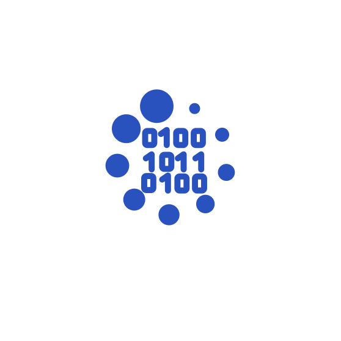

<h3 align="center">👨‍💻 Eileen HJ SONG </h3>

 

 

   📚 Data Scientist를 꿈꾸며 공부하고 있습니다 

 
 
 

<h3 align="center">🛠 Language and tools</h3>
 

  
  

  
  

  
  

  
  

  
  
  

  
  
  
  
  
  

  
  

 
 

<!--
  
-->
<!--
  
-->
  

 
 