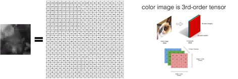

<br>

선형대수(linear algebra)는 데이터 분석에 필요한 각종 계산을 돕는 학문이다. 데이터 분석엔 다량의 숫자 데이터를 다루어야 한다.


선형대수를 사용하면 대량의 데이터를 포함하는 복잡한 계산 과정을 편리하고 간단한 수식으로 서술할 수 있다. 


선형대수에서 데이터는 개수와 형태에 따라 다양한 형태로 표현할 수 있다.
- 스칼라(scalar), 벡터(vector), 행렬(matrix), 텐서(tensor)


**요약**

- 스칼라: 숫자 하나로 이루어진 데이터
- 벡터: 여러 숫자로 이루어진 데이터 레코드(data record)
- 행렬: 벡터 데이터 집합
- 텐서: 같은 크기의 행렬이 여러 개 있는 것


<br>

# 데이터 표현 방식


스칼라와 벡터는 선형 대수를 구성하는 기본 단위다.


## 스칼라 (Scalar)
- **정의**: 단일 숫자로 이루어진 데이터.
- **표기**: 일반적으로 알파벳 소문자로 표시 (예: `x`).
- **특징**:
  - 숫자 하나로 구성.
  - 실수 집합 R의 원소로 간주 (예: `x ∈ R`).
  - 크기를 나타내며, 벡터와 행렬에 곱해질 수 있음.


<br>

## 벡터 (Vector)


- **정의**: 데이터를 1차원 배열로 표현.
- **표기**: 일반적으로 소문자와 화살표로 표시 (예: `\vec{v}`).
- **특징**:
  - 여러 숫자로 구성된 1차원 배열.
  - 주로 열 벡터 형태로 표현됨.
  - 벡터의 길이는 차원수와 동일.
  - 파이썬에서는 numpy 배열로 표현 (예: `np.array([1, 2, 3])`).


데이터는 순서쌍(ordered pair, -tuple)으로 표현할 수 있다. 예를 들어, 한 사람의 키, 몸무게, 연령, 발사이즈은 한 사람에 관한 데이터이다. 김씨에 대한 키 170, 몸무게 50, 연령 20, 발사이즈 255는 (170, 50, 20, 255)로 표현이 가능하다. 각각의 성분들이 모여 한 사람의 데이터가 된다. 벡터를 구성하는 성분은 하나의 숫자로 이루어져있고, 이를 **스칼라**라고 한다.

스칼라는 크기, 벡터는 크기와 방향을 가지고 있다.

스칼라는 변수로 저장되어 있는 단순한 숫자이며 벡터 혹은 매트릭스에 곱해지는 경우 해당 값에 곱한 값으로 결정되며, 실수와 정수 모두 사용할 수 있다.

<br>

## 행렬 (Matrix)


여러 사람의 데이터를 모아 하나의 직사각형 형태로 배열할 수 있다. 이를 Matrix, 행렬이라고 한다. 즉, 벡터를 쌓아 행렬을 만든다. 


- **정의**: 데이터를 2차원 배열로 표현.
- **표기**: 알파벳 대문자로 표시 (예: `X`, `Y`).
- **특징**:
  - 벡터의 집합으로 이해할 수 있음.
  - 행과 열을 가진 2차원 배열.
  - 파이썬에서는 numpy의 `ndarray`로 표현.


  ```
  A = np.array([[11,12,13],[21,22,23]])
  ```


<br>

## 텐서 (Tensor)
- **정의**: 같은 크기의 행렬이 여러 개 있는 형태.
- **특징**:
  - 다차원 배열로 표현되는 데이터 구조.
  - 벡터와 행렬을 일반화한 개념.
  - 예: 컬러 이미지는 (높이 x 너비 x 색상 채널)의 3차원 텐서.

행렬은 디지털 이미지를 나타내는데 유용하다. 칼라 이미지는 RGB라고 알려진 RED, GREEN, BLUE의 3개의 Channel로 표현되어 세 개의 행렬이 3차원으로 겹쳐진 모양이 되어 우리가 보는 형형색색의 색상을 가진다. 이를 텐서(Tensor)라고 한다.




<br><br><br>
끝🙂
<br><br><br>
