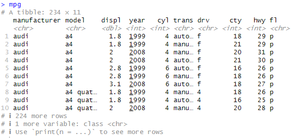
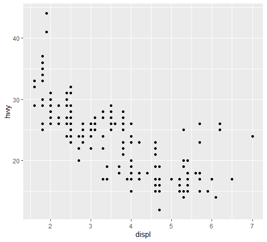
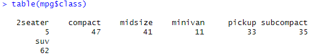
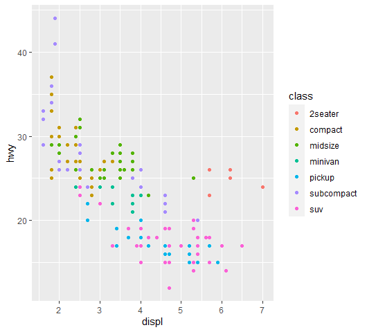
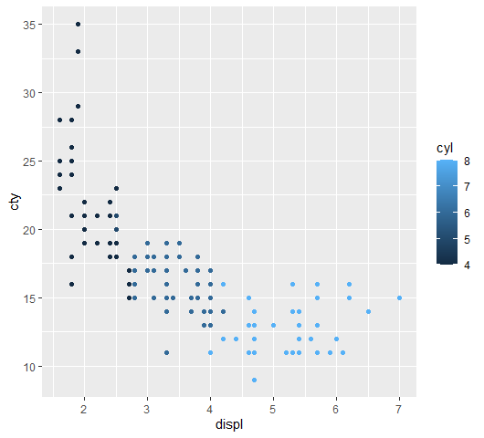
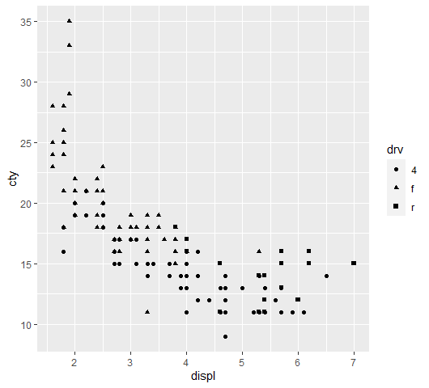
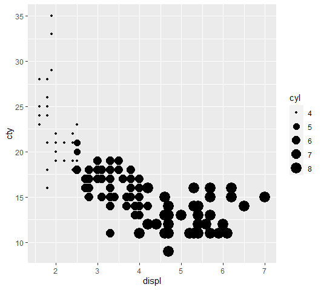
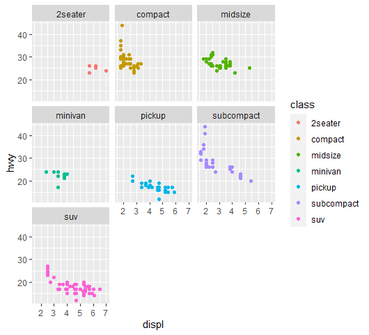
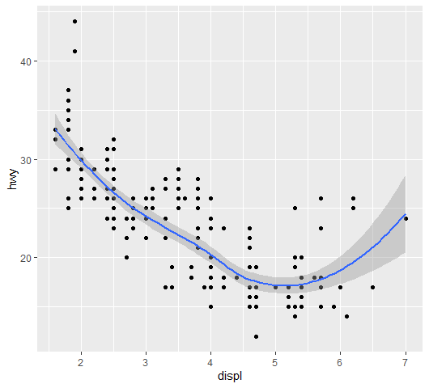

<br>

# visualization R ggplot2 with 'mpg' data
<br>

## Data Intrdoction : ‘mpg’ in R

1999 년부터 2008 년까지 인기 차종의 연비에 대한 자료로 R에 내장되어 있다. 해당 자료로 시각화를 해보려고 한다.


> R mpg 변수설명

```
– manufacturer & model: 자동차 생산회사와 모델. 1999 년에서 2008 년 사이의 38 가지 모델
– displ: 엔진 배기량(liter)
– year: 생산연도
– cyl: 자동차의 실린더수(엔진의 배기량)
– trans: 자동사의 변속방법
– drv: 자동차의 구동렬. 전륜구동(front wheel, f),후륜구동(rear wheel, r), 사륜구동(four wheel, 4)
– cty 와 hwy: 도시와 고속도로에서의 mpg(갤런당 주행거리 mile/gallon)
– fl: 연료 타입
– class: 자동차 타입, 2인승, SUV, 소형차 등
```

<br>


## mpg R 데이터 확인하기
<br>

먼저, 시각화를 위한 패키지를 불러온다

```r
#패키지 없을 때 인스톨 필수!
install.packages("tidyverse")

library(tidyverse)
mpg
```




데이터 확인이 가능하다. 234개의 rows(observation)와 11개의 칼럼으로 구성되어 있다는 것을 알 수 있다.

또한, 아래에는 데이터 타입이 chr-문자열인지, dbl-더블인지, int-정수인지 알 수 있다.


<br>


## mpg R 산점도 표현

<br>

> R 산점도: geom_point()

```r
ggplot(mpg, aes(x=displ, y=hwy)) + geom_point()

```

<br>

R의 ggplot2 패키지를 사용하여 mpg 데이터셋의 displ(배기량)을 x축으로, hwy(고속도로 연비)를 y축으로 하는 산점도(scatter plot)를 그려본다.


aes는 aesthetic의 약자로, "시각적"이라는 의미를 가지고, ggplot2에서의 aes는 그래프에서 변수를 어떤 시각적 요소(색상, 크기, 모양 등)에 매핑할 것인지를 지정하는 함수라고 생각하면 된다.





<br>

### 클래스별 분포 파악

<br>

```r
table(mpg$class)
```
mpg 데이터 셋의 class 변수에 접근($)하겠다는 의미이다





어떤 데이터들로 구성되어 있는지 확인할 수 있다


<br>

### 산점도 - color, size, shape

#### 1. 클래스별 색깔로 표현


차량의 클래스(class)에 따라 색상을 다르게 표현할 수도 있고, 차량의 실린더 수(cyl)에 따라 색상을 다르게 표현할 수도 있다.


<br>

```r
ggplot(mpg,aes(displ, hwy, color=class)) + geom_point()
```
<br>



<br>

r에서 color=class로 하면, 앞에서 mpg class가 7개 있는 것을 확인했다. 클래스별로 7가지 색으로 표현할 수 있다

즉, class 값(차량의 분류, 예: "SUV", "compact" 등)에 따라 점의 색상을 다르게 표현한 것이다

<br>
<br>

또한, 차량의 cyl 값(실린더의 수)에 따라 점의 색상을 다르게 표현은 다음과 같이 한다.
<br>

```r
ggplot(mpg,aes(displ, cty, color=cyl)) + geom_point()
```

- cyl: 자동차의 실린더수(엔진의 배기량)
- cty : 도시와 고속도로에서의 mpg(갤런당 주행거리 mile/gallon)



cyl는 연속변수 이므로 그라데이션으로 표현가능하다. 디폴트는 밝은색이 높은 숫자


<br>

#### 2. 클래스별 모양으로 표현

<br>


후륜인지, 전륜인지 등 drv 클래스를 shape로 두면, 변수에 해당하는 데이터를 모양으로 아래와 같이 표현할 수 있다.


```r
ggplot(mpg,aes(displ, cty, shape=drv)) + geom_point()
```
<br>




#### 데이터 타입 확인하기

테이블엔 숫자가 스트링처럼 보일 수도 있다. 하지만 데이터를 다룰 때 데이터 타입을 확인하는 것은 굉장히 중요하다!

그래서, class()함수를 활용해서 타입을 확인해주면 된다.


```r
table(mpg$cyl)
class(mpg$cyl)

```

 4  5  6  8 


 
81  4 79 70 
> class(mpg$cyl)
[1] "integer"
> 

cyl 클래스의 데이터는 정수인 것을 확인할 수 있다.


<br>

#### 3. 클래스별 사이즈 지정
<br>


연속형 변수를에서 보통 사이즈를 표현하고, 클래스나 쉐입은 범주형 변수이다. 칼라도 연속형을 쓰긴 한다. 표현하기 나름.


연속형 변수 cyl을 두 가지로 시각화 해보겠다. 아까 본 그라데이션 color로 해도 되고, 또는 size로 큰 수를 표현해도 된다.

```r
# 아까 본 그라데이션 코드
ggplot(mpg,aes(displ, cty, color=cyl)) + geom_point()
# 사이즈 별로 나타냄
ggplot(mpg,aes(displ, cty, size=cyl)) + geom_point()
```





다양하게 표현가능하다!


<br>

### Facetting - 그래프 나누기

<br>

```r
ggplot(mpg,aes(displ, hwy, color=class)) + geom_point()
```


이때까지는, 위의 그림과 같이 R 시각화 한, 한 곳에 다양한 클래스가 섞여있었다. 그래서 정확하게 클래스별로 확인이 불가능 했는데, 당연히 나누어서 클래스별로 명확하게 비교해 볼 수 있다~

<br>
! 다만, 클래스별로 나누어 비교하려면 scale이 동일해야한다.


R에서 이 때 쓰는게 바로 facetting. 클래스를 나누어준다! split! 뒤에 +facet_wrap()을 해주면 된다.

<br>
클래스 별로 나누고 싶기 때문에 (~class)를 써줬다.

<br>
```r
ggplot(mpg,aes(displ, hwy, color=class)) + geom_point()+facet_wrap(~class)
```




클래스별로 나누었기 떄문에, r에서 한 시각화가 더욱 한 눈에 보인다!


<br>

### 산점도 선으로 연결하기
<br>

스무스하게 산점도를 연결해보장~ 어렵지않다. geom_smooth() 코드를 추가해주면 끝


```r
ggplot(mpg,aes(displ, hwy)) + geom_point()+geom_smooth()
```




회귀랑 비슷하다.

선이 그려졌는데 이것은, x를 잘 대변해주는 y를 찾는 것이다. 회색 영역은 standard 에러 부분이고, 자료가 충분하지 않으면 회색 영역이 넓어 진다고 보면 된다.


자료를 표현하는 방법으로 특히, 하나의 연속변수를 표현하는 방법이라고 생각하면 된다.


<br>
<br>

끝🙂
<br>
<br>
<br>


