<br>

# visualization R ggplot2 연속변수
<br>

## geom 종류 
• geom_point() : 산포도<br>
• geom_smooth() : smooth line 과 se 를 표시<br>
• geom_boxplot(): 상자그림<br>
• geom_histogram(), geom_freqpoly() : 연속변수의 분포<br>
• geom_bar() : 막대그림<br>
• geom_path(): 점들을 자료 순서대로 선으로 연결한 그림<br>
• geom_line(): 산점도에서의 위치에 따라 왼쪽에서 오른쪽순으로 모든 점들을 연결


<br>

## Data Intrdoction : ‘tips’ in R
<br>
미국(?)의 한 waiter가 일하던 restaurant 에서 수개월 동안 일을 하면서 tip 받은 것과 관련하여 모은 자료가 R에 내장되어 있다.
<br>

> 변수 설명

```
 - total_bill: 각 table 에서 지불한 돈(dollar)
 - tips: 각 table 에서 지불한 팁 (dollar)
 - sex: 팁 낸 사람의 성별
 - smoker: table 이 smoking section 에 있는가
 - day: 서빙 요일
 - time: 서빙 시간(Dinner, Lunch)
 - size: 함께와서 식사한 사람 수(명)
 ```
<br>

우리가 알고(?) 싶은 것은, 사람들이 tip을 내는 성향이다.


tip은 연속변수이기 때문에 histogram을 사용하기 좋다. histogram은 하나의 변수에 대해서만 그리므로 X만 지정할 수 있다.


<br>

## 데이터 파악하기
<br>

### 데이터 summary()

<br>

각각의 변수의 타입에 맞게 서머리 해준다
<br>

일단, tips 데이터는 reshape2 라이브러리에 있다.


tips로만 데이터를 확인하면 주루르르르륵 나오지만, **summary 함수를 쓰면 각각의 변수의 타입에 맞게 서머리** 해준다!


```r
install.packages("reshape2")
library(reshape2)
tips
summary(tips) 
```
<br>

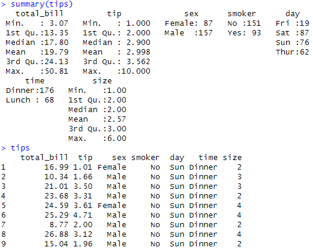

<br>

위 그림에서 tips를 보면, tips로 주르륵 나오지만, R summary()함수를 쓰면 연속변수나 범주형변수에 알맞게 Min, Max 등의 분포들을 보여준다!


<br>

### head, tail, dim
<br>

데이터 프레임을 살펴볼 수 있는 기능이다 !


```r
head(tips)
tail(tips)
dim(tips) 
```


head와 tail은 이폴트로 데이터 앞뒤의 6개를 보여준다. dim()은 데이터의 차원을 출력해준다!

> dim(tips) 
[1] 244   7
이렇게 244개의 observation과 7개의 변수으로 구성된 것을 확인가능하다.


<br>
<br>

## 그래프 그리기
<br>

### Histogram
<br>

 
tip은 연속변수니까 히스토그램 써보겠다. histogram은 하나의 변수에 대해서만 그리므로 x 만 지정해주면 됨.


```r
ggplot(tips, aes(x=tip))+geom_histogram()
```


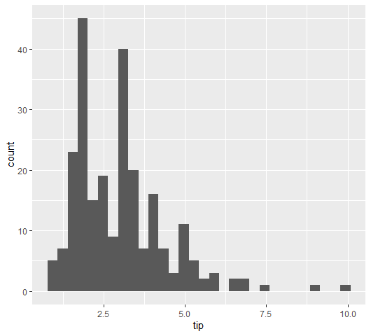


히스토그램으로 보면, 오른쪽으로 꼬리가 길지만 피크가 드문드문 보인다. 예상치못한 특이점들이 발견된 것이라고 볼 수 있는 것 같다.


드문 나타나는 피크는 팁을 내는 사람들의 성향으로 볼 수 있다.
돈이기 때문에, 1,2,3,4,5에 피크가 있다는 것은 라운드off(반올림 , 내림)하는 경향이라고 할 수 있을까.


자세히 보기 위해서 binwidth를 써보겠다. 💡**히스토그램은 다양한 빈너비를 해보아야 경향/패턴을 파악하는 것이 중요하다**


```r
ggplot(tips, aes(x=tip))+geom_histogram(binwidth = 1) #1불 단위
ggplot(tips, aes(x=tip))+geom_histogram(binwidth = 0.5) #0.5센트 단위
ggplot(tips, aes(x=tip))+geom_histogram(binwidth = 0.25) #0.25센트 단위
ggplot(tips, aes(x=tip))+geom_histogram(binwidth = 0.05) #5센트 단위
```


<br>

### frequency polygons

<br>

히스토그램에서 각 막대의 중심 위에 점을 찍고, 이 점들을 선으로 연결해주는 frequency polygons 이다. 이렇게 그려진 선 그래프는 데이터의 전체 분포 -다중 분포, 연속성, 밀도, 이산형데이터-를 비교할 떄 이용 가능하다


<br>

```r
ggplot(tips,aes(tip))+geom_freqpoly()
ggplot(tips,aes(tip, color=sex))+geom_freqpoly()
```


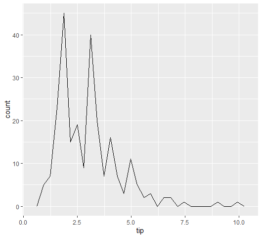

<br> 
위의 히스토그램을 freploy로 연결하면 위의 그림과 같이 나온다.


<br>
그럼 이번에는, 성별로 나누어서 함께 보자.

<br>
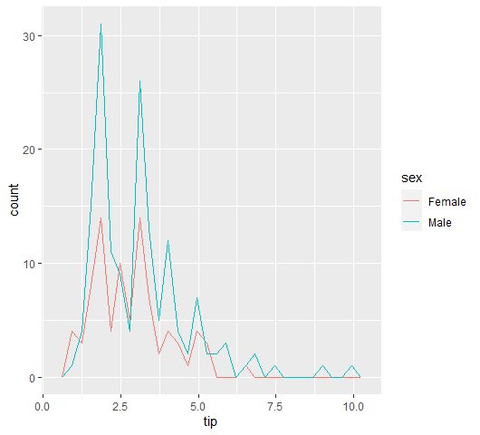

<br>


이번에는 히스토그램 바 안에서 구분하여 그려보자
```r
ggplot(tips,aes(tip, color=sex))+geom_histogram()
```


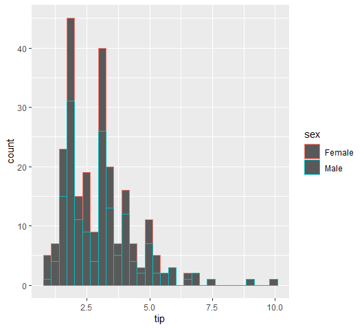


이 두 그래프를 보면 male이 tips을 더 많이 준 것 처럼 보인다. 하지만 간과한 것은 데이터의 특성!!!
 


한번 성별 분포를 보면 table()


```r
table(tips$sex)
```


> table(tips$sex)

Female   Male 
    87    157 


남자가 여자보다 훨씬 많은 것을 알 수 있다! 그러니, 당연히 횟수로만 따지면 남자가 많이 나올 수 밖에..


그럼 우리가 해야 하는 것은 바로, 데이터 스케일을 맞추어 주는 것이다. 이 때 사용할 수 있는 것이 density이다.

<br>

### density
<br>

density 함수의 경우 면적이 1이 된다. 그러므로, 여러개의 분포를 비교해 볼 때 유용하다. 위와 같이 데이터의 특성, 즉 남녀 수 자체가 다르면 당연히 비교가 어렵다. 그럼 스케일, 밀집도를 1로 맞추어 주면 비교가 가능하지 않을까?!

<br>


```r
ggplot(tips,aes(tip))+geom_density()
```


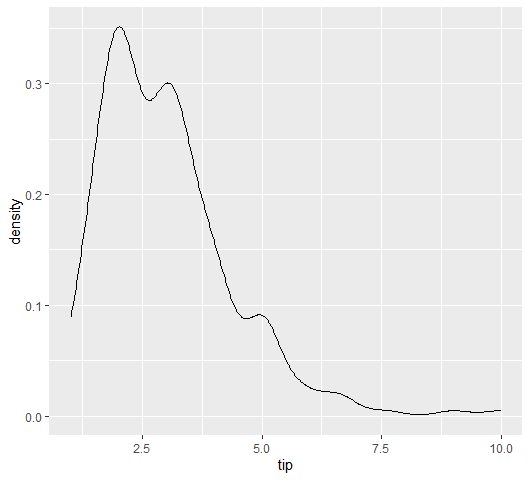


위 그림에서 보듯, density는 면적이 1이 되는 곡선을 찾아준다. bin은 bw로 표현할 수 있다.


```r
ggplot(tips,aes(tip))+geom_density(bw=0.1)
```

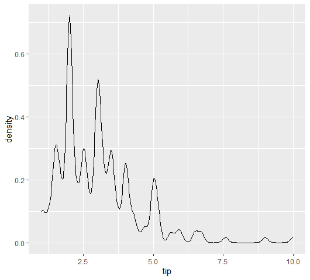


<br>
이제 남녀를 나누어 보면,


```r
ggplot(tips,aes(tip, color=sex))+geom_density(bw=0.1)
```
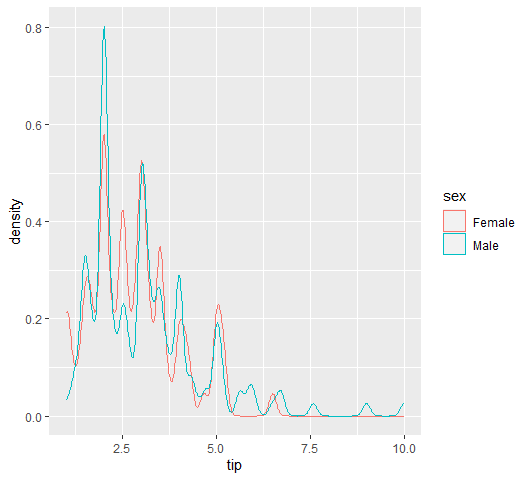


표본 크기가 다른 여러 그룹의 분포를 공정하게 비교가 가능해졌다!

Good! 

<br>

### 요일별 분포를 살펴보자!

tips 자료에서도 요일별로 분포를 살펴보자. freqpoly로 colour=day로 해주면, 요일별로 다른 색의 선을 그려준다.

```r
ggplot(tips, aes(total_bill, colour=day)) +
  geom_freqpoly(binwidth=5)
```

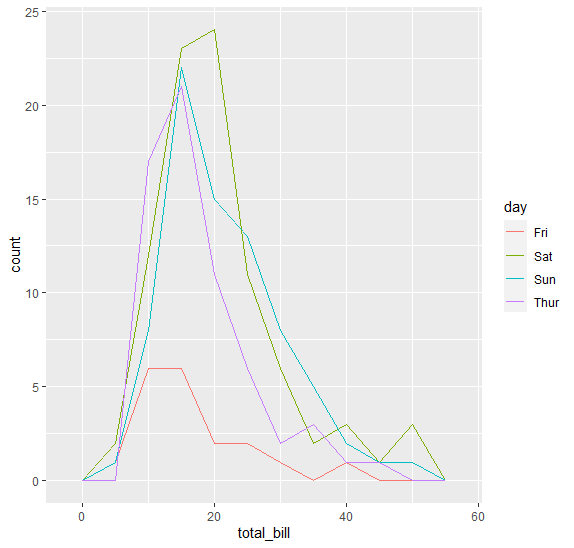

하지만, 요일별 observation 수가 다르기 때문에 정확한 비교가 어렵다. 위에서 그랬듯, 이런 경우 그래서 density로 바꿀 수 있다.


<br>

density로 바꾸었을 때는 면적을 1로 바꾸기 떄문에 observation수가 다르더라도 명확히 비교가 가능하다.

```r
ggplot(tips, aes(total_bill, colour=day)) +
  geom_density()
```
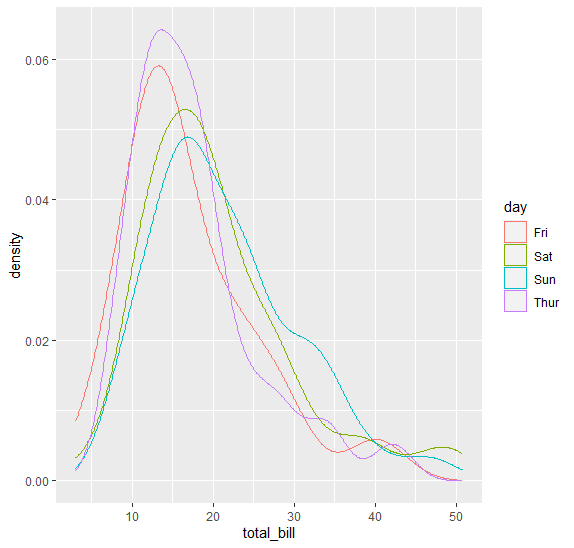

각 요일별 피크가 어느정도인지 분포를 명확히 알 수 있다


추가로 fill=day를 해주면 색깔 구분이 잘 되긴 하지만, 뒤에 가려진건 보이지 않기 때문에 alpha=를 해주면 색상에 투명도를 더해서 흐름을 볼 수 있다.

```r
ggplot(tips, aes(total_bill, colour=day, fill=day)) +
  geom_density(alpha=0.5)
```
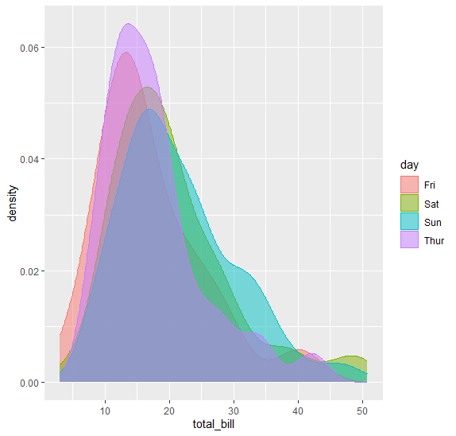


위에서 처럼 선만 그린 것 보단 조금 더 비교하기가 쉬운 상황이 될 수도 있다.

<br>


같은 것을 히스토그램을 살펴본다. color를 day로 잡아두면, 각 바를 요일별로 분할하여 선으로 표시해준다. 

```r
ggplot(tips, aes(total_bill, colour=day)) +
  geom_histogram()
```
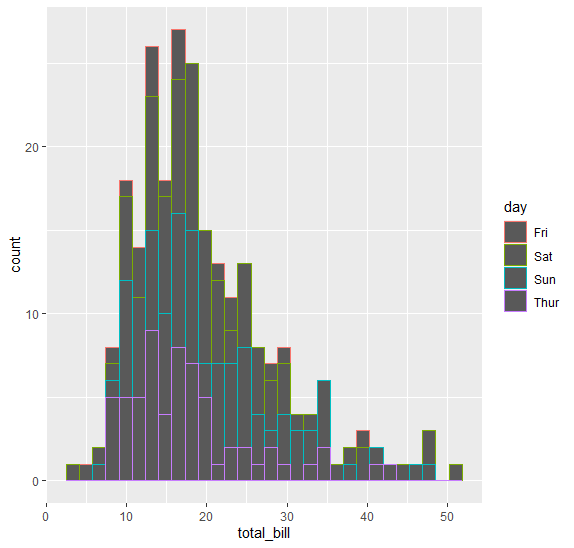


요일 순서대로 보인다. 점점 쌓아진 모습이다. 하지만 선이 잘 보이지 않고 복잡하기 때문에 역시 fill을 해주면 분포를 구분할 수 있다


```r
ggplot(tips, aes(total_bill, colour=day, fill=day)) +
  geom_histogram()
```

하지만, 오히려 분포가 가리기도 해서 차라리 facet_wrap으로 4개를 day기준으로 나누는 것도 방법이다.
```r
ggplot(tips, aes(total_bill, colour=day, fill=day)) +
  geom_histogram()+facet_wrap(~day)
```

근데 오히려 피크가 비슷할때는 헷갈릴 수도 있으니 ncol=1을 해주면 하나의 칼럼으로 만들어달라는 의미이기 때문에, 나란히 나열되기 때문에 4개 분포의 피크가 어디인지 알 수 있다.

```r
ggplot(tips, aes(total_bill, colour=day, fill=day)) +
  geom_histogram()+facet_wrap(~day,ncol=1)
```
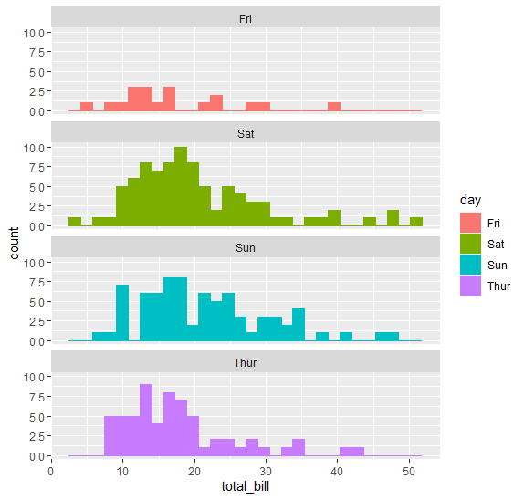


<br>

## 정리하자면..
<br>

히스토그램은 주로 연속형 변수의 분포를 시각화하기 위해 사용된다. 히스토그램은 이러한 연속형 데이터의 분포를 빈(bin) 단위로 나누어 각 빈에 속하는 데이터의 개수(빈도)를 막대로 표시하여 시각화할 수 있다.

<br>

히스토그램을 그냥 이어둔 것이 fre poly이다. 근데 sample size가 다른 경우 정확히 비교하지 못한다는 단점이 있다. 단순한 빈도수 기반의 frequency polygon은 왜곡된 비교를 초래하기 때문이다. 예를 들어, 한 그룹이 다른 그룹보다 표본 크기가 훨씬 크다면, 그 그룹의 빈도가 자연스럽게 높게 나타날 것이기 때문이다.

<br>
그래서, 그룹별 세부 분포를 비교해보고 싶다면, density를 통해서 보완가능하다. 왜냐? 각 그룹의 분포를 정규화하여 면적이 1이 되게 하므로, 표본 크기의 차이로 인한 왜곡 없이 여러 그룹의 분포를 공정하게 비교 가능하다. 즉, density는 표본 크기가 다른 여러 그룹의 분포를 정확하게 비교하며, 그룹 간의 차이나 유사성을 시각적으로 파악할 수 있음!


<br><br><br>
끝🙂

<br><br><br>