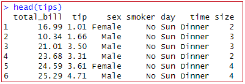

# visualization R ggplot2 
<br>

이전에는 하나의 연속형 변수를 그려보았다. 이번에는, 하나의 범주형 변수를 살펴보겠다.

<br>

## 범주형 변수

 범주형 변수(categorical variable)로 R에서 시각화 그래프를 그려보겠다. 범주형 변수는 두 개 이상의 범주나 레이블로 나뉘는 변수를 의미한다. 각 범주는 특정 그룹이나 분류를 나타내며, 숫자로 표시될 수 있지만, 수학적 의미는 딱히 없다!


범주형 변수는 크게 두 가지 유형으로 나누어질 수 있는데:


- 명목형 변수 (Nominal variable): 순서나 계급이 없는 범주형 변수로, 동물의 종류(고양이, 개, 말)나 사람들의 성별(남성, 여성)이 있다.


- 순서형 변수 (Ordinal variable): 범주들 사이에 순서나 계급이 있다. 예를 들면, 학점(A, B, C, D, F)나 설문조사에서의 응답(매우 동의, 동의, 중립, 반대, 매우 반대)등 이다.


데이터 분석이나 머신 러닝에서 범주형 변수를 사용할 때, 종종 '원-핫 인코딩' 같은 방법으로 숫자형 변수로 변환하여 모델에 입력값으로 사용하기도 한다~


<br>

## Data Intrdoction : ‘tips’ in R
<br>

>  [ggplot2](/notes/kr/R/Ch02_ggplot_2.md) <sub>👈 클릭</sub>


<br>

> 변수 설명
<br>




<br>

헤드로 tips data를 간단히 살펴보면 연속형도 있지만, sex, smoker, day, time은 연속형 변수인 것을 알 수 있다. 


> table(tips$time)


Dinner  Lunch 


   176     68 


서빙 시간의 디너와 런치 분포다. 이를 그림으로 표현해 보겠다.


<br>

## Bar chart
<br>
> geom_bar()


```r
ggplot(tips,aes(time))+geom_bar()
```


알파벳 순으로 디너가 먼저이기 때문에, 알파벳 순서대로 나온다.


요일별로 보고싶다면, aes에 time을 day로만 바꿔주면 된다.


```r
ggplot(tips,aes(day))+geom_bar()
```


time과 day를 살펴보니 대충 이 레스토랑은 주말에, 저녁에 사람이 많은 것으로 확인된다. 하지만 자료의 특성상 웨이터가 수집한 것이므로, 이 사람의 근무시간도 생각해보아야 한다(알 수 없지만 추측). 주말엔 풀타임일 수도 있고, smoke로 보면 non-smoke테이블에 더 많이 서빙을 했다. smoke 존이 적을 수도 있는 것이고, 웨이터가 non-smoke존을 포커스로 서빙하는 사람일 수도 있다. 즉, **자료가 얻어진 특성을 이해하는 것이 중요하다**


<br>

### 그래프 요일 순으로 정렬하기
<br>


> factor(levels=)

(!)다만, 알파벳 순으로 나오기 때문에 날짜별로 정렬하기는 어렵다. 그치만 날짜기 때문에 정렬을 해 주는게 좋겠지? 


```r
table(tips$day)
 Fri  Sat  Sun Thur 
  19   87   76   62 
```

변수를 살펴보면 위와 같고, 따로 데이 변수를 만들어서 순서를 정렬해보겠다. 정렬은 levels로 정의해준다.


```r
TipsDay <- data.frame(
  #데이 변수 만들기
  day = factor(c("Thur", "Fri", "Sat", "Sun"),
  #순서 정렬해주기
      levels=c("Thur", "Fri", "Sat", "Sun")),
  count=c(62, 19, 87, 76))


ggplot(TipsDay, aes(day, count)) + geom_bar(stat="identity")
```
<br>
이렇게 그리면 목금토일 순서로 나온다. 아까 그린 그림과 코드를 비교해보겠다


<br>


<br>

```r
ggplot(tips,aes(day))+geom_bar()
ggplot(TipsDay, aes(day, count)) + geom_bar(stat="identity")
```
<br>

첫번째의 경우, 변수  day를 가지고 테이블(x만) 가지고 바 차트를 그리는 거지만


이번에는 tipsday를 만들어서 넣었기 때문에 따로 계산을 할 필요가 없다. y에 count를 넣었기 때문에 각 범주마다 count대로 바를 채워준 것이다. 따로 테이블을 계산하지 말고 주어준 값(count) 그대로 그리라는 (stat="identity")를 표현한 것이다.

## scatter
<br>

사실, 궁금했던 것은 따로 날짜 순서별로 변수를 다시 만들어야하나? 였다. 변수가 많아지면 힘들텐데.. 범주형 변수의 순서를 지정하는 것에는 여러가지 방법이 있다고 한다.  


tips 데이터셋의 day 변수를 목-금-토-일 순서로 나열하고 싶다면, 다음과 같이 factor 함수를 사용할 수도  있다고 한다.


```r
tips$day <- factor(tips$day, levels = c("Thur", "Fri", "Sat", "Sun"))

ggplot(tips, aes(day)) + geom_bar()

```


<br>


## pie chart
<br>
> geom_pie() + corrd_polary()

전체 합이 100%가 되는 경우, 각 할당량을 알기 위한 경우에는 pie가 편리하다.


```r
ggplot(TipsDay,aes(x="", y=count, fill=day)) + geom_bar(stat="identity")
```

x변수는 없고 fill에 day를 넣어주면, 각각의 요일이 차지하는 부분을 할당량별로 알 수 있다.


x를 지정해주지 않았기 때문에 뭉뚱그려 나온다

<br>


여기서, + coord_polar("y") 를 해주면 y를 동그랗게 묶어주어 우리가 알고있는 pie 차트가 완성된다.


```r
ggplot(TipsDay,aes(x="", y=count, fill=day)) + geom_bar(stat="identity") + coord_polar("y")
```


<br>

다만, 파이 그림에서 토-일 요일이 비슷하게 보이고 정확히 구별이 안되기 때문에 명확하지 않다는 단점이 있다.
상황에 따라 그리기~


<br>

# 하나의 범주형 변수와 하나의 연속 변수
<br>

이번엔 하나는 범주형 변수고 하나는 연속 변수일 경우를 살펴보겠당! 이 때는, **각 범주별로 연속 변수의 분포를 비교하고 싶은 경우**일 것이다.
<br>

## Jittering
> geom_jitter

자료에 약간의 노이즈를 주는 것. 흩어지게 한다면 겹쳐지지 않아서 점들의 분포를 조금 자세히 볼 수 있다.


## Box plots
> geom_boxplot()

summary statistics이다. min, max, Q1, Q2, Q3를 가지고 상자를 그리고 중간 선은 Q2로 median을 그리는 상자이다. summary value를 가지고 그래프를 그릴 수 있다.


## Violin plots
> geom_violin()

각 y 값들을 binning 해서 연결하여 이어주는 기법이다. 

교수님께서는, 최근에는 박스 플롯과 바이올린 플롯을 같이 나타내는 것을 가장 좋아하시고 분포 등을 명확히 알 수 있는 가장 좋은 형태인 것 같다고 말씀하셨다.


## 하나의 범주형변수와 하나의 연속변수
<br>

1.산점도로 살펴보자.

```r
ggplot(tips, aes(day,tip))+geom_point()
```


간단한 분포를 파악할 수 있다. 하지만, 자료가 244개이고 연속분포이기 때문에 같은 수치의 경우 점들이 겹쳐서 찍혀보일 수도 있다. 이런 경우, 피해서 그리는 방법은 jitter겠다.


### jitter()
```r
ggplot(tips, aes(day,tip))+geom_jitter()
```


한 줄에 있던 것들을 흩어지게 하여 같은 tip에 대한 분포들을 자세히 볼 수 있다.


### boxplot()


```r
ggplot(tips, aes(day,tip))+geom_boxplot()
```


sunday가 중앙값이 젤 높고, thur이 낮고.. 등을 한 눈에 볼 수 있다.  outlier도 볼 수 있다


### violin()

```r
ggplot(tips, aes(day,tip))+geom_violin()
```


각 자료의 위치와 분포를 확실하게 알 수 있다.


 

### violin() + boxplot()


아까 말한 교수님이 요즘 제일 좋아한다는 분포.


```r
ggplot(tips, aes(day,tip))+geom_violin()+geom_boxplot()
ggplot(tips, aes(day,tip))+geom_violin()+geom_boxplot(width=0.5)
```


(width=0.5)를 써서 boxplot의 폭도 줄일 수 있다. 


thur의 경우, 아랫부분에 제일 넓게 퍼져있지만 중앙값도 제일 낮은 것을 확인할 수 있다. 
정확한 분포 위치를 같이 파악할 수 있기 떄문에 가장 좋은 것이 아닐까~


<br>

## 정리하자면..


여기까지, 범주형 변수에 대해 살펴보았다. 하나의 범주형 변수에는 bar, pie 등을 쓸 수 있다.

하나는 범주형 변수고 하나는 연속 변수일 경우, 각 범주별로 연속 변수의 분포를 비교하고 싶을 것이기 때문에
Jittering , Box plots, Violin plots 을 활용하여 분포들을 파악할 수 있다.


다음 챕터에서는, 두 개 이상의 연속변수와 범주형 변수를 보겠다.


<br><br><br>
끝🙂

