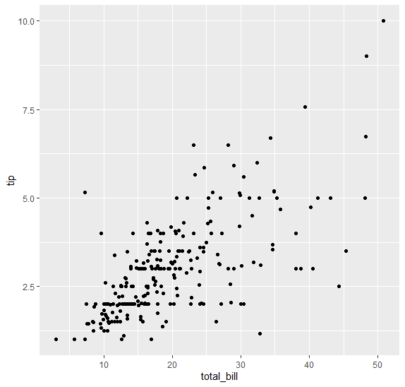
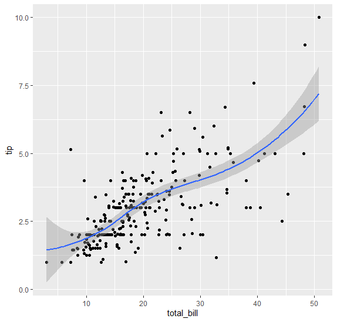
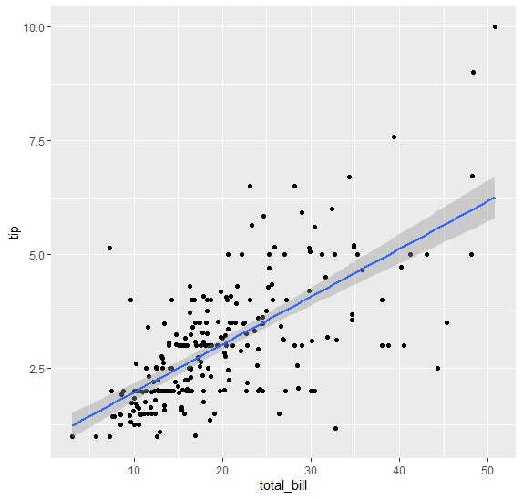
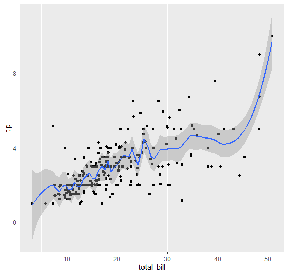
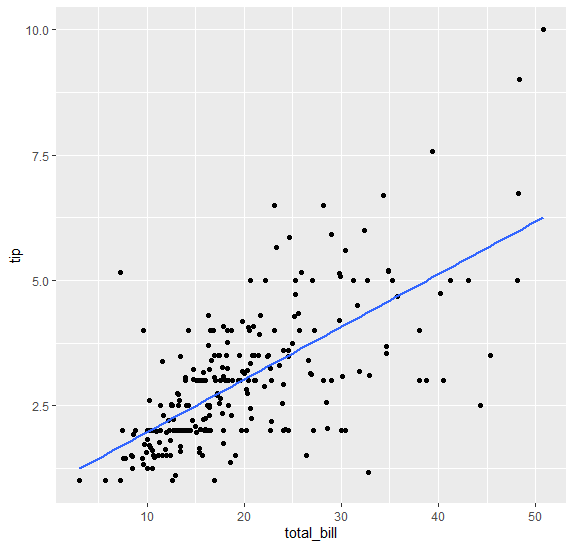

<br>

# 두 개의 연속 변수들

total bill과 tip의 관계를 알아보고자 한다.

```r
ggplot(tips,aes(total_bill,tip))+geom_point()
```


45불을 먹고도 팁을 2.5정도를 낼 수도 있고, 많은 만큼 많이 내기도 한다. 즉, 평균의 직선을 긋는다고 생각했을 때 그 아래쪽은 적은 팁을 낸 사람과 위 쪽은 많은 팁을 낸 사람으로 구분할 수 있을 것이다.


<br>

## smooth()

smooth line은 x 를 가장 잘 설명할 수 있는 y를 찾아주는 선이다. 


```r
ggplot(tips,aes(total_bill,tip))+geom_point()+geom_smooth()
```





log(x)라인이며 전반적으로 증가하며 평균 선이 생긴다.
이 평균 선을 둘러싼 회색 선은 standard error로, 주어진 자료가 많다면 에러가 적을 것이며 주어진 자료가 적다면 에러가 큰 모습을 띈다.

geom_smooth()를 썼을 때, 콘솔에는

'geom_smooth()' using method = 'loess' and formula = 'y ~ x'

이렇게 뜬다. loess는 default 메서드라는 의미이고, 어떤 방식으로 라인을 찾을지, 방법은 바꿀 수 있다.


회귀 직선 lm을 추가하면, 다음과 같은 직선으로 선이 생긴다. 

<br>

```r
ggplot(tips,aes(total_bill,tip))+geom_point()+geom_smooth(method="lm")
```



span 인자를 써서 로컬 회귀(LOESS: Locally Weighted Scatterplot Smoothing)를 사용할 때 데이터에 얼마나 많은 이웃이 영향을 주는지를 결정하는 파라미터를 결정할 수 있다.

<br>

```r
ggplot(tips,aes(total_bill,tip))+geom_point()+geom_smooth(span=0.1)
```



span의 값은 0에서 1 사이이고, span 값이 1에 가까울수록 더 부드러운 곡선을 생성한다. span 값이 0에 가까울수록 더 많은 국소적인 변동을 포착하는 곡선을 생성한다. 만약, 값이 0.1로 설정된 경우, 곡선은 많은 국소적인 변동을 포착하한다. 즉, 데이터에 더 가깝게 회귀선이 그려지고, 데이터의 노이즈를 더 많이 포착하게 된다.


어쨌든 다양한 span 값을 시도함으로써 데이터에 가장 잘 맞는 평활화 수준을 찾으면 된다.!


> span default: 0.75


만약, standard error를 없애고 싶다면 se=FALSE를 추가해주면 된다.


```r
ggplot(tips,aes(total_bill,tip))+geom_point()+geom_smooth(method="lm", se=FALSE)
```





`tip` 이런 옵션은 아래 코드로 보면 된다.


```r
?geom_smooth 
```


<br>


<br><br><br>
끝🙂
<br><br><br>