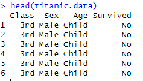
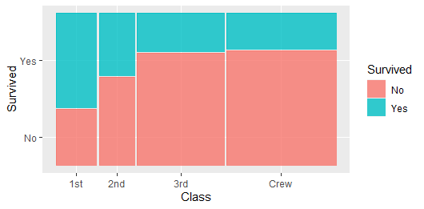
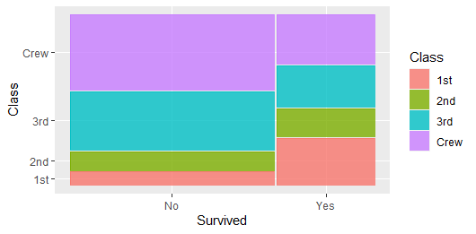
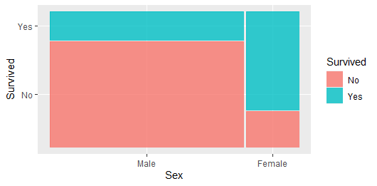

<br>

# 두 개의 범주형 변수


<br>


## Data Intrdoction : 'Titanic' in R


Titanic은 r에 내장된 함수이다. 타이타닉 데이터는 학습용으로 워낙 유명하니 생략하겠다. 승객들의 운명에 관한 정보를 담아둔 것 정도..


```r
data("Titanic")
Titanic
str(Titanic)
```

str(Titanic)로 변수를 확인해준다


> str(Titanic)
 'table' num [1:4, 1:2, 1:2, 1:2] 0 0 35 0 0 0 17 0 118 154 ...
 - attr(*, "dimnames")=List of 4
  ..$ Class   : chr [1:4] "1st" "2nd" "3rd" "Crew"
  ..$ Sex     : chr [1:2] "Male" "Female"
  ..$ Age     : chr [1:2] "Child" "Adult"
  ..$ Survived: chr [1:2] "No" "Yes"


4차원 테이블이다. 

## apply()

```r
apply(Titanic, 1, sum)
```
Titanic 데이터의 1번째 변수(Class)를 모두 sum을 하라는 의미이다. 따라서 클래스별 분포를 알 수 있는 것이다.


결과는 다음과 같다.

 1st  2nd  3rd Crew 

 325  285  706  885 


```r
apply(Titanic, 2, sum)
```
> apply(Titanic, 2, sum)
  Male Female 
  1731    470 


```r
apply(Titanic, 3, sum)
```
Child Adult 

  109  2092


```r
apply(Titanic, 4, sum)
```

    No  Yes 

1490  711


```r
apply(Titanic, c(1,4), sum)
apply(Titanic, c(2,4), sum)
apply(Titanic, c(3,4), sum)
```


각 클래스별 테이블을 합한 차원을 만들어준다. 


1번과 4번 테이블을 합친 것만 살짝 보자면, 다음 결과가 나온다.


      Survived

Class   No Yes

  1st  122 203

  2nd  167 118

  3rd  528 178

  Crew 673 212


## geom_mosaic


ggmosaic을 활용해보겠다. 당연히, 패키지가 없다면 설치해야한다.

mosaic() 함수는 범주형 변수들 간의 관계를 시각화하기 위한 모자이크 플롯(mosaic plot)을 생성하는 함수다. 모자이크 플롯은 테이블 내의 빈도나 비율에 따라 각 카테고리의 영역 크기를 조절하여, 두 개 이상의 범주형 변수 간의 관계를 시각적으로 표현할 수 있다.


```r
library(ggmosaic)
as.data.frame(Titanic)
Titanic.data<-as.data.frame(Titanic)
head(Titanic.data)
```




as.data.frame() 함수를 써주어 R에서 객체를 데이터 프레임(data frame) 형태로 변환한다.


Titanic 데이터셋은 table 형식이기 때문에, data.frame 객체로 변환한 것이다. 


특히, as.data.frame() 함수를 table 객체에 적용하면, 각 차원의 조합에 대한 빈도수를 나타내는 행으로 데이터 프레임이 생성된다. 이 때, "Freq"라는 열(column)이 자동으로 추가되어, 해당 조합의 빈도수를 나타내며, 마지막 칼럼으로 Freq가 붙게 된다.


### Q1. 탑승 클래스에 따라 survived가 어떻게 달라지는가?


이제 이 타이타닉 데이터를 가지고 그림을 그려보겠다. 범주형 데이터는 하나의 기준으로 세우고 그려야 한다.

```r
ggplot(Titanic.data)+geom_mosaic(aes(x=product(Class), weight=Freq, fill=Survived))
```

#### product()

보통 x에 Class를 쓰는데, 여기선 product에 넣어주었다. product() 함수는 여러 범주형 변수들을 결합하여 모자이크 플롯의 축을 구성하는 데 필요하다. 데이터 내의 여러 범주형 변수들을 곱하여 하나의 범주형 변수로 결합(combine)하고, 그 변수는 모자이크 플롯의 하나의 축으로 사용할 수 있게 된다.


그리고, 각 조합의 빈도(Freq)를 사용하여 모자이크 플롯의 각 영역의 크기를 결정하였다.




위 그림 처럼 Titanic 데이터에서 Class와 Sex 변수를 모자이크 플롯의 x축에 동시에 표현하고 싶기 때문에, x=product(Class, Sex)와 같은 방식으로 사용한 것이다. 이렇게 하면, x축은 Class와 Sex의 모든 조합을 포함하게 된다.

product() 함수를 사용하지 않고 단일 변수만을 지정하면, 모자이크 플롯은 해당 변수에 따라만 분할된다. 어쨌든.. 여러 변수를 동시에 고려하여 플롯을 생성하기 위해서 product() 함수를 사용하여 이 변수들을 결합한 것이다.


**전체를 100으로 봤을 때 x 축의 넓이는 1st, 2nd..등 class를 기준으로 포션이 나누어 진 것이다**


Class가 1일때, 2일때,.. survived의 분포인데,


! 조건을 반대로 해보겠다


```r
ggplot(Titanic.data)+geom_mosaic(aes(x=product(Survived), weight=Freq, fill=Class))
```




x축은 전체 yes와 no의 비율을 볼 수 있는데 더 많이 생존을 못한 것을 알 수 있고 그 안에서의 클래스별 비율을 알 수 있다. 


<br>

### Q2. 성별에 따라 survived가 어떻게 달라지는가?


```r
ggplot(Titanic.data)+geom_mosaic(aes(x=product(Sex), weight=Freq, fill=Survived))
```


성별이 주어졌을 때의 생존 비율.. 남자는 반 이상 살아남았구나..


이것 또한 Q1처럼 반대 조건으로 확인할 수도 있다.

```r
ggplot(Titanic.data)+geom_mosaic(aes(x=product(Survived), weight=Freq, fill=Sex))
```


<br>

### Q3. 나이(성인/아이)에 따라 survived가 어떻게 달라지는가?

```r
ggplot(Titanic.data)+geom_mosaic(aes(x=product(Age), weight=Freq, fill=Survived))
```


나이별로도 살펴볼 수 있다..


당연히 조건을 나누어 다르게 살펴볼 수도 있다.


```r
ggplot(Titanic.data)+geom_mosaic(aes(x=product(Survived), weight=Freq, fill=Age))
```

<br>


## 정리하자면


categorical, 범주형일 떄 특히 **variable이 2개** 일 때는 두 방향으로 조건을 나누어 볼 수 있고, 그 때마다 보여주는 정보는 다르기 때문에, 적절하게 사용할 필요가 있구나!


<br><br><br>
끝🙂
<br><br><br>