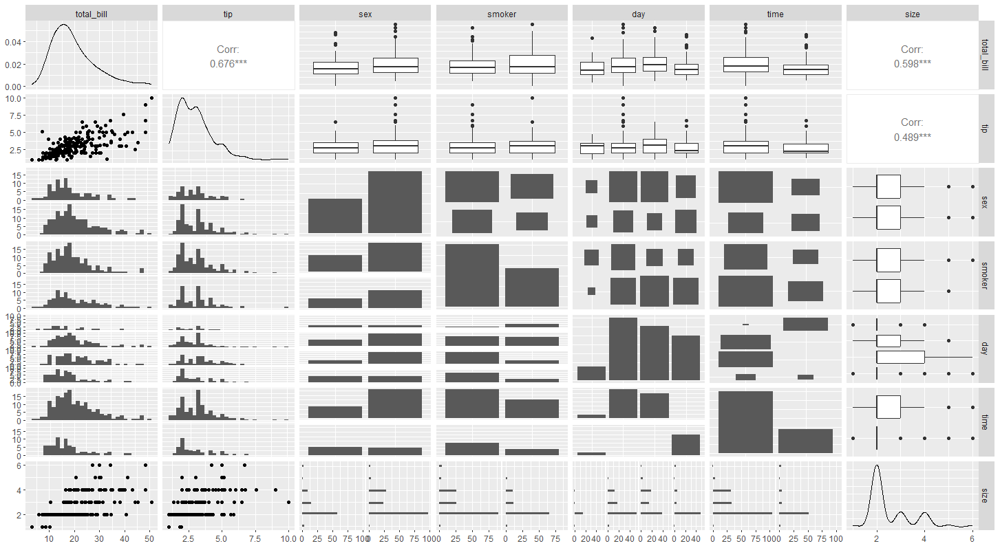
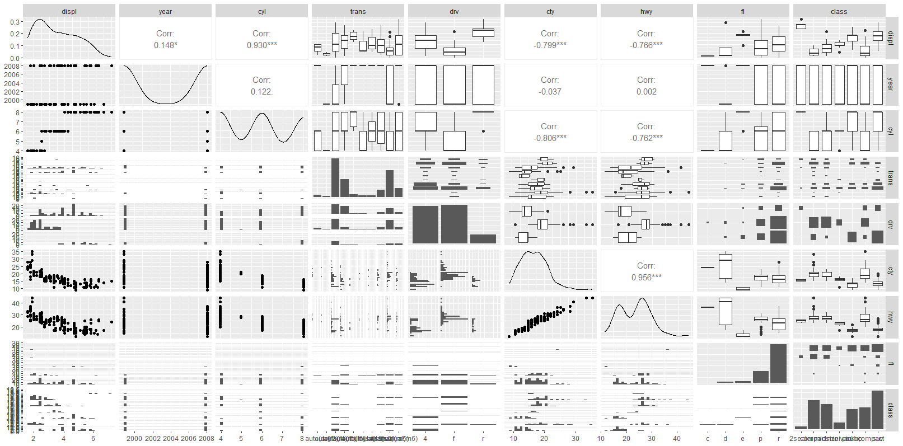

<br>

# 셋 이상의 변수들


매트릭스 형태로 그림을 그려준다. GGally를 쓰고, tips자료를 떠올려 보면 연속형 변수와 범주형 변수가 섞여있다. 이 변수들을 ggpair에 일단 넣어주면 다음과 같이 그릴 수 있다.


## ggpairs()


### tips

```r
library(GGally)
ggpairs(tips)
```





7x7의 매트릭스가 그려지고 대각선은 각 데이터의 분포를 의미한다. 연속형일 경우 density, 범주형일 경우 bar chart를 보여준다. 


연속형일 경우 산점도도 그려주고, 범주형일 경우 히스토로 쪼개서 그려주거나 box plot으로도 보여주는 것을 확인할 수 있다. 


두 개의 연속변수인 경우 correlation 값도 주고 있다. 


<br>


### mpg

앞서 봤던 mpg 자료도 ggpairs를 활용해서 다음과 같이 전체적인 자료를 살펴볼 수 있다.


```r
ggpairs(mpg[,-c(1:2)])
```





<br>


<br><br><br>
끝🙂
<br><br><br>