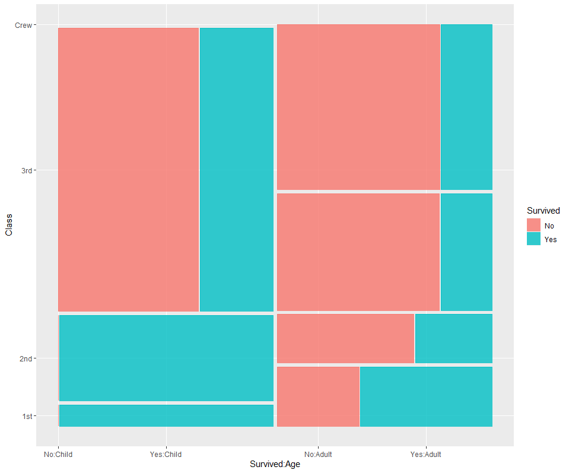
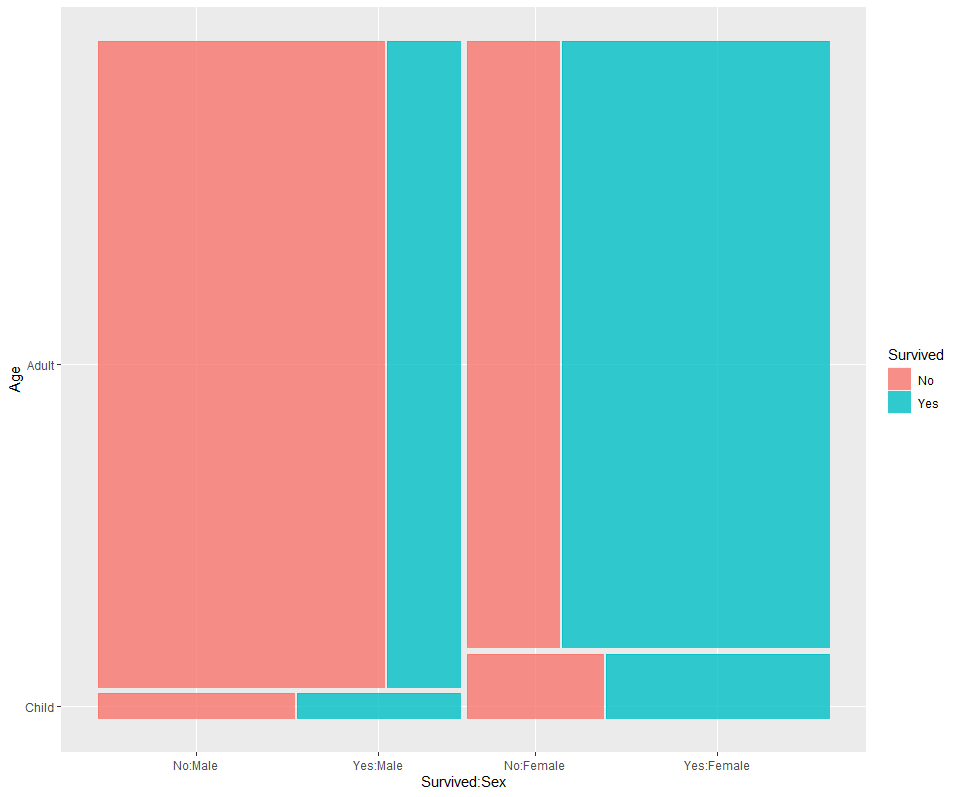
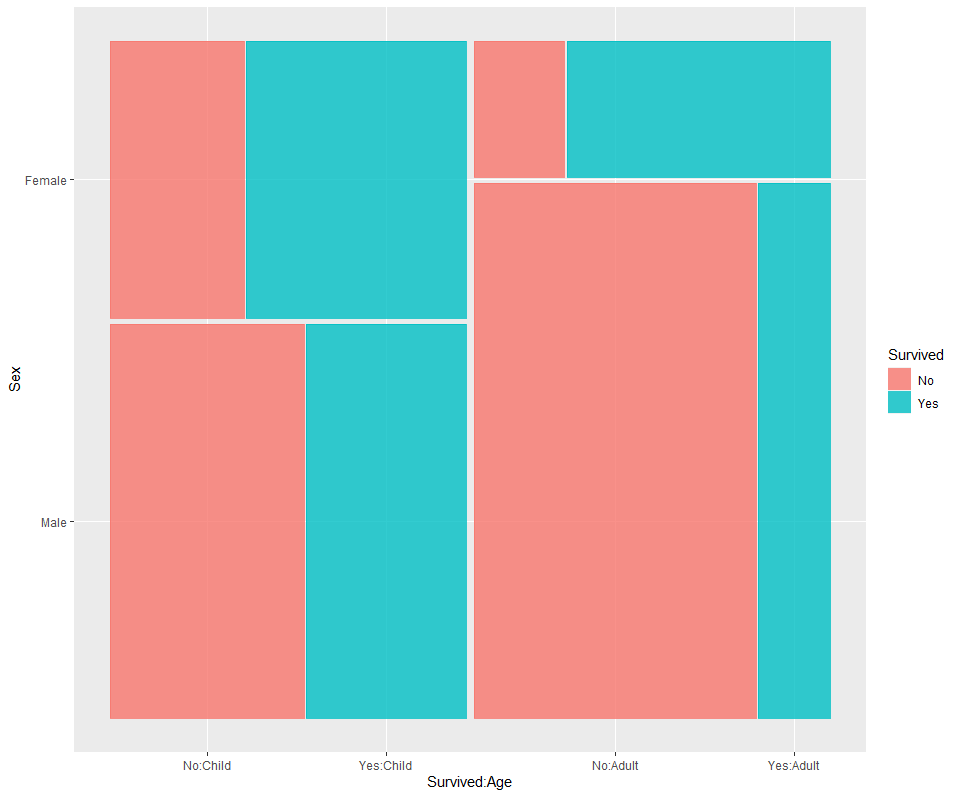
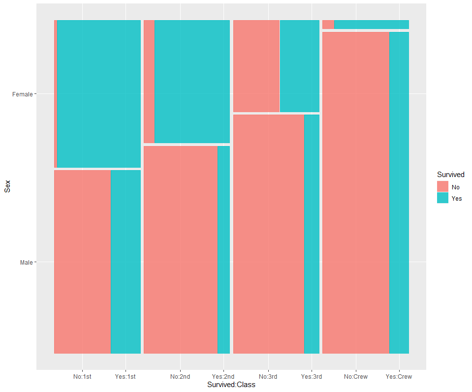
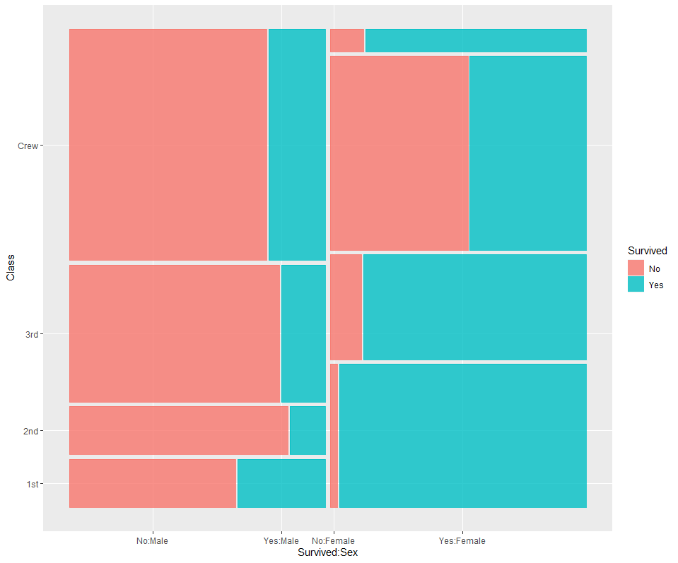

<br>

# 셋 이상의 범주형 변수


계속 살펴보던 R에 내장된 Titanic 데이터이다. 
참고 하려면 이전 포스팅을 봐야한다.


[Ch5.두 개의 범주형 변수](Ch05_ggplot_5.md)


<br>

### Age, Class, Survived


최종적으로 알고싶은 Survived를 fill로 두었다. 색상으로 비율을 알고 싶으니까. 그리고, 이전과는 다르게 conditions를 클래스로 둔다. 


> x와 conds는 모자이크 플롯 분할 순서와 방향을 결정하는데 중요하다.

```r
ggplot(Titanic.data)+geom_mosaic(aes(x=product(Age),conds=product(Class),weight=Freq,fill=Survived))
```


위 코드에서는 '연령별 -> 클래스별 순서'로 분할했다고 할 수 있다.


아까와는 달리 x가 같은 portion으로 나뉘었다. class가 같은 포션을 차지하지 않지만, geom_mosaic()에서 x와 conds의 특성 때문에 분할의 방향이 다르게 표현되었다. x=product(age)로 놓았음에도 y로 표현된 것이다.


x에 지정된 변수는 모자이크 플롯의 y축 방향으로 첫 번째 분할을 결정하고,
conds에 지정된 변수는 x축 방향으로 두 번째 분할을 수행한다.


코드를 조금 자세히 살펴보자..


```
1. x=product(Age): 모자이크 플롯의 x축을 Age 변수 (Child, Adult)로 구성
2. conds=product(Class): Age 카테고리 내에서 데이터를 Class 변수에 따라 더 세분화. 즉, Age의 각 카테고리 내에서 Class의 카테고리로 데이터가 분할됨.
3. weight=Freq: 각 조각의 크기를 결정하는 데 사용되는 가중치로, Freq (빈도) 값을 사용. 각 조각의 크기는 해당 조합의 빈도(Freq)에 비례.
4. fill=Survived: 이 aesthetic은 각 조각의 색상을 Survived 변수의 값에 따라 다르게 채움. 즉, 각 조각의 색상은 해당 조합의 생존 여부에 따라 다르게 표시
```


<br>

### Class, Age, Survived


Titanic 데이터에서, Class랑 Age를 바꿔보자. 이번에는 클래스별 -> 연령별로 분할이 된다.

```r
ggplot(Titanic.data)+geom_mosaic(aes(x=product(Class),conds=product(Age),weight=Freq,fill=Survived))
```




그럼, Age를 둘 로 나누고 그 안에서 Class를 나누게 된다. 


두 코드의 차이는 아래와 같이 정리할 수 있다.

```
첫 번째 코드 (x=product(Age), conds=product(Class))에서는:
Age가 y축 방향의 첫 번째 분할로 사용되고, Class가 x축 방향의 두 번째 분할로 사용.


두 번째 코드 (x=product(Class), conds=product(Age))에서는:
Class가 y축 방향의 첫 번째 분할로 사용되고,
Age가 x축 방향의 두 번째 분할로 사용.
```


<br>

### Age, Sex, Survived

```r
ggplot(Titanic.data)+geom_mosaic(aes(x=product(Age),conds=product(Sex),weight=Freq,fill=Survived))

```




성별로 나누고, 그 안에서 age별로 나누어졌다. 이번 데이터에서 child보다 adult에서 생존 확률이 높은 것을 볼 수 있다.


<br>

### Sex, Age, Survived


```r
ggplot(Titanic.data)+geom_mosaic(aes(x=product(Sex),conds=product(Age),weight=Freq,fill=Survived))

```



child내에서 male이 더 많고, 살아남은 경우는 femaile이 더 살아남았다.


<br>

### Sex, Class, Survived

이번엔 성별과 클래스의 관계를 보겠다.


```r
ggplot(Titanic.data)+geom_mosaic(aes(x=product(Sex),conds=product(Class),weight=Freq,fill=Survived))

```



각 클래스로 나누고 그 안에서 성별의 비율을 볼 수 있다.

1등석 여자는 거의다 살아남았고, 여자의 비율도 1등석이 더 많다.

남자의 생존확률은 비슷하다.


<br>

### Class, Sex, Survived

관계를 바꾸어보았다. 


```r
ggplot(Titanic.data)+geom_mosaic(aes(x=product(Class),conds=product(Sex),weight=Freq,fill=Survived))

```


남녀를 따로보면 남자 안에서는 1등석이 제일 많이, crew가 많이 살아남았다. 여자의 경우는 1등석이 제일 많이 살아남고 2등석과 crew가 많이 살아남은 것을 볼 수 있다.


<br>

## 정리하자면..

3개의 카테고리가 있을 경우 하나씩 컨디션을 주면서 살펴보고, 해석을 잘 해야한다. ㅠㅠㅠ


<br><br><br>
끝🙂
<br><br><br>