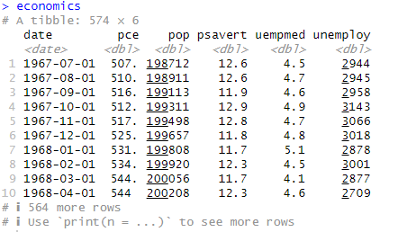
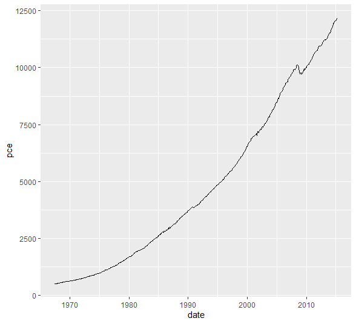
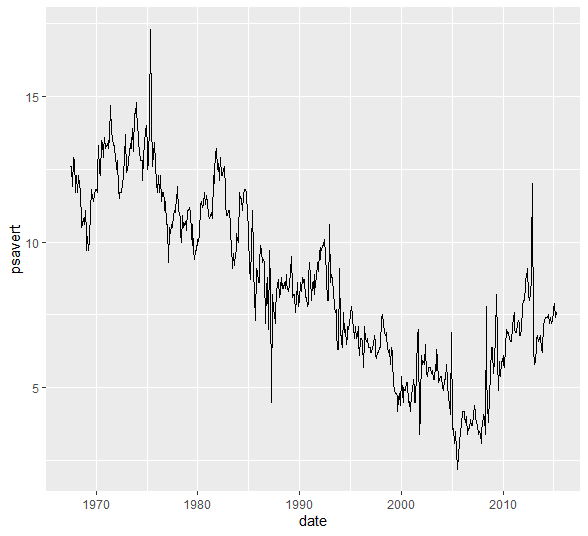
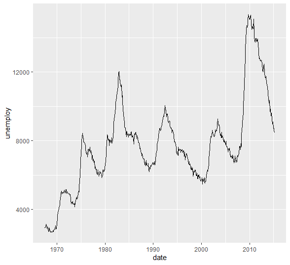
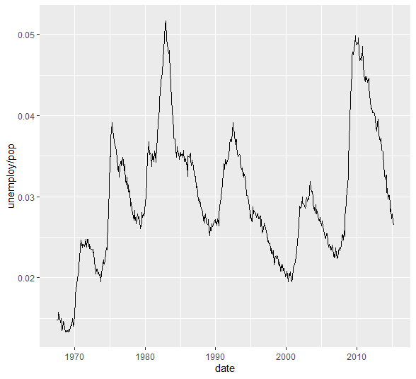
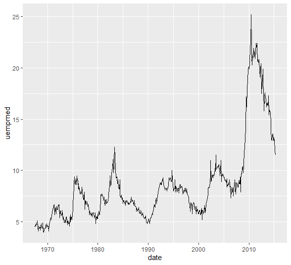

<br>

# 시계열 자료


<br>

## Data Intrdoction : 'economics' in R

<br>

ggplot2 library에 있는 1967년 10월부터 2014년 4월까지의 과거 40여년간 미국의 경제 상황에 대하여 조사한 월간자료이다.


변수는 다음과 같다

```
- date: 조사한 날짜(year-month-day)
- pce: 개인소비지출 (personal consumption expenditures, dolloars)
- pop: 전체 인구수 (total population, thousands)
- psavert: 개인 저축률 (personal savings rate)
- uempmed: 실업지속 기간의 중앙값 (median duration of unemployment, weeks)
- unemploy: 실업자 수 (number of unemployed, thousands)
```


자료를 보면 다음과 같다


```r
economics
```



## geom_line()

geom path()와 geom_line() 모두 선을 사용하여 데이터를 연결하는데 사용되지만, 주요 차이는 연결되는 데이터 포인트의 순서에 있다. geom_line()은 어떤 값을 주던 x 값의 순서대로 이어준다. 그래서 시계열 자료에서는 geom_line을 쓰는 것이 좋다 


## geom_line과 path의 차이

두 line과 path의 차이를 잠깐 보고 가자면,


- geom_path():
geom_path()는 데이터의 순서대로 포인트를 연결한다. 즉, 데이터 프레임에 나타나는 순서에 따라 포인트를 연결한다.
데이터가 특정 순서대로 주어진 경우(예: 시간 순서로 추적된 경로) 해당 순서에 따라 포인트를 연결하려면 geom_path()를 사용한다.


- geom_line():
geom_line()는 x 값에 따라 포인트를 연결한다. 이는 x 축 값을 기준으로 오름차순으로 포인트를 정렬하고 연결한다.
일반적인 시계열 데이터나 단순한 라인 플롯을 그릴 때 주로 사용된다.


<br>

### pce의 흐름


```r
ggplot(economics, aes(date, pce)) + geom_line()
```




date에 따라 pce(개인 소비 지출)은 점점 증가함을 알 수 있음.


<br>

### psavert의 흐름


```r
ggplot(economics, aes(date, psavert)) + geom_line()
```




psavert(개인 저축률)의 경우는 상황에 따라 왔다갔다 하는 것 같음.


<br>


### unemploy의 흐름


```r
ggplot(economics, aes(date, unemploy)) + geom_line()
```



실업자 수는 경제가 안좋을 때는 내려갔다가 좋으면 올라가는 번갈아가는 모습을 보인다. 실업자 수는 population도 확인해주면 좋다.


<br>

### unemploy의 흐름 + population


population의 흐름을 따로 ggplot(economics, aes(date, pop)) + geom_line() 코드로 보면, 상승세에 있는 것을 확인할 수 있다. 그래서 pop으로 나누어서 정확한 실업 비율을 확인할 수 있다.


```r
ggplot(economics, aes(date, unemploy / pop)) + geom_line()
```



실제로 해보면 비슷하지만, 다소 정확하게 확인 수 있다.


<br>

### unempmed의 흐름 + population


실업 지속 기간을 보면


```r
ggplot(economics, aes(date, uempmed)) + geom_line()
```




한달 평균의 중앙값인데, 최근이 될 수록 실업 지속기간이 좀 더 심각한 모습을 볼 수 있다.


<br><br><br>
끝🙂
<br><br><br>