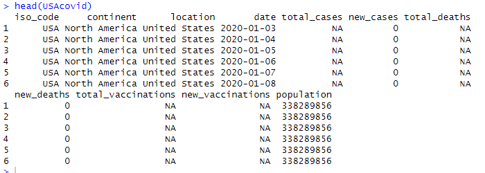
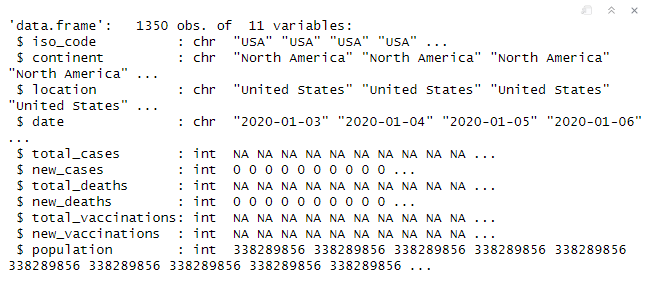
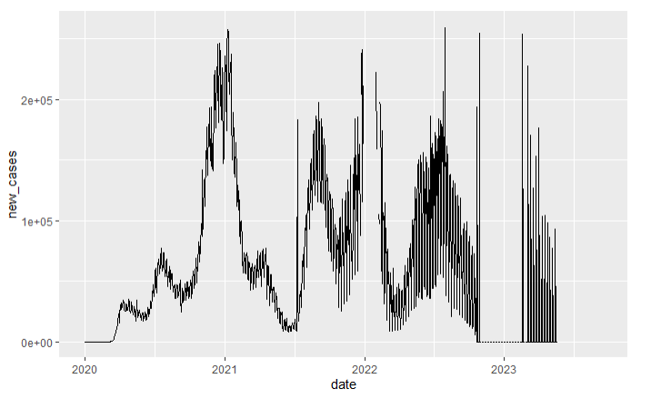
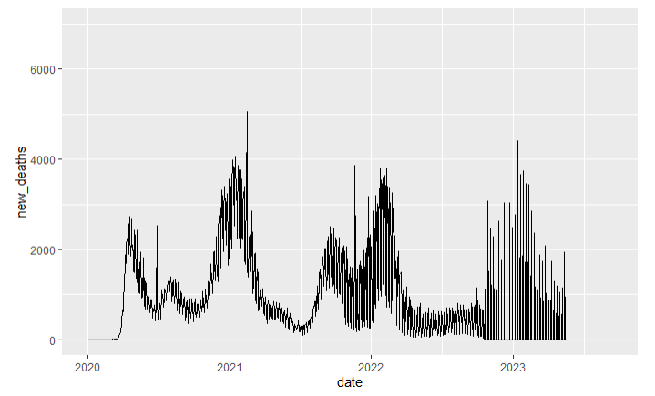
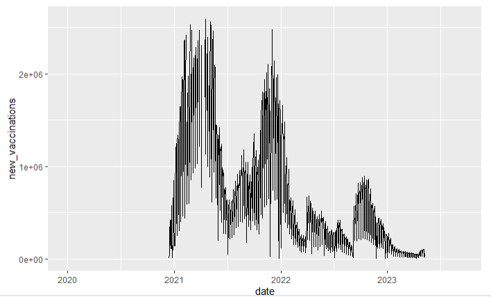
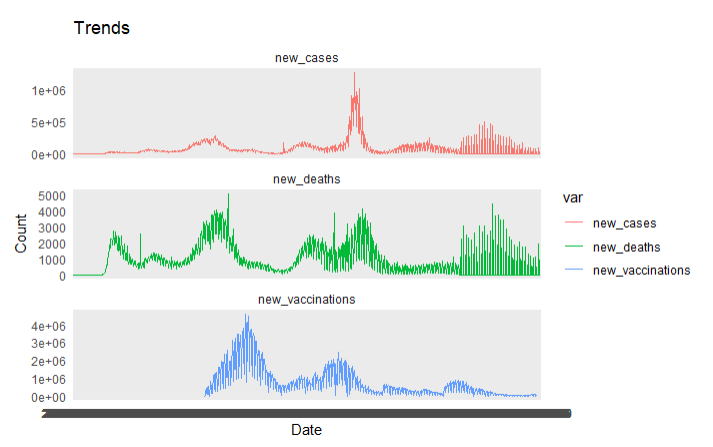
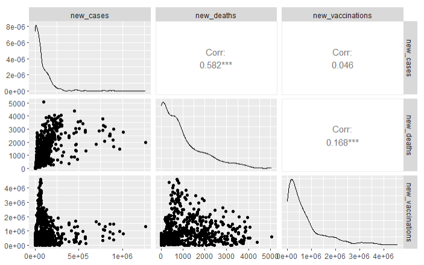

<br>

# Covid data 시계열 자료 활용하기


## 데이터 시각화

USAcovid 자료를 활용해보려고 한다.


### 헤드 확인




### 자료 개수

 nrow()로 확인해주니, 총 1350개이다


```r
nrow(USAcovid)
```


### 변수 및 타입 확인


```r
str(USAcovid)
```





위와 같이 11개의 변수가 있다.


### new_cases의 추이


date가 str이어서, as.Date로 변환시켰다.


```r
library(ggplot2)

USAcovid$date <- as.Date(USAcovid$date)

ggplot(USAcovid, aes(x = date, y = new_cases)) +
  geom_line() +
  xlim(as.Date("2020-01-03"), as.Date("2023-09-13")) +
  ylim(0,260000)
```





도출된 그림을 보니, 2020년 말에서 2021년 초에 new case가 폭발적이었고, 2022년 중반에도 case가 많았지만, 데이터가 들쑥날쑥한 것으로 보아 데이터 수집 방식의 변화가 있었을 것으로 예상된다.


### new_death 추이


```r
ggplot(USAcovid, aes(x = date, y = new_deaths)) +
  geom_line() +
  xlim(as.Date("2020-01-03"), as.Date("2023-09-13")) +
  ylim(0,7000)
```





new cases와 비슷하게 2020년 말에서 2021년 초 , 2022년 중반에 많은 사망이 있었다. 이 또한 2022년 말부터 현재까지는 데이터 수집 방식의 변화가 있었을 것으로 예상된다.


### new_vaccin 추이


```r
ggplot(USAcovid, aes(x = date, y = new_vaccinations)) +
  geom_line() +
  xlim(as.Date("2020-01-03"), as.Date("2023-09-13")) +
  ylim(0,2600000)
```





2021년 부터 백신을 맞거나 데이터가 수집되기 시작한 것으로 보인다.
초창기에 많이 맞았다가 2021년 말부터 2022년 초에 많은 접종이 이루어 진 것 같다.


### new cases, death, vaccin 추이함께 살펴보기


```r
death <- c(USAcovid$new_deaths)
case <- c(USAcovid$new_cases)
vaccin <- c(USAcovid$new_vaccinations)
dateAll <- rep(c(USAcovid$date), 3)

plot.USAcovid <- na.omit(plot.USAcovid)
plot.USAcovid <- plot.USAcovid[order(plot.USAcovid$date), ]

ggplot(plot.USAcovid, aes(x = date, y = value, color = var, group = var)) +
  geom_line() +
  facet_wrap(~ var, ncol = 1, scales = "free_y") +
  labs(title = "Trends", x = "Date", y = "Count") +
  theme_minimal()
```





2021년 초 백신 접종이 늘어난 이후 new cases,deaths는 감소한 것으로 보인다. 하지만 2022년 다시 코로나가 유행하고 감염과 사망수가 늘어난 것 같다. 또한 2022년 하반기부터 세 데이터 모두 요동치는 것으로 보아 수집 방식에 동일한 변화가 있었을 것으로 보인다(주별 카운팅)


### total_cases,total_deaths, total_vaccinations의 관계


```r
ggplot(plot.USAcovid, aes(x = date, y = value, color = var)) +
  geom_line() +
  labs(title = "Trends in USA", x = "Date", y = "Count") +
  theme_minimal() +
  scale_color_brewer(palette = "Set1")


library(GGally)
ggpairs(USAcovid[,c("date", "new_cases", "new_deaths", "new_vaccinations")])
```





특히 두드러지는 관계는 new_cases와 new_deaths의 상관계수는 0.582로, 양의 상관 관계로 확진자 수가 증가하면 사망자 수도 증가함을 알 수 있다. 


new_cases와 new_vaccinations의 상관계수는 -0.627로, 음의 상관 관계고, 백신 접종 수가 증가할수록 확진자 수가 감소하는 경향을 보이고 있다.


<br><br><br>
끝🙂
<br><br><br>