<br>

# group
<br>

## Data Intrdoction : 'Oxboys' data in R

Oxford에 있는 26명 소년에 대한 자료. 해당 소년들이 나이들면, 키가 크는지 보기 위하여 9번에 걸쳐 측정한 자료다. 


library(nlme)에 내장되어 있다.


> 변수

```
- Subject: 소년 ID
– age : 표준화된 나이 (-1 부터 1 의 값)
– height: 키(cm)
– Occasion: 키가 측정된 순서로, 1 은 가장 먼저 측정된 것,
9 는 마지막 측정을 나타는 범주형 변수
```


```r
library(nlme)
library(tidyverse)
data(Oxboys, package = "nlme")
head(Oxboys)
```

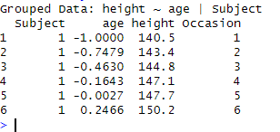


<br>

## Multiple groups, one aesthetic


ggplot에서 그룹 지정한 것과 그렇지 않은 것을 비교해보고자 한다. 이 자료에서 궁금한 것은 나이별로 키가 어떻게 변화하는지 궁금하다.

```r
ggplot(Oxboys, aes(age, height)) +
  geom_point() + geom_line()
```


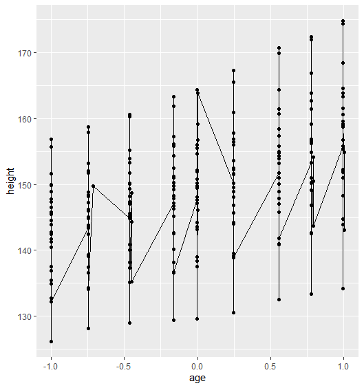


age별로 sorting해서 이어주고 있다. 여기서 소년 별로 알고 싶을 때, group 옵션을 사용하는 것이다.


이 때, group=subject로 각 아이들의 정보는 자신의 정보랑 묶일 수 있도록 지정해줄 수 있다. 


```r
ggplot(Oxboys, aes(age, height, group=Subject)) +
  geom_point() + geom_line()
```

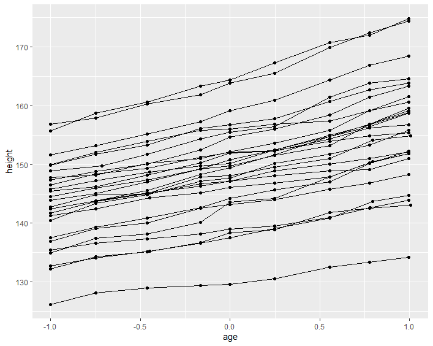


그럼, 각 id(아이들 개별)별로 라인이 연결된다. 그럼, 각 아이들 별로 세부적인 흐름을 살펴볼 수 있다. 


>point는 그룹별로 묶어지지 않지만 line은 묶인다.


여기서, group을 지정하지 않아도, subject를 **color**로 묶어버리면 또 그룹처럼 구분이 가능하기도 하다


```r
ggplot(Oxboys, aes(age, height, color=Subject)) +
  geom_point() + geom_line()
```

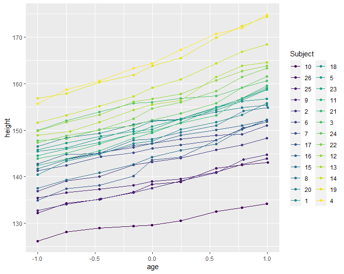


<br>

## Different groups on different layers
<br>


ggplot에서 지정한 aesthetic mapping은 그 이후에 추가하는 모든 레이어(layer)에 영향을 미친다. 즉, 데이터의 어떤 열을 색상으로 매핑하거나 크기로 매핑한 경우, 이 매핑은 그래프에 추가하는 모든 레이어에 적용된다.

그러나, 레이어 내에서도 aesthetic mapping을 지정할 수 있다. 레이어 내에서 지정된 aesthetic mapping은 해당 레이어 내에서 우선적으로 적용된다. 즉, 레이어 내에서 특정 열을 다른 색상으로 매핑하면, 이 매핑은 해당 레이어에만 적용되며, ggplot에서 지정한 전체적인 aesthetic mapping을 덮어쓸 수 있다.


이에 따라, **group = Subject 를 ggplot에서 지정한 경우와 geom_line에서 지정한 경우의 차이** 비교해보겠다.


```r
ggplot(Oxboys, aes(age, height, group = Subject)) +
  geom_line() +
  geom_smooth(method = "lm", se = FALSE)
```


regression을 활용해서 스무딩라인을 그린다. 파란색 선은 선형 회귀선(linear regression line)인데, 데이터 포인트들의 추세를 나타내며, 데이터에 가장 잘 적합하는 선형 모델을 표시하는 것이다.


그리고, 그룹을 ggplot에서 지정했기 때문에, 이후의 geom에 다 걸리게 됨. line도 sub, smoothing도 group별로 다 하게 된다. 


! 근데, 여기서 문제는, 모든 아이들의 최적선을 그리니 복잡하다는 것이다.


그래서, 전체 아이들 키의 최적선을 보고 싶으면 **group을 ggplot이 아닌 line에서 잡아주는 것이다.** 


```r
ggplot(Oxboys, aes(age, height)) +
  geom_line(aes(group = Subject)) +
  geom_smooth(method = "lm", linewidth = 2, se = FALSE)
```

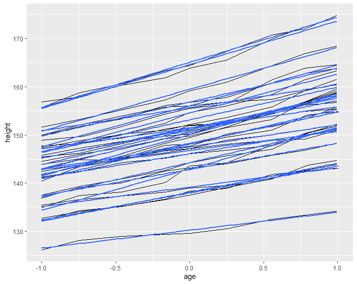


전체 아이들의 키 중에서 전체 패턴을 파악해서 최적선을 그리게 된다.


> se=false
```
lm 그리면 옆에 신뢰구간 뜨는데, 그거 뜨지 않게 하는 것임.
se 매개변수를 FALSE로 설정하는 것은 부트스트래핑(bootstrap)된 신뢰 구간(confidence interval)을 표시하지 않도록 하는 것을 의미함.
```


<br>

## Overriding the default grouping
<br>

상자그림 위에 Subject group별로 profile line 그리려고 한다. geom_boxplot()의 경우 x변수는 범주형 변수로 x변수가
group 으로 쓰이게 되며 x변수의 범주별로 상자그림을 그린다. 


occasion별로 상자를 그린다. occasion은 수치로 나와있지만 범주형 변수고 순서가 있는 레벨이다. 구래서 boxplot을 그린거다. x는 범주형이고 y는 연속형 변수다.


```r
ggplot(Oxboys, aes(Occasion, height)) +
  geom_boxplot()
```

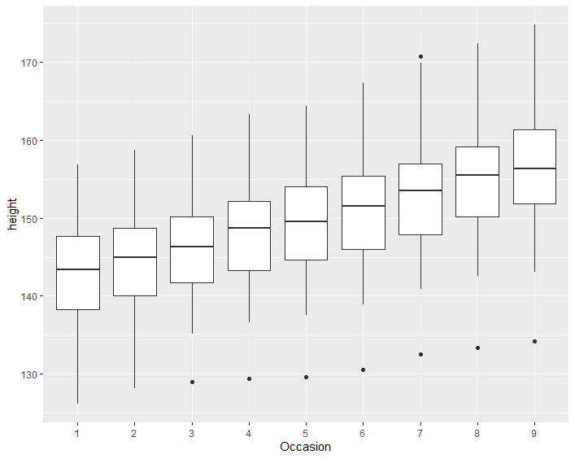


line을 그려주면, 길이가 길어지는데.. 색상과 alpha를 줘서 선을 나누어 본다. 어디까지가 상자그림 선인지, 라인으로 그린 선인지 보인다.

```r
ggplot(Oxboys, aes(Occasion, height)) +
  geom_boxplot()+geom_line(color="red", alpha=0.5)
```

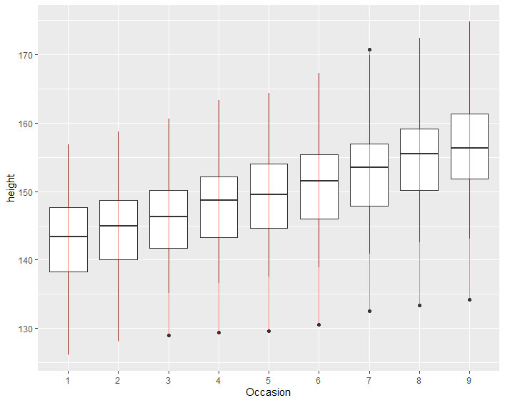


각 그룹별로 쪼개져서 occasion 범주별로 나누어서 그림을 그려졌다. line도 범주별로 지정이 된 건데.. 우리가 알고 싶은 것은 각 아이들 별로!!


그래서, 상자그림 위에 Subject별로 profile line을 상자그림 위에 그리기 위해서는 geom_line에서 따로 group = Subject 지정해야 한다.


```r
ggplot(Oxboys, aes(Occasion, height)) +
 geom_boxplot() +
 geom_line(aes(group = Subject))
```

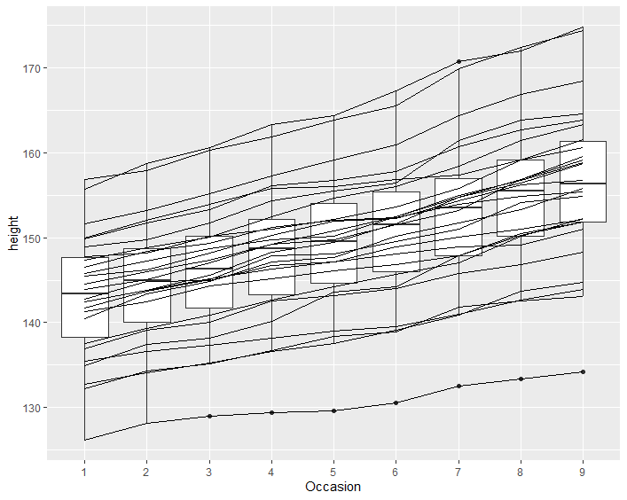

이렇게 하면 subject별로 묶여서 그림을 그리게 된다. 


<br>

## 범주형 변수의 group geom

<br>
범주형 변수로 놓는 경우, 그룹으로 잡혀서 작동하는 geom들이 있다. 박스플랏은 범주형 변수와 수치형 변수 사이의 관계를 탐색할 때 유용하게 쓸 수 있다. 


```r
ggplot(Oxboys, aes(Occasion, height)) +
  geom_line()
```


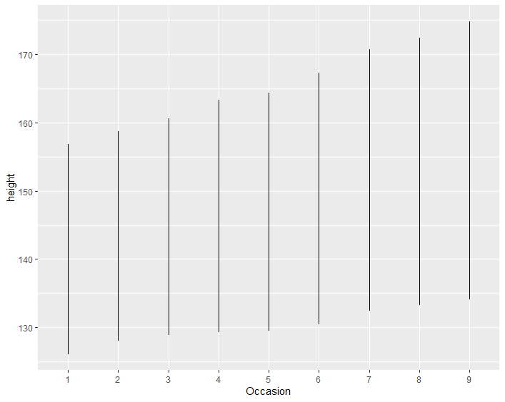


occasion을 하면, 범주별로 나눠서 선을 그린다.


```r
ggplot(Oxboys, aes(age, height)) +
  geom_line() 
```


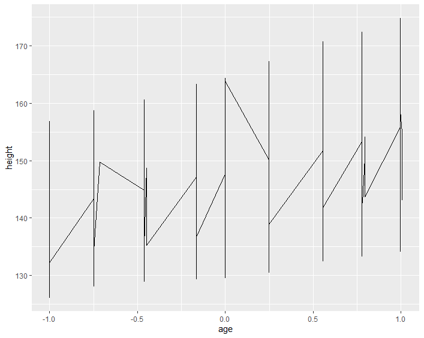


age와 heigth로 나누면, 라인별로 이어진다.


```r
ggplot(Oxboys, aes(age, height)) +
  geom_boxplot() 
```

박스플랏은 위에서도 언급했듯, 범주형 변수와 수치형 변수 사이의 관계를 탐색할 때 유용하게 쓸 수 있다. 그래서, age와 height는 연속형 변수이기 때문에 아래와 같은 에러가 뜬다. 

Warning message:

Continuous x aesthetic

ℹ did you forget `aes(group = ...)`? 


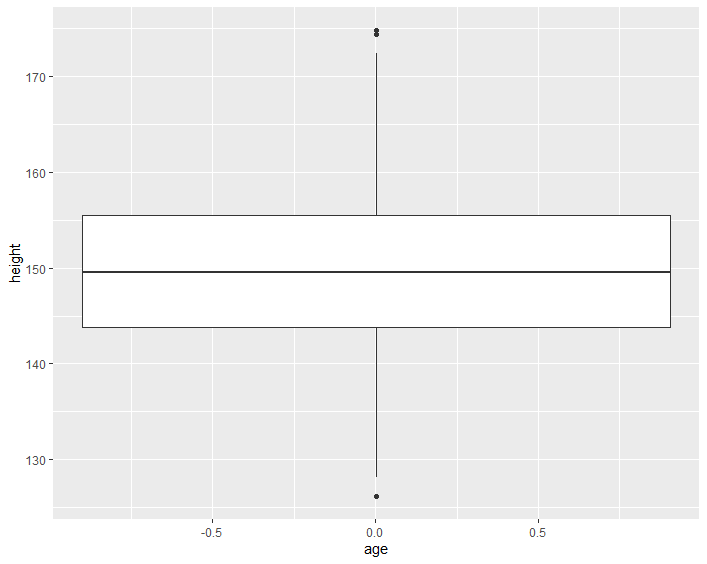


그리고 그림은, 전체 데이터에 대한 값을 boxplot으로 프린트 해준다.


Occasion별로 그룹을 하고, 상자 위치를 age위치에 둔다. 

```r
ggplot(Oxboys, aes(age, height)) +
  geom_boxplot(aes(group=Occasion)) 
```

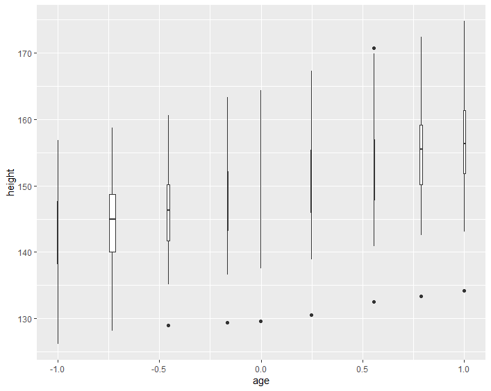


age의 폭만큼 박스의 폭이 그려져있다. 솔직히 이 그림은 잘 모르겠다 ㅋㅋㅋ age가 다른건가..? 시간 순이기 때문에 폭이 같아야하는거 아닌가 모르겠다. 


<br>

## Matching aesthetics to graphic objects
<br>


시각적 요소(예: 점, 선, 막대, 색상 등)와 데이터의 특성(예: 변수)을 연결하거나 매핑하는 과정을 통해 시각화 해본다. 이번에는 칼라가 어떻게 그룹별로 작동하는지 보려고 한다. 


```r
df <- data.frame(x = 1:3, y = 1:3, colour = c(1,3,5))
ggplot(df, aes(x, y, colour = factor(colour))) +
  geom_line(aes(group = 1), linewidth = 2) +
  geom_point(size = 5)
```


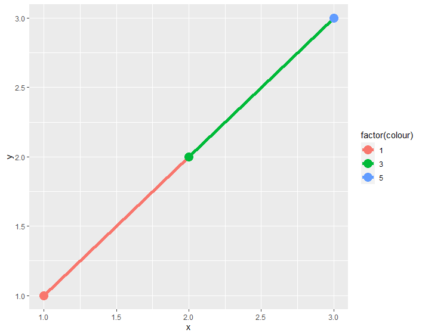


```r
ggplot(df, aes(x, y, colour = colour)) +
  geom_line(aes(group = 1), linewidth = 2) +
  geom_point(size = 5)
```


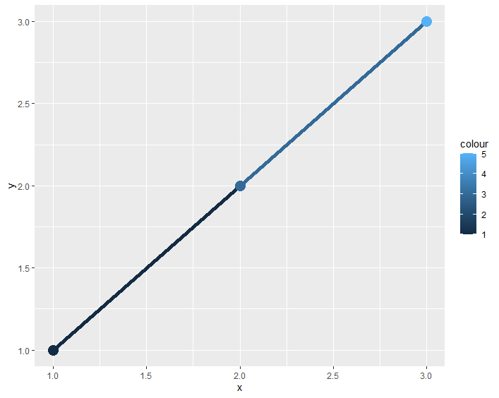


```r
```

```r
```


<br>

## Surface plots
<br>


공간 내에서 연속 변수들의 상호 작용을 시각적으로 표현하는 데 사용되는 그래픽 방법으로, 주로 3D 공간 내의 데이터를 나타내거나 시각화할 때 사용된다. Surface plot은 특히 두 개의 독립 변수(X와 Y)와 그에 따른 종속 변수(Z) 간의 관계를 보여주는 데 유용하다.


특히, 함수 시각화, GIS, 히트맵 등에 쓰일 수 있다. 

```r
```


```r
```


```r
```


```r
```


<br><br><br>
끝🙂
<br><br><br>