<br>

# Matching aesthetics to graphic objects
<br>


이전 ch12의 group에서 조금 더 나아가보는 것이다. 

graphic objects. 시각화 요소 point, line, bar등의 실제 그래픽 요소들의 "aesthetics"는 시각화의 요소와, 데이터 특성(x축 값, y축 값, 색상, 크기, 모양)을 맵핑해보겠다. 즉.. 특정 데이터 포인트의 값을 색상으로 표현하거나, 다른 변수의 값 점의 크기를 표현하는 것 들..?!


## factor()


그룹화의 또 다른 방법이다.


`colour`열을 만들고 c(1,3,5)의 값들을 할당한다. 벡터 생성 c()하여, 값은 (1, 3, 5)로 준다.


`factor(colour)`는 colour 열의 값을 factor로 변환한다. 그럼, 해당 값들이 범주형으로 취급되어서, 각 범주에 대해 다른 색상으로 할당한다. 만약, 변환하지 않는다면 연속변수형으로 그레디언트로 표현하게 됨.


```r
df <- data.frame(x = 1:3, y = 1:3, colour = c(1,3,5))
ggplot(df, aes(x, y, colour = factor(colour))) +
  geom_line(aes(group = 1), linewidth = 2) +
  geom_point(size = 5)
```


colour = factor(colour)로 인해 각 데이터 포인트 (1, 3, 5)는 별도의 범주(그룹)로 취급됩니다. 이 때문에 geom_line()만 사용하면 각각의 점은 별도의 그룹으로 인식되어 선으로 연결되지 않는다.


근데 `geom_line(aes(group = 1))`을 사용하여 모든 데이터 포인트를 하나의 그룹으로 묶어서 간주하게 만들어주면, 모든 데이터들을 동일한 그룹으로 묶게 되어 연속된 선을 그리게 된다. 즉. 데이터 포인트들을 하나의 그룹으로 간주하고 연결한다... 그룹을 묶은 것을 또 전체 그룹으로 묶는다. 이렇게 연속적으로 선이 그려지는 것이다. 


결론적으로, **factor(colour)로 개별적인 그룹을 형성한 후, group = 1을 사용해 이 개별 그룹들을 다시 전체적인 하나의 그룹으로 묶어서 선으로 연결**한 것이다.


```r
ggplot(df, aes(x, y, colour = colour)) +
  geom_line(aes(group = 1), linewidth = 2) +
  geom_point(size = 5)
```


이렇게 위 그림처럼.. factor로 잡지 않으면 범주형으로 안되기 때문에, 그룹지정이 안되고, scale로 잡고, 연속형으로 분류가 된다!


여기선 그룹이 안잡혀있어서 geom_line에 그룹지정을 해도 그룹이 없기 때문에 의미가 없다. 그래서, 삭제하여도 그림은 동일하다.


<br>

그룹이 어떻게 작동하는지 조금 더 살펴본다.

```r
ggplot(df, aes(x, y, colour = factor(colour))) +
  geom_line(linewidth = 2) +geom_point(size = 5)
```


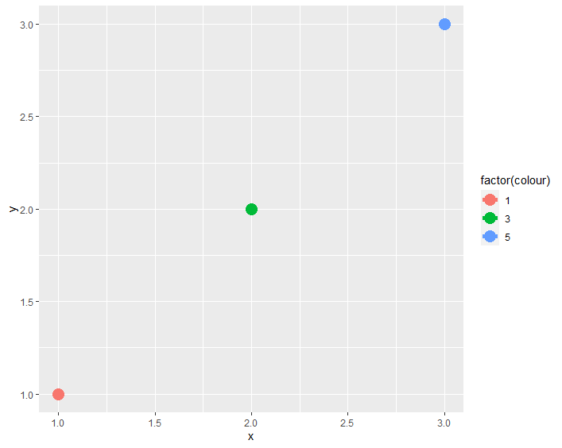

각 그룹의 observation이 하나고, geom_line에서 그룹을 지정하지 않았기 때문에 이어주는 선이 없다. 즉, 각 데이터 포인트를 별도의 그룹으로 인식하므로 선은 그려지지 않고, 대신 크기 5의 점들만 그려집니다.


조금 더 라인을 잘 보기 위해서..


```r
df1 <- data.frame(x = 1:6, y = 1:6, 
 colour = c(1,1,3,3,5,5))
ggplot(df1, aes(x, y, colour = factor(colour))) +
 geom_line(size = 2) + geom_point(size = 5)
```

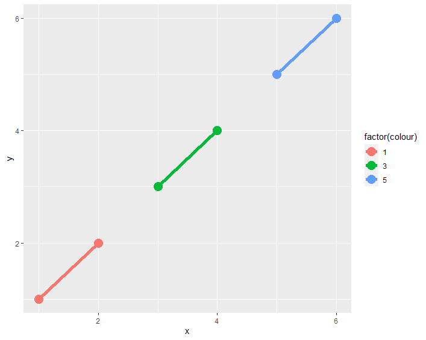


같은 칼라 범주끼리 묶어준당


또.. 정리하자면, colour = factor가 잡혀있다면, 

1. 그룹으로 잡아줌

2. 그룹별로 칼라를 잡아줌

3. 이후 geom에도 적용됨


<br>

## fill


bar chart에서 fill의 역할을 살펴본다. 이전에 보았던 mpg 자료에서 class의 bar chart 그려본다


```r
ggplot(mpg, aes(class)) +
 geom_bar()
```


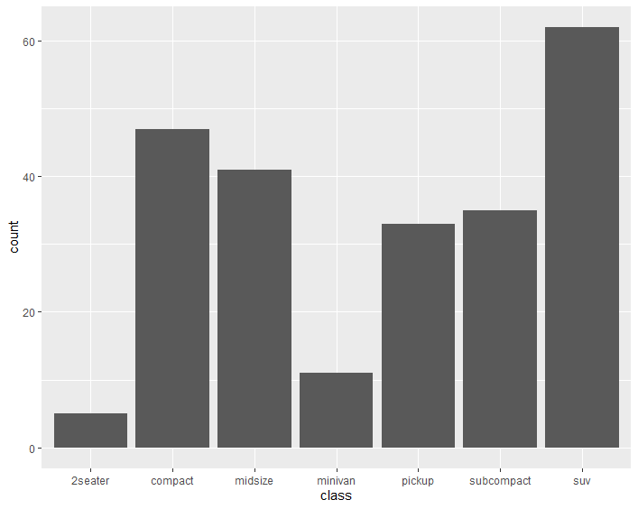


클래스별로 바차트가 생기고, 각 클래스별로 포션을 알고싶다면 fill=drv로 잡아본다


```r
ggplot(mpg, aes(class, fill = drv)) +
 geom_bar()
```


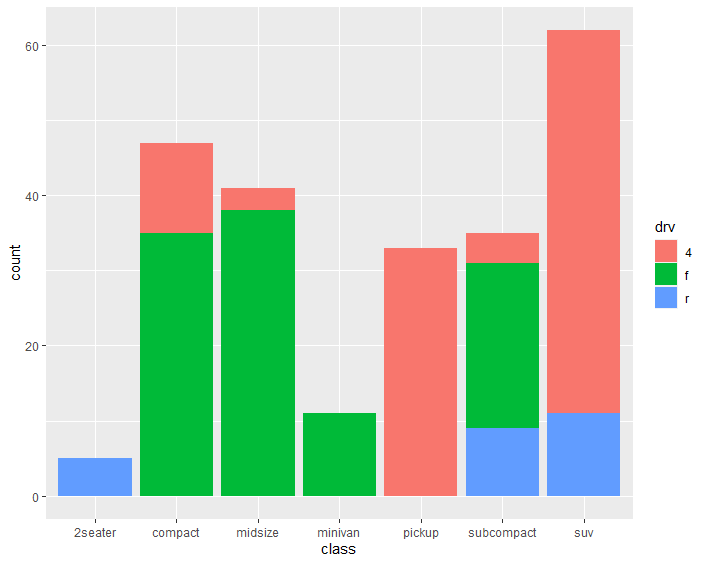


그러면 각 클래스 내에서 분포를 볼 수 있다. 그치만 단점은.. 어느정도인지 정확히 파악이 불가능하다.


<br>

### position


bar_chart에서 클래스 내에서 분포를 살펴보기 어렵기 때문에 옆으로 펼쳐서 보고 싶을 때 쓰는 옵션이 position이다.


```r
ggplot(mpg, aes(class))+geom_bar(aes(fill = drv), position="dodge")
```

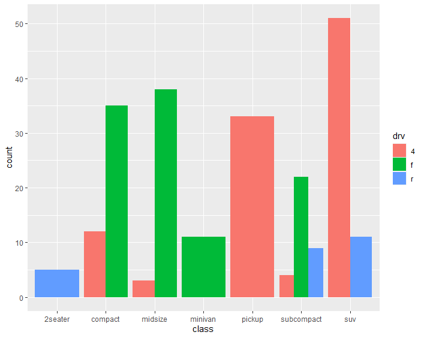


각 클래스 내에서 카테고리별 높이를 비교할 수 있다.


<br>

### theme 

theme를 활용해서 x 축의 레이블을 조정해본다. theme을 써서 그림의 세세한 부분을 바꿔줄 수 있다. 


text를 바꿀거라서, `element_text` 함수 안에서 지정해주면 된다. hjust는 오른쪽정렬이다. 오른쪽에 붙어있도록.


```r
ggplot(mpg, aes(class, fill = drv)) +
 geom_bar()+theme(axis.text.x=element_text(angle=45,hjust=1))
 ```

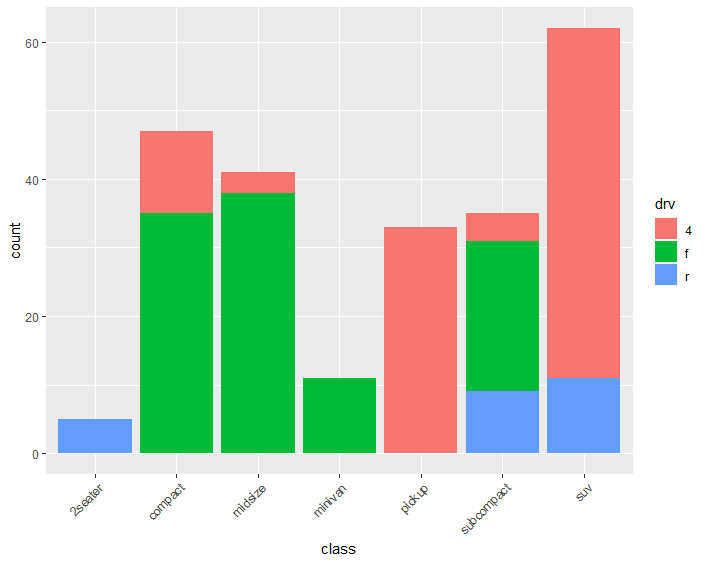


<br>

## Surface plots
<br>


3D 공간 내의 데이터를 나타내거나 시각화할 때 사용된다. Surface plot은 특히 두 개의 독립 변수(X와 Y)와 그에 따른 종속 변수(Z) 간의 관계를 보여주는 데 유용하며,  특히, 함수 시각화, GIS, 히트맵 등에 쓰일 수 있다. 


surface plot은 `persp()`, lattice 패키지의 `wireframe()` 함수 또는 rgl 패키지의 함수들을 사용하여 표면 그래프를 그릴 수 있다.


- geom_tile(): data point가 중앙에 오는 타일을 그려줌

- geom_raster(stat = "identity") : tile 의 크기가 모두 같게 조정

- geom_rect(): xmin, xmax, ymin, ymax 로 지정되는 tile 을 그려줌


<br>

### geom_tile

```r
df <- data.frame(
 x = c(6, 2, 12), 
 y = c(4, 8, 12), 
 label = c("a","b","c")
  )
p <- ggplot(df, aes(x, y, label = label)) +
 labs(x = NULL, y = NULL) 
```


```r
p + geom_tile() + ggtitle("tile")+geom_point(color="red")
```


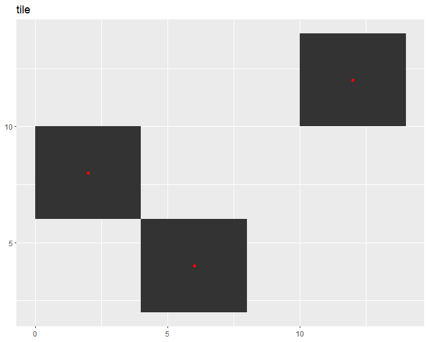


geom_tile을 쓰면 타일형태로 그려주고, point와 함께 쓸 수 있다. 


<br>

### geom_raster


```r
p + geom_raster() + ggtitle("raster")+geom_point(color="red")
```

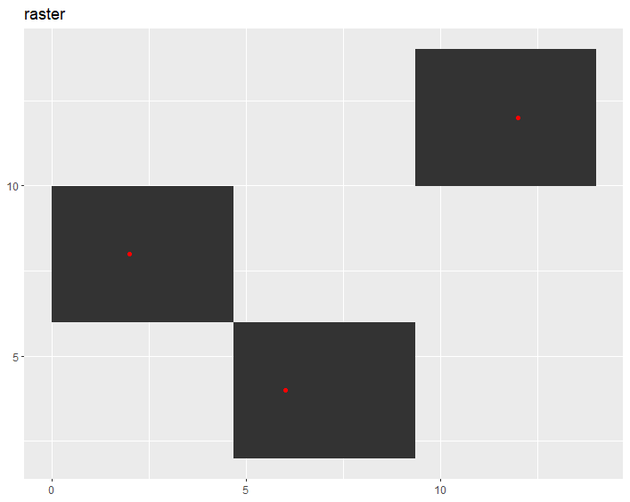


tile은 같은 모양의 타일을 붙인다면, raster는 x,y축을 다 채우려고 하는 특징이 있다.  


<br>

### geom_rect


```r
p + geom_rect(aes(xmin=2.5,xmax=10,ymin=4,ymax=8)) + ggtitle("rect")
```

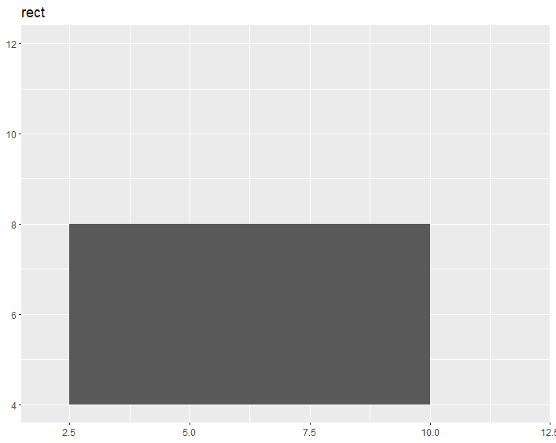


각 위치 잡아주고 네모로 칠해주는 것이다


<br>

## 세 가지 정보 함께 나타내기


r에 내장된 `faithfuld` 파일을 활용한다. eruption 관련 자료. 얼마나 기다렸을 때 eruption이 되는지에 대한 정보.. 대충 오래기다리면 eruption의 높이가 높은 모습을 띄는 자료다.

obs: 272 / col : 2 

<br>

### countour plot


`faithfuld`는 density를 계산해논거다.


x: eruption, y: wating일 때 density를 countour로 나타내려고 한다.


`after_stat` 통계 계산이 수행된 후의 결과 값을 참조할 때 쓴다. 


```r
ggplot(faithfuld, aes(eruptions, waiting)) +
 geom_contour(aes(z = density, colour = after_stat(level)))
```


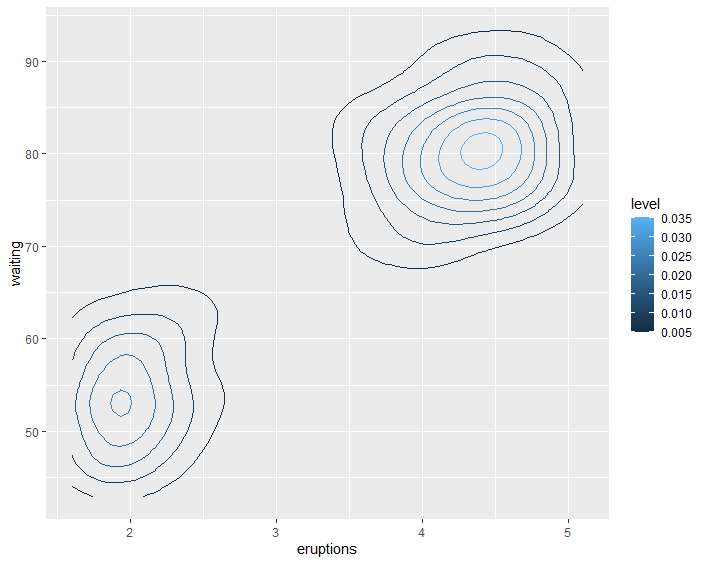


우리가 아는 countour나옴.. 웨이팅 짧으면 eruption 짧고.. 웨팅 길면 이럽션도 길다.. 색이 밝으면 레벨이 높고, 점점 색이 진해질수록 레벨이 낮다.


어느정도 분포가 모여있는? 형상이다.


#### raster로 그리기

이번엔, **raster** 로 그려본다. 이 경우는 자료 전체로 x, y를 다 커버하는 것


geom_raster(aes(fill = density)) 로 하면, density에 따라 색을 칠한다.

```r
ggplot(faithfuld, aes(eruptions, waiting)) +
 geom_raster(aes(fill = density))
```


웨이팅과 이럽션이 길수록 자료가 많은 분포를 보인다


<br>

#### 레이블 지정하기


레이블 데이터를 만들었다. 변수 이름은 동일하게 만들고 레이블을 peak one, two 로 만들었고, 위치를 지정해준것이다. 


```r
label <- data.frame(
 waiting = c(55, 80), 
 eruptions = c(2, 4.3), 
 label = c("peak one", "peak two")
)
ggplot(faithfuld, aes(waiting, eruptions)) +
 geom_raster(aes(fill = density)) +
 geom_label(data = label, aes(label = label))
```


> geom text로도 동일하게 가능함. 근데 글자도 잘 안보이고.. 머시깽.. label 쓰면 배경을 보여서 위치를 명확하게 잡아주는 차이 정도..?


<br>

### bubble plot


자료가 많아서, 1부터 n까지 10씩 건너띄면서 자료를 저장해서 small에 넣는다. size 덴서티를 넣어줘서, 덴서티가 높으면 size가 클것이다. 


View(small)로 보면, densitiy가 0에 가까운 경우가 많다. 이런 경우는 적게 만들고, 점들이 겹쳐서 잘 안보일 수 있기 때문에 알파를 두면, 점들이 어떻게 분포되어있는지 잘 볼 수 있다. 


`scale_size_area()` 로 실제 obs가 적은 점들을 없앤다.


```r
small <- faithfuld[seq(1, nrow(faithfuld), by = 10), ]

ggplot(small, aes(eruptions, waiting)) +
 geom_point(aes(size = density), alpha = 1/3) +
 scale_size_area()
```


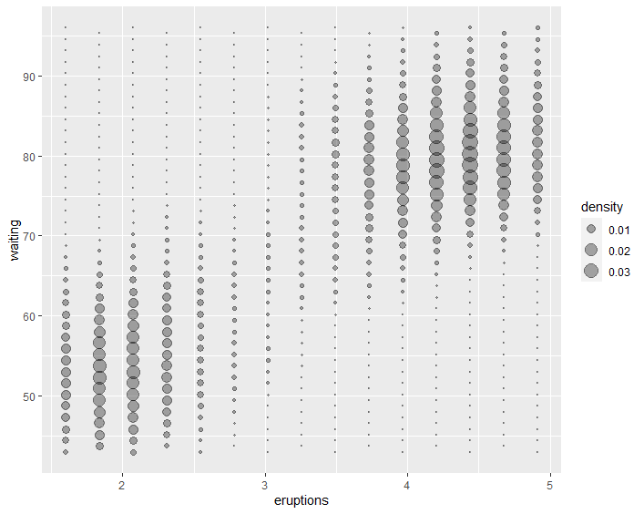


그럼, 0에 가까운 것은 작은 점으로 바뀌고 자료 분포를 좀 더 명확히 볼 수 있다


<br><br><br>
끝🙂
<br><br><br>