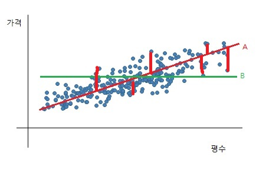

  

## 선형회귀의 기본 개념
선형회귀는 대표적인 알고리즘이다. 단순하면서도 유용하고, 다른 알고리즘의 기반이되기 때문에 완벽한 이해가 필요하다.
지도학습으로, 값을 찾아나가는 회귀유형이다.
종속 변수 하나와 독립(설명) 변수들 간의 관계를 수식으로 설명/예측하는 방법 

- x가 1일 때, y값은 3
- x가 2일 때, y값은 5
- x가 3일 때, y값은 7 

x의 값으로 4가 들어왔을 때, y값은 무엇일까?
y가 함수라고 가정했을 때, f(x) = 2x + 1라고 유추할 수 있다. 따라서, x가 4일 때는 9라는 y값을 가질 것이라고 생각할 것이다.

이러한 문제는 컴퓨터는 어떻게 유추할 수 있을까? 바로 선형 회귀분석(Linear Regression)을 통해서이다. x에 대한 y값을 알고 있을 때, 새로운 x값이 주어졌을 때 그에 대한 y값을 유추하는 것이다.

조금 쉽게 선형회귀가 쓰이는 예시를 들어보자, 집 값을 유추한다고 했을 때
- 10평일 때 1억,
- 20평일 때 5억,
- 30평일 때 9억 이라고 가정해보자
집의 평수는 x, 집 값은 y이다. 그렇다면, 40평이라는 x값이 주어졌을 때, 집 값은 얼마일까? 바로 y를 찾는 것이다.

  

## 선형 회귀 용어

좀전의 예시를 함수로 표현하자면 다음과 같이 표현할 수 있다.
y = a + bx , (a, b는 상수)

통계에서는 x: 독립(설명) 변수, y: 종속 변수로도 표현을 하고

- 목표 변수(target variable, output variable): 맞추려고 하는 값
- 입력 변수(input variable, feature): 맞추기 위해 사용하는 값

즉, x라는 속성을 통해 y의 값을 찾는 것이다
- x = 집 평수, y = 집 값
- x = 공부량, y = 성적
- x = 아빠 키, y = 아들 키
으로 표현할 수 있다

선형회귀는 지도학습으로 미리 데이터를 '학습'시킨다. 학습시킨 데이터에서 우리는 새로운 x값이 주어졌을 때, 가장 최적의 y를 찾아야 한다. 즉, 가지고 있는 데이터를 가장 잘 대변해주는 선, 최적선을 찾는 것이다. 

  

## 가설함수(Hypothesis function)
 

### 최적선(line of best fit)
어떤 선이 가장 집값을 잘 대변해줄 수 있는 선이라고 할 수 있을까?  A일까? B일까?

우리는 이렇게, 어떤 선이 최적의 선인지 알기 위해서 여러 선을 시험해볼 것이다. 

 

### 가설 함수란?
어떤 선이 가장 데이터를 잘 대변해주는지 시도하는 이 함수 하나하나를 가설함수(Hypothesis function)이라 부른다.
우리는 곡선이 아니라 linear! 선이기 때문에 1차함수가 되며 아까 2에서 언급하였던 y = a + bx로 표현할 수 있는 것이다.

결국, 선형 회귀의 입문은 계수 a와 b를 찾아내는 것이다
우리가 y=ax+b라고 표현을 하지만, 회귀에서 가설함수로 표현하자면 

$$
h(x) = \theta_{0} + \theta_{1}x
$$

로 표현할 수 있다. 입력변수 x 에 대한 함수이며, a와 b 대신  $\theta$ 를 써서 표현한다. 

Q. 왜 a와 b를 쓰지 않는 것일까..?
사실, 집 값, 키, 성적을 유추한다고 하였을 때, 한 가지 요소만이 영향을 미치는 것이 아닐 것이다. 집 값에는 평수 뿐만 아니라 위치, 층수, 연식 등이 있을 것이다. 키(height) 또한 아빠의 키 뿐만 아니라 아이의 수면, 영양 등이 영향을 미칠 것일텐데 모든 것을 a, b, c 로 표현하면 너무 많고 복잡하기 때문에  $\theta$ 를 써서 표현한다.

$$
h_{\theta}(x) = \theta_0 + \theta_1 x_1 + \theta_2 x_2 + \theta_3 x_3 + \ldots
$$

**Tip**: $h$는 $\theta$ 값에 따라 결정됩니다.

$$
h_{\theta}(x) = \theta_{0} + \theta_{1}x
$$

 

### $$ \hat{y} $$ 는 뭐야? 수학적으로 표현해보자!

---

> 위의 내용을 안다는 가정하에!

함수를 다음과 같이 나타낼 수도 있다.

$$ Y = f(X) + e $$

여기서,
- $$ f $$는 $$ X_1, \ldots, X_p $$에 대해 알려지지 않은 함수이고,
- $$ e $$는 랜덤 오차항(error term)이다.

함수 $$ f $$는 관찰된 점들을 기반으로 추정해야 한다. 오차항은 X와 독립적이고, 평균은 0이다. f는 X가 Y에 제공하는 체계적인 정보를 나타낸다.

통계학습은 $$ f $$를 예측 및 추론하는 과정이라고 할 수 있다.

---

> 예측

입력변수인 X는 우리가 손쉽게 획득할 수 있지만, 예측하고자 하는 Y는 그렇지 않을 수도 있다. 오차항은 평균이 0이므로, 다음과 같이 표현할 수 있다.

$$ \hat{y} = \hat{f}(x) $$

여기서,
- \(\hat{f}\)는 \(f\)에 대한 추정,
- \(\hat{Y}\)은 \(Y\)의 예측값을 나타낸다.

- $$ \hat{f} $$는 $$ f $$에 대한 추정,
- $$ \hat{Y} $$은 $$ Y $$의 예측값을 나타낸다.

Y에 대한 예측인 $$ \hat{Y} $$의 정확성은 reducible error와 irreducible error에 달려있다. 어차피, $$ \hat{f} $$은 완벽하게 추정하지 못하기 때문에 오차를 줄이는 것이 중요하기 때문이다. 오차를 축소하여 $$ f $$를 추정함으로써 $$ \hat{f} $$의 정확성을 높인다고 생각하면 된다.

---

> 수학적 상관관계 표현

하나의 설명변수 X를 기반으로 **양적 변수** Y를 예측하는 단순선형회귀는 X와 Y사이에 선형적 상관관계가 있다고 여긴다.

수학적으로는 다음과 같이 표현할 수 있다:

$$ Y \approx \beta_0 + \beta_1 X $$

$$ \approx $$ 기호는, approximate로 **대략**의 의미를 가지고 있다. 베타는 우리가 앞서 보았던 y=ax+b, 세타와 비슷하다고 생각하면 된다. 베타는 알려지지 않은 상수로 절편과 기울기를 나타내며, 모델 계수 또는 파라미터라고 부른다.

  

## RSS와 MSE 간단 정리
회귀 분석에서 모델의 적합도를 평가하기 위해 사용되는 지표 RSS(Residual Sum of Squares)와 MSE(Mean Squared Error)를 살펴보고자 한다. 두 지표는 오차의 제곱에 관련된 것이지만, 계산 방식과 의미에는 약간의 차이가 있다

- RSS는 모든 예측 오차의 제곱합을 나타내며, 데이터 포인트의 수에 따라 그 크기가 달라질 수 있다.

- MSE는 이 오차의 평균을 나타낸다다. 따라서 데이터 포인트의 수와 독립적이며, 다양한 모델 또는 데이터셋 간의 성능을 비교하는 데 더 유용하다.

간단히 말하면, **RSS는 제곱 오차의 총합**을 나타내고, **MSE는 제곱 오차의 평균**을 나타낸다. 즉, MSE는 "잔차의 제곱의 합(RSS)을 데이터 포인트의 개수로 나눈 것"이다. 

RSS = 
$$ \sum_{i=1}^{n} (y_i - \hat{y}_i)^2 $$

MSE = 
$$ \frac{1}{n} \sum_{i=1}^{n} (y_i - \hat{y}_i)^2 $$

 

### 잔차 제곱 합(RSS)

 
RSS = 
$$ \sum_{i=1}^{n} (y_i - \hat{y}_i)^2 $$

앞에서 보았듯, 햇(^)표시가 있는 것은 예측값이다. 실제관측값에서 예측값을 뺀 것의 제곱 합을 한 것이 RSS이다. 

 

#### RSS? 어디에 쓰냐?

1.모델 적합도의 척도로서의 RSS:

회귀 모델을 데이터에 적합시키려면 어떤 기준에 따라 모델의 파라미터를 추정해야 한다. RSS는 이러한 기준 중 하나로, 모델의 예측값과 실제 값 사이의 차이를 측정하는 척도이다.

- 모델이 데이터에 잘 맞다면?!

  --> RSS는 작아질 것!

- 모델이 데이터에 잘 맞지 않다면?!

  --> RSS는 커질 것! 

2.최소제곱법 (Least Squares):

RSS를 최소화하는 파라미터(or coefficient)를 찾는 방법을 '최소제곱법'이라한다. 앞에서 배운 다양하게 표현된 세타, 베타, a,b를 구하는 것이다.

최소제곱법을 사용하여 파라미터를 추정하면, 그 결과로 나온 모델은 데이터에 대한 잔차의 제곱합 (즉, RSS)를 최소화하는 특성을 갖게 된다.

3.모델 비교:

다양한 회귀 모델 중 어느 것이 데이터에 더 잘 맞는지 비교할 때 RSS를 사용할 수도 있다. 단순한 선형 모델과 복잡한 다항식 모델을 비교한다고 가정한다면, (1. 모델적합도에서 말했듯) RSS가 낮은 모델은 그 데이터에 대해 더 좋은 적합도를 보인다고 할 수 있다.

4.과적합의 위험:

!! 그러나 모델의 복잡도가 증가하면 RSS는 자연스럽게 감소하는 경향이 있다. 이는 복잡한 모델이 훈련 데이터의 노이즈까지 캡쳐하기 때문이다.

따라서 RSS만을 기준으로 모델을 선택하면 과적합의 위험이 있고,
RSS는 회귀 분석에서 중요한 척도지만, 모델 선택에 있어서는 다양한 검증법이 고려되어야 함은 분명하다.

 

### 평균 제곱 오차(MSE)
상세히 설명하자면, 평균 제곱 오차(Mean Squared Error)는 데이터와 가설함수가 얼마나 떨어져있는지를 나타내는 표현이다. 즉, 각 데이터의 실제 값과 데이터가 예측하는 값이 차이가 난다. 

최적선은 A인 것 같은데, A라고 가설을 세웠지만 실제 값들은 선들과 일치하지 않고 떨어져 있는 경우들이 있다. 이러한 경우 예측값에서 실제값을 빼게 되는데, 1.에서 예로 들었던 것과 같이 x=20평일 때 y=5억 이라는 데이터를 학습시켰으나, 선형 최적선은 20평일 때 4.5억으로 예측을 한다면 -5천만원이라는 오차가 생기게 된다. 추가적으로 30평일 때 8억이라고 예측했으나, 9억이라는 데이터를 가지고 있다면 +1억이라는 오차가 생기게 된다. 

이렇게 오차들을 제곱하여 더해서 데이터 수(n)개로 나눈 값을 평균 제곱 오차라고 한다. 데이터가 많겠지만 2개만으로 예시를 든다면

MSE = 
$$ \frac{{(-5)^2 + 1^2}}{2} $$

값이 된다. 
즉, MSE가 크다는 것은 실제 데이터와 예측값의 오차가 크다는 것이고, 가설 함수는 데이터를 잘 표현하지 못한 것이라 할 수 있다.

비용(cost)에 대해 오차가 음수일 때와 양수일 때가 있기 때문에 동일하게 간주해야하기 때문이다. 그런데! 절대값이 아닌 제곱을 이용하는 이유는, 가설이 잘못되었을 경우 패널티를 더욱 강하게 주기 때문에, 학습에 효율적이라고 여긴다. 컴퓨터의 입장에서는 연산속도가 느려질 수 있기 때문에 최소제곱법을 사용하여 오차의 제곱을 더해주는 것이다.

>tip. 전체적으로 '오차'들의 평균은 대략 0이다.

  

## 평균 제곱 오차의 일반화

방금 이야기 한 MSE의 식을 수학적으로 표현하면 다음과 같다.

$$
MSE = \frac{1}{m} \sum_{i=1}^{m} \left( h_{\theta}(x^{(i)}) - y^{(i)} \right)^2
$$

h는 가설함수 이며, x는 인풋, y는 아웃풋이다.
i번째 인풋(집의 크기)의 예측값에서 y의 i번째 데이터, 즉 실제 집 값을 뺀 값에 제곱을 한 것이다.
시그마는 i부터 m번까지 반복적으로 대입하는 것이므로, 총 데이터의 양이라고 생각하면 된다.
데이터가 15개가 있다면 i=1, m=15가 되겠다. 그리고 이 오차 값들의 제곱을 더한 후, 평균값을 구하기 위해 제곱 값에 1/m을 해주면 된다.
이러한 방식으로 평균 제곱 오차를 구할 수 있다.

  

## 손실함수(Loss Function) 

 

### MSE를 통한 가설 평가
최적선을 찾기위해서는 가장 데이터를 잘 대변하는 선을 구하게 되는, 가설함수를 시도한다는 것을 배웠다.
당연히 가설을 세우면 평가 기준이 필요하다. 선형 회귀에서는 방금 배운 MSE를 기준으로 평가하게 된다.

오차를 나타내기 때문에, 당연히
평균 제곱 오차가 크다: 가설 함수가 데이터에 잘 맞지 않다
평균 제곱 오차가 크다: 가설 함수가 데이터에 잘 맞다

는 것을 나타낸다.

  

## 손실함수를 통한 가설 평가
가설 함수의 성능을 평가하는 함수로, 당연히 손실이 작으면 가설 함수가 데이터에 잘 맞는 것이고, 손실함수가 크다면 데이터에 잘 맞지 않다고 표현한다.
손실 함수는 

$$
j (\theta)
$$

로 표현할 수있다. 

가설함수에서 바꾸는 것은 x나 y가 아니라 (이미 평수와 가격이 정해져 있는 것이니까! 변수가 아니라 상수임)

$$
\theta
$$
를 바꾸어서 가장 적합한 가설함수를 찾아내는 것이다. output은 세타 값을 어떻게 설정하느냐에 따라 달라진다!

선형회귀 경우 MSE가 손실함수의 output이 된다.

$$
j (\theta) = \frac{1}{2m} \sum_{i=1}^{m} \left( h_{\theta}(x^{(i)}) - y^{(i)} \right)^2
$$

특정 가설함수의 MSE가 크면 손실함수의  output 이 크다고 판단하면 된다.
반대로 MSE가 작으면 손실함수의 output(손실)이 작으므로 좋은 가설함수라고 판단할 수 있다.

다만, 1/m 이었는데 1/2m으로 바뀐 것은 참고해주면 된다. 나중에 다시 확인해보겠다.

 

### 비용 함수(cost function)
비용 함수는 손실 함수의 다른 말이다. 엄격히 구분하여 쓰지는 않지만, 차이가 있기는 하다.

손실 함수: 샘플 하나에 대한 손실을 정의
비용 함수: 훈련 세트에 있는 모든 샘플에 대한 손실 함수의 합

  

## 경사 하강법(Gradient Descent)

 

### 경사 하강법의 개념
선형 회귀에서 우리의 목표는

$$
\theta
$$
값들을 바꿔 손실함수의 아웃풋을 최소화하기 위한 전략 중 하나는 경사 하강법이다.

'경사'는 기울기의미하며, 하강법은 내려가는 방법이다. 즉, 경사를 따라 내려가는 방법이 '경사 하강법'이다. 만약, 우리가 산에서 내려온다고 한다면 가장 빠른 길을 선택할 것이다. 가장 빠른 길은 그럼 어떤 것일까?

바로 경사가 가파른 길이다.

하지만, 빨리 내려오고 싶다고 해서 걸음이 크다면 다칠 수 있기 때문에 조심해서 천천히 내려와야만 한다. 이렇게, 천천히 조금씩 조심히 내려오는 과정이 바로 '경사 하강법 모델'이다. 

이전에 보았던 손실 함수 식이다

$$
j (\theta) = \frac{1}{2m} \sum_{i=1}^{m} \left( h_{\theta}(x^{(i)}) - y^{(i)} \right)^2
$$

손실함수 j는 세타를 받는 함수이다.

손실함수의 아웃풋이 크다는 것은 손실이 크니, 가설함수가 좋지 않고
손실함수의 아웃풋이 작다는 것은 손실이 작으니, 가설함수가 좋다는 것이다

그럼, 우리는 손실함수의 아웃풋을 최소화, 즉 극소점을 찾는 것이 목표이다.

 

### 경사 하강법 계산

$$
\theta
$$
을 일단 랜덤 값, 또는 0으로 설정하게 된다.

랜덤한 값으로 세타값을 정했다면, 

경사의 크기와 방향을 활용해서 극소점에 가까워 지도록 개선하는 것이므로 경사 하강법이라고 말한다.

가정에서는 세타를 0으로 설정했지만, 
세타가 하나가 아니라 여러개의 세타가 존재할 수 있기 때문에 생각보다 복잡할 수 있다.

기울기를 구하려면 j를 편미분 해야한다. 
현재 좌표를 기입하고 벡터를 만들면 이것이 바로 위치의 기울기라고 할 수 있다

기울기 정보는 우리에게 2가지 정보를 제공해준다.
1. j가 얼마나 기울었는지
2. 현재 세타 지점에서 가장 가파르게 올라가는 방향

우린 가장 가파르게 내려가는 방향으로 움직여야한다.

 

### 경사 하강법 테크닉

우리는 손실함수의 극소점으로 가는 것이 목표이다!

스타팅포인트에서 시작하여 우리는 조금씩 조금씩 손실함수의 기울기를 활용하여 극소점을 향해 내려가면 된다. 

기울기는 가장 가파르게 올라가는 방향을 알려주므로, 반대 방향으로 가면 된다.

   
끝🙂
   
