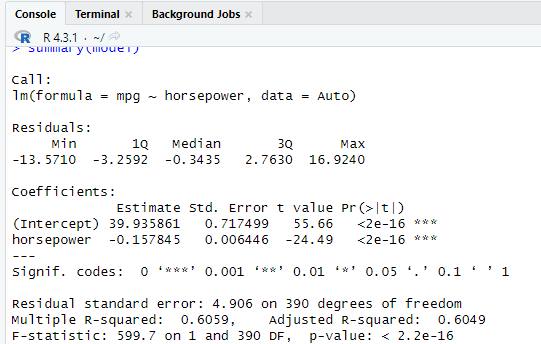
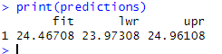
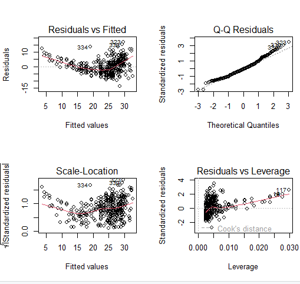
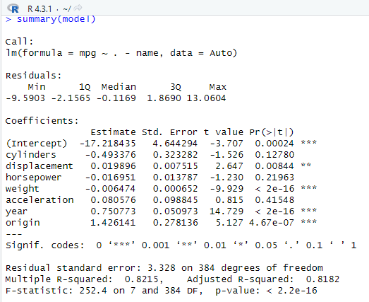
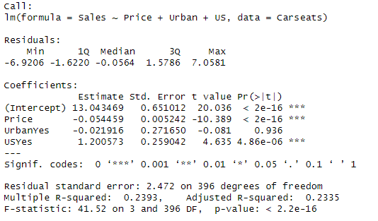
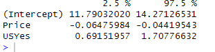
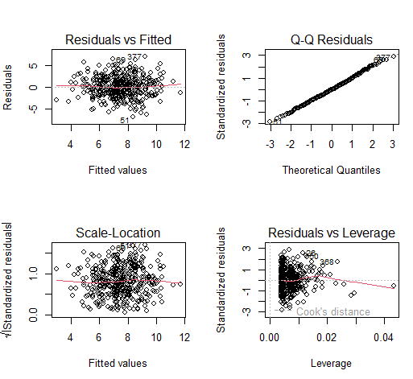

*해당 포스팅은 'an introduction to statistical learning' 책의 연습문제를 R로 해석하며 공부한 것을 정리해두었습니다*


# Linear_3.7 Exercises
## 4번

### Question
4. I collect a set of data (n = 100 observations) containing a single
predictor and a quantitative response. I then ft a linear regression
model to the data, as well as a separate cubic regression, i.e. Y =
β0 + β1X + β2X2 + β3X3 + ".


(a) Suppose that the true relationship between X and Y is linear,
i.e. Y = β0 + β1X + ". Consider the training residual sum of
squares (RSS) for the linear regression, and also the training
RSS for the cubic regression. Would we expect one to be lower
than the other, would we expect them to be the same, or is there
not enough information to tell? Justify your answer.


(b) Answer (a) using test rather than training RSS.


(c) Suppose that the true relationship between X and Y is not linear,
but we don’t know how far it is from linear. Consider the training
RSS for the linear regression, and also the training RSS for the
cubic regression. Would we expect one to be lower than the
other, would we expect them to be the same, or is there not
enough information to tell? Justify your answer.


(d) Answer (c) using test rather than training RSS


### Answer
(a) 처음에는, X와 Y의 관계가 선형이라고 가정하였기 때문에, linear의 RSS가 낮을 것이라고 생각을 하였다. 하지만 cubic 또한, 더 많은 coefficient를 가질 것이기 때문에, 데이터에 유연하게 대처할 수 있기 때문에 RSS가 더 낮은 결과를 가져올 것으로 예상된다. linear의 경우 멀리 떨어진 이상치를 무시하겠지만, cubic은 이상치 또한 감지하기 때문에 데이터에 대한 RSS자체는 낮아질 수 있다고 생각한다.  
(RSS가 낮다 = 오차가 작다, 모델이 훈련 데이터를 잘 성명하고 있다.)

(b) 하지만, 모델이 데이터에 잘 맞으면 앞서 말했듯 작은 변동성이나 이상치에도 민감하게 반응하여 작은 것도 일반화를 시키기 때문에, 테스트 데이터나 새로운 데이터에 대한 성능이 떨어질 수 있다. RSS가 낮다면 overfitting이 될 수 있기 때문에 조심해야 한다.

(c) (a)에서 응답했듯, cubic이 데이터들의 더 복잡한 관계를 나타낼 수 있고, 이상치 들을 탐색하며 유연한 3차 곡선이 에러를 줄일 수 있기 때문에 RSS가 낮을 것라고 예상한다. 

(d) 데이터에 따라 다를 것이라 예상하지만, (b)에서 응답한 것과 비슷한 결과가 도출될 것이라 예상된다. test데이터에서 적합성은 향상될 수 있지만, 과적합이나 작은 변동에도 일반화 하므로 cubic의 성능이 항상 좋다고 할 수 있을까? 

<br>
<br>

## 8번
### Question
8. This question involves the use of simple linear regression on the Auto data set.
<br>
(a) Use the lm() function to perform a simple linear regression with mpg as the response and horsepower as the predictor. Use the summary() function to print the results. Comment on the output.
<br>
For example:


i. Is there a relationship between the predictor and the response?


ii. How strong is the relationship between the predictor and the response?


iii. Is the relationship between the predictor and the response positive or negative?


iv. What is the predicted mpg associated with a horsepower of 98? What are the associated 95 % confdence and prediction intervals?


<br>
(b) Plot the response and the predictor. Use the abline() function to display the least squares regression line.
<br>
(c) Use the plot() function to produce diagnostic plots of the least squares regression ft. Comment on any problems you see with the ft.

### Answer

일단 데이터를 먼저 보겠다.

```r
install.packages("ISLR")
library(ISLR)

#mpg y , horsepower x
model <- lm(mpg ~ horsepower, data=Auto)

summary(model)

predictions <- predict(model, newdata=data.frame(horsepower=c(98)), interval="confidence")

print(predictions)

```




<br>


> 일단 먼저 해석해보자

<br>


*** (Intercept) (절편): *** 

- Estimate (추정값): 39.935861
이 값은 horsepower가 0일 때 예측되는 mpg의 값. 실제로 마력이 0인 차량은 존재하지 않으므로, 이 값은 실제 상황에 직접적인 해석을 하는 것이 아닌, 수학적 모델의 일부로 이해

- Std. Error (표준 오차): 0.717499
절편의 추정값의 표준 오차
- t value (t 값): 55.66
절편의 t 통계량
- Pr(>|t|) (p-value): <2e-16
t 통계량에 대한 p-value. 값이 작을 수록 절편은 통계적으로 유의미

*** horsepower: ***

- Estimate (추정값): -0.157845
이 값은 horsepower가 1 단위 증가할 때 mpg가 예상되는 변화량. 이 경우에는 마력이 1단위 증가할 때마다 mpg는 약 0.1578 단위 감소

- Std. Error (표준 오차): 0.006446
horsepower 계수의 추정값의 표준 오차

- t value (t 값): -24.49
horsepower의 t 통계량

- Pr(>|t|) (p-value): <2e-16
t 통계량에 대한 p-value. 값이 작기 때문에 horsepower는 mpg를 예측하는 데 통계적으로 유의미한 변수.

- Signif. codes는 p-value의 유의 수준. ***이 있다는 것은 는 매우 작은 p-value를 의미함. 즉, 계수가 매우 유의미하다는 것을 의미한다! 


<br>

#### a_i
i. Is there a relationship between the predictor and the response?

<br>

#### a_ii
ii. How strong is the relationship between the predictor and the response?

R-squared(결정계수)는 우리 모델이 얼마나 데이터를 잘 설명하는지에 대한 지표다. **결정계수는 1에 가까우면 데이터를 완벽하게 설명**한다는 의미이므로, 당연히 0에 가까우면 데이터를 설명하지 못한다는 의미다.

R-squared 값이 0.8이므로, 모델이 데이터의 80%를 설명한다고 보면 된다.


위 데이터에서는 Multiple R-squared: 0.6059로 나와있다. 선형 회귀 모델이 데이터 변동성의 약 60.59%를 설명한다고 볼 수 있다. 즉, 차량의 마력과 연비 간의 관계의 약 60.59%를 설명할 수 있다.


 
- 0.3 이하: 약한 연관성
- 0.3 ~ 0.7: 중간 정도의 연관성
- 0.7 이상: 강한 연관성

<br>

#### a_iii
iii. Is the relationship between the predictor and the response positive or negative?

horsepower와 mpg의 관계를 보아야 한다.

여기서 모델은 마력(horsepower)이 증가할 때 연비(mpg)가 어떻게 변하는지를 설명하고 있는데, horsepower의 계수가 음수이므로, 마력이 올라갈수록 연비가 떨어진다고 해석할 수 있다.

즉, horsepower의 계수가 –0.157845, 즉 마이너스이므로 음의 방향을 가진다


* 계수: 어떤 변수의 영향력을 나타내는 값

<br>


#### a_iv
iv. What is the predicted mpg associated with a horsepower of 98? What are the associated 95 % confdence and prediction intervals?

먼저 98 마력일 때의 연비 예측하고, 신뢰구간 95%과 예측구간을 살펴보아야 한다. 

- predict() 함수로 연비를 예측

```r
predictions <- predict(model, newdata=data.frame(horsepower=c(98)), interval="confidence")
```

95% 신뢰 구간과 예측 구간이라는 두 가지 '구간'을 제공는데, 이 구간은 예측된 값의 정확도를 나타낸다. 즉, "우리의 예측값이 이 구간 내에 있을 확률이 95%다"라는 의미다. 신뢰 구간은 평균 예측값의 범위를 보여주며, 예측 구간은 개별 예측값의 범위를 보여준다



<br>

일단, 해석해보자

- fit: 예측된 mpg 값은 약 24.47. horsepower가 98일 때 예측되는 평균 mpg 값

- lwr: 95% 신뢰 구간의 하한 값은 약 23.97. horsepower가 98일 때의 실제 mpg 값이 이 값 이상일 가능성이 95%라는 것

- upr: 95% 신뢰 구간의 상한 값은 약 24.96. horsepower가 98일 때의 실제 mpg 값이 이 값 이하일 가능성이 95%라는 것

따라서, horsepower가 98일 때 mpg는 약 24.47이며, 이 값의 95% 신뢰 구간은 23.97에서 24.96 사이다. 즉, horsepower=98일 때 실제 mpg 값이 23.97과 24.96 사이에 있을 확률이 95%라는 것이다.


<br>

#### b

(b) Plot the response and the predictor. Use the abline() function to display the least squares regression line.

마력(horsepower)이 높을수록 연비(mpg)관계를 그래프로 그리고, abline() 함수를 사용하여 최소제곱 회귀선을 표시하는 식은 다음과 같다

```r
plot(Auto$horsepower, Auto$mpg, xlab="Horsepower", ylab="MPG", main="MPG vs. Horsepower")
abline(model, col="red")

```


<br>
딱 봐도 
- 마력( horsepower)이 높을수록 연비(mpg)는 낮아진다. 

이전 계수 데이터에서도 계수가 –0.157845으로 음의 관계를 나타내는 것을 이미 확인했었음.


<br>

#### c
(c) Use the plot() function to produce diagnostic plots of the least squares regression ft. Comment on any problems you see with the ft.


plot() 함수를 사용하여 최소제곱 그래프 그리고, 적합성에 대해 확인해봐야한다.

plot()은 진단 플롯은 아래의 4가지를 설명할 수 있다.

- **Residuals vs Fitted**: 예측된 값에 대한 잔차를 보여줌. 선형성의 문제를 확인하는 데 유용하다. 잔차들이 수평선 주위에 무작위로 흩어져 있어야 한다. 그렇지 않으면, 즉, 패턴이나 굴곡이 있다면 선형 모델이 데이터에 적합하지 않을 수 있다.

- **Normal Q-Q**: 정규성을 검사함! 이 플롯은 잔차가 정규 분포를 따르는지 확인하는 데 유용함. 점들이 직선에 가까이 있어야하고, 그렇지 않다면 잔차가 정규 분포를 따르지 않을 수 있다. 즉, 데이터 포인트가 대략 대각선을 따르면 잔차가 정규적으로 분포되었다고 보면 됨.

- **Scale-Location (또는 Sqrt of Standardized residuals vs Fitted)**: 잔차의 균등성 또는 등분산성(homoscedasticity)을 확인하는 데 사용된당. 점들이 수평선 주위에 무작위로 퍼져 있으면 등분산성의 가정이 충족되었다고 볼 수 있음.

- **Residuals vs Leverage**: 이 플롯은 영향력 있는 관측값(outliers)을 확인하는 데 사용되며, 이상치와 레버리지가 높은 관측치를 찾을 수 있다. 일반적으로 레버리지가 높은 관측값은 플롯의 오른쪽 부분에 위치함.


 코드는 다음과 같다. 


```r
par(mfrow=c(2,2))  # 2x2
plot(model)

```




<br>

(par(mfrow=c(2,2))  그저 그래픽 나타내는 식임)
* par(): 그래픽 파라미터를 설정하거나 수정하는 함수
* mfrow(multi-frame row-wise) 'row-wise'는 그래픽을 행별로 채운다는 의미/ 여러개의 그래프를 행으로 채우겠다


<br>
<br>

* tip 그래프를 보고 다음 항목을 확인해보면 된다.


<br>

```
- Residuals vs Fitted:
잔차들이 수평선 주위에서 무작위로 퍼져 있나요?
명확한 패턴, 굴곡, 또는 이상한 형태를 볼 수 있나요?
패턴이 있다면, 비선형성이나 특정 그룹의 데이터에서 높은 잔차를 보이는 경향이 있는지 확인해 보세요.


- Normal Q-Q:
대부분의 데이터 포인트가 대각선을 따르나요?
꼬리 부분에서 크게 벗어난 포인트가 있는지 확인하세요. 그런 포인트들이 있다면 잔차가 완벽하게 정규 분포를 따르지 않을 수 있습니다.

- Scale-Location:
잔차가 무작위로 수평선 주위에 퍼져 있나요?
패턴이나 굴곡을 볼 수 있나요? 그렇다면 등분산성 가정에 위배될 수 있습니다.

-Residuals vs Leverage:
플롯의 오른쪽 부분에 이상한 점들이나 멀리 떨어진 점들을 볼 수 있나요?
Cook’s distance를 확인하여 영향력 있는 관측값을 찾을 수 있습니다. 높은 레버리지와 큰 잔차를 가진 관측값은 모델에 큰 영향을 줄 수 있습니다.
```


<br>


## 9번

9번은 c번만 보기로 한다.


### Question
9. This question involves the use of multiple linear regression on the Auto data set.

(c) Use the lm() function to perform a multiple linear regression with mpg as the response and all other variables except name as the predictors. Use the summary() function to print the results. Comment on the output. For instance:


i. Is there a relationship between the predictors and the response?


ii. Which predictors appear to have a statistically signifcant
relationship to the response?


iii. What does the coefcient for the year variable suggest


<br>

### Answer

lm() 함수로 회귀 모델을 만들고, summary() 함수로 결과 도출


<br>

#### i. 예측 변수와 반응 변수 사이에 관계가 있는가?

F-통계량과 관련된 p-값을 확인해야한다. F-통계량과 관련된 p-값은 다중 선형 회귀 분석에서 전체 회귀 모델의 통계적 유의성을 평가하는 데 중요한 지표이기 때문이다.

- p-값이 매우 작으면 (일반적으로 0.05 미만), 반응 변수와 예측 변수 사이에 통계적으로 유의한 관계다.


```r

# 다중 선형 회귀 모델 생성
model <- lm(mpg ~ . - name, data=Auto)

# 결과 출력
summary(model)

```




<br>
F-statistic: 252.4 on 7 and 384 DF,  p-value: < 2.2e-16 


--> p-value가 2.2e-16으로 거의 0에 가깝기 때문에, 매우 유의하다고 볼 수 있다.


<br>

#### ii. 반응 변수와 통계적으로 유의한 관계를 가진 예측 변수는 어떤 것인가?

각 예측 변수의 계수에 대한 p-값이 작은(0.05 미만)것이, 반응 변수와 통계적으로 유의한 관계가 있다고 볼 수 있다. 0.05미만이며('*' 가 많은) displacement, weight, year, origin 변수가 유의미한 예측 변수라고 볼 수 있다.


<br>

#### iii. year 변수의 계수는 무엇을 나타내는가?

year 변수의 계수는 mpg가 1년마다 얼마나 변하는지를 나타내는데, 계수가 0.750773으로 양수 계수는 mpg가 연도별로 증가하는 것을 보여준다. 즉, 자동차의 제조년도가 최근일수록 연비가 더 좋다.


<br>

## 10번

### Question

This question should be answered using the Carseats data set.


(a) Fit a multiple regression model to predict Sales using Price, Urban, and US.


(e) On the basis of your response to the previous question, ft a smaller model that only uses the predictors for which there is evidence of association with the outcome.


(f) How well do the models in (a) and (e) ft the data?


(g) Using the model from (e), obtain 95 % confdence intervals for the coefcient(s).


(h) Is there evidence of outliers or high leverage observations in the model from (e)


### Answer

<br>

#### (a)

```r
library(ISLR)

model_carseat <- lm(Sales ~ Price + Urban + US, data=Carseats)
summary(model_carseat)


```


<br>

결과를 보면, urbanYes만 유의하지 않다. 

<br>

#### (e)

유의하지 않은 것을 제외하고 다시 분석한다

```r
model_carseats2 <- lm(Sales ~ Price + US, data=Carseats)
summary(model_carseats2)

```


<br>

#### (f)


둘 중 어떤 모델은 데이터를 얼마나 잘 맞추는지 확인하기 위해서, summary()출력에서 Multiple R-squared 값을 확인하여 두 모델의 적합도를 비교해야한다.


위 그림을 보면, a에서의 분석은
- Multiple R-squared:  0.2393,	Adjusted R-squared:  0.2335 

<br>
e에서의 분석은
- Multiple R-squared:  0.2393,	Adjusted R-squared:  0.2354 

<br>
이므로, 둘다 Multiple R-squared의 값이 같다. 데이터의 변동성을 동일한 비율로 설명하고 있다고 볼 수 있다. 

하지만, 조정된 결정계수의 값을 보면 e에서의 분석이 조금 높으므로 e가 좀 더 데이터를 동일하게 설명한다고 볼 수 있다. 


* 예측변수(독립변수)가 여러개이기 때문에 multiple R-squared라고 함. 그래서 다중회귀에서 많이 씀.


<br>

#### (g)
(e)의 모델을 사용하여 계수의 95% 신뢰 구간을 구해야 한다.

```r

confint(model_carseats2, level=0.95)
```




<br>

- 신뢰 구간: 11.7903 ~ 14.2713
- Price 신뢰 구간: -0.0648 ~ -0.0442
- USYes 신뢰 구간: 0.6915 ~ 1.7078


--> price의 경우, 가격이 증가하면 sales는 감소한다.
--> us일 경우, us인일 경우 sales는 위의 구간만큼 증가한다. 
--> 둘 다 변수의 계수 구간에 0을 포함하지 않는 신뢰구간을 가지니까 유의미함.


<br>

#### (h)

(e)의 모델에서 아웃라이어나 높은 레버리지를 가진 관측값의 증거가 있는지를 살펴보아야 한다.
8에서 했던 것과 같이 적합성을 판단하기 위해 적합된 모델의 잔차(residuals)와 레버리지(leverage) 통계량 봐야하기 때문에 진단플롯을 사용한다. 

```r
par(mfrow=c(2,2))
plot(model_carseats2)

```



<br>

8과 동일하게, 살펴봐야 하는 것들의 목록이다


```
1. 첫 번째 그래프(잔차 vs 적합도)에서 잔차가 패턴 없이 무작위로 분포되어 있어야 합니다.
2. 두 번째 그래프(Q-Q 플롯)에서 점들이 대각선에 근접하게 분포되어 있어야 합니다.
3. 세 번째 그래프(스케일-위치 플롯)에서 점들이 대략적으로 수평선 주위에 무작위로 분포되어 있어야 합니다.
4. 마지막 그래프(레버리지 vs 표준화된 잔차)에서 높은 레버리지를 가진 관측값이 있는지 확인할 수 있습니다.
```


<br>
<br>
끝.