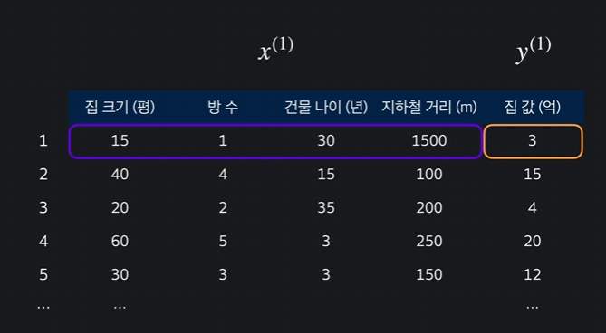

# 다중 선형 회귀 분석(Multiple Regression)

## 다중 선형 회귀 개념 
선형 회귀에서는 하나의 입력변수 x(집 평수)로 목표변수 y(집 값)을 예측하였다. 하지만, 우리가 삶에서 하나의 입력변수로만 예측하기는 어렵다. 집 값에 영향을 미치는 것은 평수 뿐 아니라 위치, 층수, 연식 등이 있을 것이기 때문이다.

이렇게, 다양한 입력변수를 가지고 예측하는 것을 다중 선형 회귀라고 한다

단, 다중 선형 회귀는 시각적으로 표현하기는 어렵다.

## 다중 선형 회귀 표현법

입력 변수가 4개가 있으며 속성(feature)이라고 한다.
첫 번째 입력변수인 집 평수를 나타내기 위해서는 x_1, 방 수는 x_2, 연식은 x_3으로 나타낼 수 있다.

입력변수의 갯수는 n 으로 표현하고, 위 그림에서는 4개의 입력변수가 있기 때문에 n=4이다.

학습 데이터의 갯수는 m으로 표현하며, 총 50개의 데이터가 있다면 m=50이 된다.

제일 윗 줄의 첫 번째 학습데이터를 칭할때는 

$$  x^{(1)}  $$

이렇게 위에다가 표기해주면 된다. 학습 데이터는 여러값을 담은 하나의 벡터라고 할 수 있다.  

즉,
$$  x^{(1)} = [15, 1, 30, 1500]  $$
첫 번째 학습데이터에서는, 15평, 1개방수, 30년, 지하철과의 1500미터의 거리가 있는 집이라는 데이터를 담은 벡터를 표현할 수 있다.

목표 변수는
$$  y^{(1)}  $$
이 되겠다.

정리하자면, 종합해서 i번 째 데이터의 j번째 속성은 다음과 같이 표현할 수 있다.  
$$  x_{j^{(i)}}  $$

## 다중 선형 회귀 가설 함수

가설함수는 입력 변수를 받아 목표 변수를 예측해 준다. 선형 회귀에서는 하나의 최적선을 찾는 것이었지만, 다중회귀에서 가설함수는 변수가 꽤 많다.

$$  h_{\theta}(x) = \theta_{0} + \theta_{1}x_{1} + \theta_{2}x_{2} + \ldots + \theta_{n}x_{n}  $$

x_1, x_2... 입력 변수가 다중이다!! 

복잡해 ㅜㅜㅜ

하지만, 얘도 자세히 보면 1차 함수이다!
집크기 + 방수 + 지하철 거리 + 연식 등이 그냥 나와있을 뿐이다!

즉, 

$$ \theta_{1} $$
은 집 크기가 가격에 미치는 영향, 

$$  \theta_{2}  $$ 
은 방 수가 미치는 영향력... 이다

따라서 
$$  \theta_{0} + \theta_{1}x_{1} + \theta_{2}x_{2} + \ldots + \theta_{n}x_{n}  $$

를 다 더하면 원하는 집 가격이 나오게 된다~

다중 선형 회귀에서도 이 세타 값들을 잘 조욜하면서 최적 값을 찾아야 한다

**복잡한 위의 식은 벡터를 사용하면 좀 더 간결하게 표현 가능하다

$$  \Theta = \begin{bmatrix}
\Theta_0 \\
\Theta_1 \\
\Theta_2 \\
\vdots \\
\Theta_n \\
\end{bmatrix}  $$

$$  X = \begin{bmatrix}
1 \\
x_1 \\
x_2 \\
\vdots \\
x_n \\
\end{bmatrix}  $$

즉,
$$  h(\theta, x) = \theta^T x  $$
으로, 곱하면 같은 식이 된당!!

## 다중 선형 회귀 경사 하강법

### 회귀에서의 손실함수

기억할지 모르겠다. 회귀분석에서, 가설 함수를 평가하는 것은 '손실함수' 이다! 손실함수는 세타에 관한 값인데, 어떤 세타를 쓰냐에 따라 손실 함수의 결과값이 달라진다

손실함수가 크면-> 가설 함수가 데이터에 잘 안맞다
손실함수가 작으면-> 가설 함수가 데이터에 잘 맞다

손실함수의 output을 낮추기 위하여 손실을 가장 줄이는 방향으로 세타 값을 바꾸어 주는 방법이다.

### 다중 선형 회귀에서는..?

손실 함수가 같다! 손실을 줄이기 위해서 경사 하강법을 해야하는데, 입력변수가 1개일 때는 세타 0과 세타 1만 업데이트 하면 되지만, 손실을 가장 줄이는 방법으로 세타 값을 줄이는 것이지만..

입력 변수가 여러개면 세타 값도 여러개이므로 단지 업데이트를 할 입력 변수가 많아질 뿐이다. 

이 것을 하나의 식으로 표현한다면 

j=0, j=1... j=n을 넣어서 모든 세타 값들을 업데이트 해야한다
이 과정을 한 번 거칠때 마다 손실을 최대한 빨리 감소시키는 방법으로 세타 값이 업데이트 되고, 최소에 가깝게 줄일 수 있는 것이다.

=> 학습 데이터에 가장 잘 맞는 세타 값을 찾게 되고, 이는 가설함수를 찾았다고 할 수 있다!

