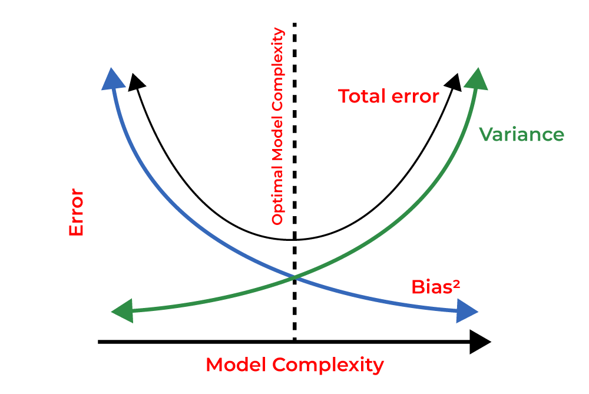

 

# 편향 분산 절충(Bias-Variance Tradeoff)
 

많이 본 그림이다... 무엇이 가장 좋은 걸까? bias와 variance는 무슨 의미일까?

 

## 데이터의 Bias 
 
데이터 분포가 특정 클래스에 모여 있는 것을 데이터에 내재된 bias라고 한다. 

`예를들어` 전국민 여론을 조사하였는데 20대 위주로 조사를 하였다면 데이터 분포가 20대의 의견이 많이 담겨져 있으니, 여론 자체가 편향되어 있을 수 밖에 없다.

즉, 데이터가 편향되어 있는 것으로, 20대의 클래스를 대부분 반영할 테니, 전 국민을 대상으로 한 일반화 성능을 감소시킬 수도 있게 되는 것이다.

> High Bias = High Error = Low accuracy 
> Low Bias = Low Error = High accuracy 

 

## 데이터의 Variance  
 
모델 자체의 복잡도가 높다는 의미이다.

- Model Complexity:

 모델이 복잡하다는 것은, 즉 모델의 자유도가 높다는 것이다. 복잡한 모델은 데이터가 복잡하게 분포하더라도 모든 데이터 포인트를 적합시킬 수 있는 능력이 있다.

- High Variance:

 variance가 높다는 것은, 쉽게 overfitting될 수 있다는 것이다. 
학습 파라미터가 상당히 높다면, 포인트를 완벽하게 표현할 수 있는 함수를 찾을 수 있다.
그러나, 오버피팅 시 모델의 복잡도가 높고 학습 데이터가 적을 경우, 작은 데이터 변동에도 민감하게 반응하여 새로운 데이터를 잘못 분류하게 된다.

 `예를들어` 오직 하얀 백조만 본 상태에서 검은 백조를 만나면 그것을 이상치로 인식하게 된다.

- Low Variance:

모델이 주어진 데이터를 충분히 표현할 능력이 없습니다.
예를 들면, 데이터 포인트들이 포물선 형태로 표현되어 있지만, 모델은 그것을 선형으로만 해석하려고 합니다.

> High Variance = overfitting
> Low Variacne = 주어진 데이터를 제대로 표현하지 못하는 모델

## Bias-Variance Tradeoff 그림으로 이해하기

무엇이 가장 이상적인 형태일까?

1. 1번 
데이터가 센터에 정확히 찍혀있다 = 에러가 낮다. 정확도가 높다. 바이어스가 작다. 

근데, 과녁 다양하게 분포한게 아니기 때문에 variance가 높지 않다. 정확히 10점에 꽂히면 positive지만, 6, 7점들은 neg로 볼 수 있기 때문에 충분히 데이터 전체의 경향을 잘 파악하지는 못한다고 생각해야한다.

2. 2번
점들이 1번보다는 조금 더 분포가 되어있다. 사실, 1번이 가장 이상적이라고 생각했지만 2번의 경우가 모델의 variance가 높고 bias 가 낮은 정확도가 높은 형태라고 생각하면 된다.

우리가, 과녁 허용 범위를 알 수 있다면 과녁을 꽉 채우는것이 좋다. 생각해보면, 사격을 해도 10점을 맞으면 좋지만 1점을 넘어서지 않으면 허용되기 때문이다. 

💡실제 데이터를 다루는 상황에서 bias는 최대한 낮추지만 variance는 어디까지 허용해야하는지 꼭 생각해야 한다.

   
끝🙂
   