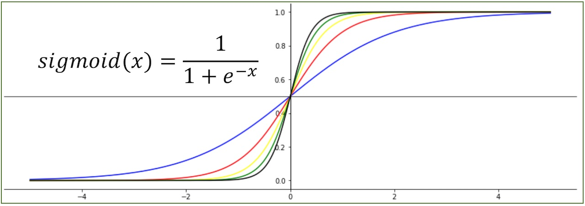

 

# 분류- 로지스틱 회귀

 

머신러닝은 지도학습과 비지도학습으로 나뉘고, 지도학습은 회귀와 분류로 나뉜다. 

회귀는 연속적인 값을 예측하는 것이며, 분류는 정해진 몇 개의 값 중에 예측을 하는 것이다.

분류를 할 때, 선형회귀로도 분류를 할 수 있다. 하지만 이상치로 분류될 수 있는 데이터 하나로 최적선이 바뀔 수 있는, **예외적인 데이터에 민감하게 분류**하기 때문에 '분류'로는 잘 사용하지 않는다.

그 때 사용하는 것이 바로 로지스틱 회귀이다.

 

## 선형 회귀와의 차이점

선형 회귀랑 뭐가 다른것인가? 선형 회귀는 선형, 1차 함수의 직선(linear)을 찾는 것이다. 하지만, 로지스틱 회귀는 데이터에 가장 잘 맞는 시그모이드 함수를 찾는 것이다.

 

## 시그모이드 함수?
 

시그모이드 함수는 0과 1사이의 값을 리턴하는 것이다.

$$ \sigma(z) = \frac{1}{1 + e^{-z}} $$

x가 
$$ \infty $$
라고 하더라도, e는 2.718... 이라는 양수이다 e의 
-
$$ \infty $$
제곱이면 0이 나온다. 결국 분모는 1이 되고, 함수의 값은 1이 되는 것이다. 

반대로 x에
-$$ \infty $$
를 대입하면 1+무한대의 분모를 가지지만 이것 역시 무한대가 되고, 1/무한대 = 0으로 취급한다.

결국, x가 작으면 0에 가까워지고, x가 크면 1에 가까워질 뿐이다.

따라서 0과 1사이의 값을 리턴하는 아이다.

 
### 0과 1사이 값의 의미

선형 회귀는 결과가 범위 제한 없이 얼마든지 크고 작을 수 있다.
하지만 시그모이드는 무조건 0과 1사이의 값이 나오므로 분류가 쉬워진다. 

 

### 로지스틱 분류가 아닌 회귀?!
 

로지스틱의 식을 보면 다음과 같다.

$$ \sigma(z) = \frac{1}{1 + e^{-z}} $$

결국 리턴 값이 0과 1사이의 연속적인 값이 나온다는 것을 알고 있다. 그래서, 연속적인 값들이 나오기 때문에 회귀라고 부르는 것이다. 보통은 시그모이드 값이 0.5보다 작은지 큰지를 보고 분류를 한다. 이름은 회귀지만 실제 사용처는 분류다.

   
끝🙂
   