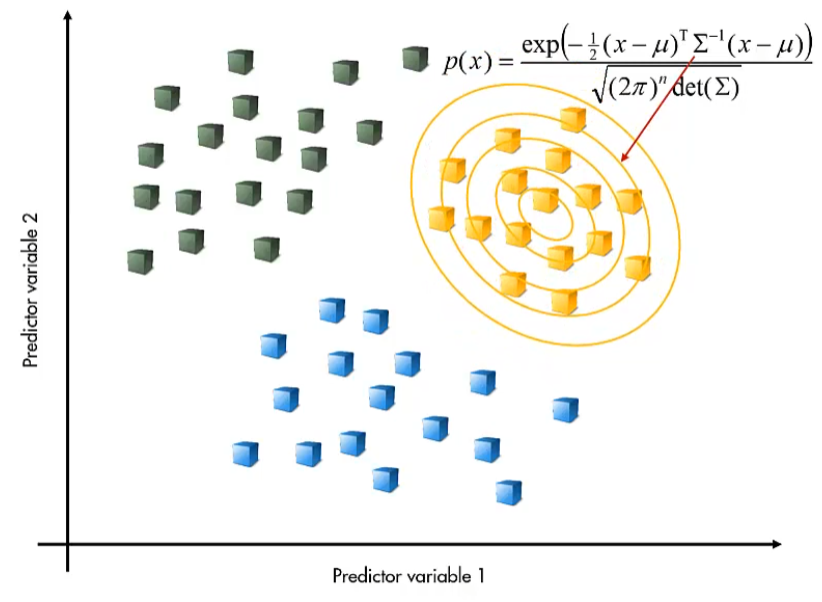
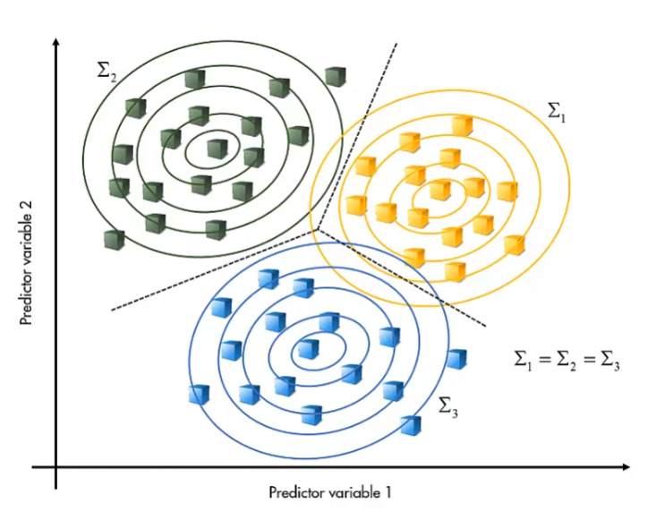

# Linear Discriminant Analysis(선형 판별 분석)

## LDA란? 

LDA는 학습 데이터를 이용해서 클래스의 경계를 결정한다. 하나 이상의 다른 연속 변수를 사용하여 단일 범주형 변수를 예측하는 데 사용되는 통계 테스트라고 생각하면 된다. 결국은 베이즈 분류를 하는거긴 하다.

특히, LDA는 분류(classification) 문제에서 사용되는 기법 중 하나로, 두 개 이상의 그룹이나 클래스 사이의 차이를 최대화하는 축을 찾아 데이터를 투영하는 방식을 사용한다. LDA의 주요 목적은 데이터의 분산이 그룹 내에서는 작게, 그룹 간에는 크게 되도록 하는 선형 조합(즉, 축)을 찾는 것이다.

클래스의 평균 벡터와 공분산 행렬을 계산하는데, 위 그림처럼 분포의 중심과 모양을 결정할 수 있다. 그리고 클래스 사이의 경계를 그리게 되는 것이다. 

확률이 동일한 지점들을 찾아 클래스를 판별한다. 이 경계 방정식은 분포의 매개 변수에 의해 결정된다고 한다.

분포들이 같은 모양을 가질때는 같은 공분산 행렬을 가지는 것이고, 경계는 단순 선형이 된다. 

만약, 공분산 행렬이 모든 클래스에서 동일하지 않다면 경계는 2차방정식이 된다. 

 
> LDA의 장점

차원 축소: 특히 고차원 데이터에서 LDA는 클래스 간의 구분을 최대화하는 방향으로 데이터의 차원을 축소한다. 이는 시각화에 유용하며, 계산 효율성을 높일 수 있다.

분류 성능 향상: LDA는 데이터의 분산을 최적화하여 클래스 간의 구분을 증가시킨다. 이로 인해 일부 데이터셋에서는 다른 분류 방법보다 더 좋은 성능을 나타낼 수 있다.

가정의 단순성: LDA는 각 클래스의 데이터가 정규 분포를 따르고 모든 클래스가 동일한 공분산 행렬을 가진다는 가정을 기반한다. 이러한 가정은 실제로 항상 만족되지는 않지만, 실제 문제에서 LDA가 잘 작동하는 경우가 많다.

해석의 용이성: LDA는 선형 결합을 기반으로 하므로, 결과를 해석하기가 상대적으로 간단합니다. 이는 특징들이 클래스 구분에 얼마나 영향을 미치는지 이해하는 데 도움준다.

정규화 불필요: LDA는 모든 클래스에서 동일한 공분산을 가정하기 때문에, 특징의 스케일링이나 정규화에 민감하지 않다.

다중 클래스 문제: LDA는 두 개 이상의 클래스를 가진 문제에 자연스럽게 확장될 수 있다. 이는 멀티 클래스 분류 문제에 직접 적용할 수 있다.

모델 복잡성 감소: LDA는 데이터의 차원을 축소하면서 모델의 복잡성을 줄일 수 있다. 이는 과적합(overfitting)을 방지하는 데 도움을 줄 수 있다.

   
끝🙂
   

> PIC REFERENCE: (YOUTUBE) MATLAB Korea