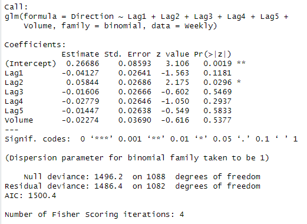

*해당 포스팅은 'an introduction to statistical learning' 책의 연습문제를 R로 해석하며 공부한 것을 정리해두었습니다*


# Classification_4.8 Exercises


## 1번


`Question`
 Using a little bit of algebra, prove that (4.2) is equivalent to (4.3). In other words, the logistic function representation and logit representation for the logistic regression model are quivalent.


`Answer`
1. 로지스틱 함수 표현?
 로지스틱 함수는 앞서 보았듯, 주어진 입력 X에 대한 이벤트가 발생할 확률을 나타낸다. 즉, 그 결과는 0과 1 사이의 값이다. 그래서 시그모이드 함수로 표현하는 것을 보았다.

`(4.2)`

 $$ p(X) = \frac{e^{\beta_0 + \beta_1 X}}{1 + e^{\beta_0 + \beta_1 X}} $$


2. 로짓 표현?
 *로짓 표현은 확률을 로그 오즈로 변환한 것*으로, 모든 실수 값을 가질 수 있다. 로지스틱 회귀 분석에서는 로짓 표현을 사용하여 종속 변수와 독립 변수 간의 선형 관계를 설명할 수 있다.

위의 함수를 아래와 같이도 표현할 수 있다.


$$ \frac{p(X)}{1-p(X)} = e^{\beta_0 + \beta_1 X} $$


여기서, 

$$ \frac{p(X)}{1-p(X)} $$

는 odds(공산)이라하며 항상 0과 무한대 사이의 값을 가진다. 


여기서 양변에 로그를 취하면 아래와 같다.


`(4.3)`

$$ \log\left(\frac{p(X)}{1-p(X)}\right) = \beta_0 + \beta_1 X $$


**따라서** 
로지스틱 함수를 사용하여 로짓 표현을 만들 수 있고, 로짓 표현을 가지고 로지스틱 함수를 쓸 수 있기 때문에 4.2와 4.3은 같다고 할 수 있다. 로지스틱에서는 결과 해석이나 예측을 이것들을 활용해서 잘 할 수 있다고 한다...


<br>

## 2번

<br>

`Question`

It was stated in the text that classifying an observation to the class for which (4.17) is largest is equivalent to classifying an observation to the class for which (4.18) is largest. Prove that this is the case. In other words, under the assumption that the observations in the kth class are drawn from a N(µk, σ2) distribution, the Bayes classifer assigns an obser

`(4.17)`
$$
p_k(x) = \frac{\pi_k \frac{1}{\sqrt{2\pi\sigma}} \exp\left(-\frac{1}{2\sigma^2}(x-\mu_k)^2\right)}{\sum_{l=1}^{K} \pi_l \frac{1}{\sqrt{2\pi\sigma}} \exp\left(-\frac{1}{2\sigma^2}(x-\mu_l)^2\right)}
$$


`(4.18)` 
$$
\delta_k(x) = x \cdot \frac{\mu_k}{\sigma^2} - \frac{\mu_k^2}{2\sigma^2} + \log(\pi_k)
$$


`Answer`

분류에서는 각 관측치(데이터 포인트)를 특정 클래스(그룹)에 할당하는 것이 목표이다. 그러므로, 우리는 각 관측치가 각 클래스에 속할 확률을 계산해야 한다. 확률을 최대화하는 클래스에 관측치를 할당 한다고 말할 수 있다. 


이 문제 목표는 `(4.17)`식을 최대화하는 클래스에 관측치를 할당하는 것이 `(4.18)`를 최대화하는 클래스에 관측치를 할당하는 것과 동일하다는 것을 증명해야 한다.

그럼, 먼저 4.17에 로그를 취해도, 동일하게 최대화가 된다.

$$
\log(p_k(x)) = \log(\pi_k) + \log\left(\exp\left(-\frac{1}{2\sigma^2}(x-\mu_k)^2\right)\right) - \log\left(\sum_{l=1}^{K} \pi_l \exp\left(-\frac{1}{2\sigma^2}(x-\mu_l)^2\right)\right)
$$

이제, 지수함수의 로그는 아래와 같다고 볼 수 있으므로
$$
\log(\exp(a)) = a
$$

적용하면:
$$
\log(p_k(x)) = \log(\pi_k) - \frac{1}{2\sigma^2}(x-\mu_k)^2 + C
$$
(C는 상수)

이 식의 선형 부분만 고려하면 4.18과 비슷한 식이 된다. 
$$
\log(p_k(x)) \propto x\mu_k - \frac{\mu_k^2}{2\sigma^2} + \log(\pi_k)
$$


따라서, 4.17 식을 최대화하는 클래스에 관측치를 할당하는 것은, 4.18에 할당하는것과 동일하다고 할 수 있따. 


```
로그 변환: 로그 함수는 곱셈을 덧셈으로 바꾸는 특성있으며, 복잡한 확률 계산을 단순화하기 위해 로그를 사용하는 경우가 많음.

베이즈 분류기: 데이터 포인트가 어떤 클래스에 속하는지 결정하기 위해, 각 클래스에 대한 데이터 포인트의 확률을 계산하고 가장 높은 확률을 가진 클래스를 선택


- 수식 의미
​
p_k(x): 이것은 데이터 포인트 x가 k번째 클래스에 속할 확률을 나타냄


π_k: k째 클래스의 사전 확률로 아무런 정보 없이 k번째 클래스에 속할 기본 확률을 의미


μ_k와 σ: k번째 클래스의 평균과 표준편차로 각 클래스의 데이터 분포를 나타냄. 데이터 포인트 x가 어떤 클래스에 속할지 결정하기 위해 사용되며, 로그 변환은 이러한 확률 계산을 단순화하기 위해 사용됨.


간단히 말해, 이 수식들은 주어진 데이터 포인트가 어떤 그룹에 속하는지 가장 확률이 높은지를 결정하기위해 사용됨.
```


<br>


## 5번 - LDA and QDA

`Question`

We now examine the diferences between LDA and QDA.


(a) If the Bayes decision boundary is linear, do we expect LDA or QDA to perform better on the training set? On the test set?


`Answer`


LDA가 선형 decision boundary를 모델링하므로, Bayes decision boundary가 선형일 때는 QDA보다 LDA가 훈련 세트와 테스트 세트 모두 더 좋은 성능을 보일 것으로 예상된다.

다만, 훈련세트에서 QDA가 오버피팅할 가능성이 있기 때문에 QDA가 나은 성능을 보일수도 있지만, 결국 선형 decision boundary를 모델링하는데 적합한 LDA가 더 나은 성능을 보일 것으로 예상된다.


```
LDA (Linear Discriminant Analysis): 각 클래스의 데이터가 동일한 공분산 구조를 가진다고 가정하고, 선형 결정 경계를 생성

QDA (Quadratic Discriminant Analysis): 각 클래스의 데이터가 다른 공분산 구조를 가질 수 있다고 가정하고, 비선형 결정 경계를 생성
```


`Question`

(b) If the Bayes decision boundary is non-linear, do we expect LDA or QDA to perform better on the training set? On the test set?


`Answer`
위 A번과 달리, Bayes의 바운더리가 비선형인 경우 QDA가 비선형 decision boundary를 모델링할 수 있으므로 QDA가의 성능이 더 좋을 것이다.


`Question`

(c) In general, as the sample size n increases, do we expect the test prediction accuracy of QDA relative to LDA to improve, decline, or be unchanged? Why?

`Answer`

샘플 사이즈 n이 증가하면, QDA의 성능이 더 향상될 것이다. QDA는 모델이 복잡하기 때문에 더 많은 데이터가 필요하고, 샘플 데이터의 사이즈가 더 커진다면 복잡한 패턴을 학습해서 더 좋은 성능을 낼 것이기 때문이다.


`Question`

(d) True or False: Even if the Bayes decision boundary for a given problem is linear, we will probably achieve a superior test error rate using QDA rather than LDA because QDA is fex enough to model a linear decision boundary. Justify your answer.


`Answer`

Bayes decision boundary가 선형인 경우 LDA가 더 간단하고 적절한 모델이므로 더 나은 성능을 가져올 것이다. QDA는 모델이 복잡하므로 과적합의 위험이 있을 수 있다.


<br>

## 6번

`Question`

Suppose we collect data for a group of students in a statistics class with variables X1 = hours studied, X2 = undergrad GPA, and Y = receive an A. We ft a logistic regression and produce estimated coefcient, βˆ0 = −6, βˆ1 = 0.05, βˆ2 = 1.


(a) Estimate the probability that a student who studies for 40 h and has an undergrad GPA of 3.5 gets an A in the class.


`Answer`

```r
beta0 <- -6
beta1 <- 0.05
beta2 <- 1

log_odds_a <- beta0 + beta1*40 + beta2*3.5
probability_a <- exp(log_odds_a) / (1 + exp(log_odds_a))
probability_a
```

> 결과

[1] 0.3775407

A grade를 받을 확률은 37.75%


`Question`

(b) How many hours would the student in part (a) need to study to have a 50 % chance of getting an A in the class


`Answer`

```r
need_hours <- function(hours, beta0, beta1, beta2) {
  log_odds_b <- beta0 + beta1*hours + beta2*3.5
  probability_b <- exp(log_odds_b) / (1 + exp(log_odds_b))
  return(probability_b - 0.5)
}

result <- uniroot(need_hours, c(0, 100), beta0=beta0, beta1=beta1, beta2=beta2)
required_hours <- result$root
required_hours
```

> 결과
50


A를 받으려면, 50시간의 공부가 필요하다.

```
- need_hours 함수:
hours 값에 대해 확률을 계산하고 0.5(50%)를 빼는 값을 반환
로지스틱 함수의 출력 확률을 계산하고, 해당 확률에서 50%를 빼면 0에 가까운 값이 나올 것. 즉, 함수의 출력 값이 0에 가까워지면 그 hours 값은 50% 확률에 가까워진다는 것을 의미

- uniroot 함수:
uniroot는 주어진 함수의 근(루트)을 찾는 R의 내장 함수. need_hours 함수의 출력 값이 0에 가까운 hours 값을 찾고자 함. c(0, 100)은 hours 값의 가능한 범위를 설정했고, 0시간부터 100시간 사이로 설정함. beta0=beta0, beta1=beta1, beta2=beta2는 find_hours 함수에 필요한 추가 인수를 제공

- result$root:
uniroot 함수의 결과는 여러 속성을 가진 목록 형태로 반환. root 속성은 찾은 근(루트)을 나타냄. 50%의 확률에 해당하는 공부 시간
```


<br>

## 13번 (b~i)

`Question`

This question should be answered using the Weekly data set, which is part of the ISLR2 package. This data is similar in nature to the Smarket data from this chapter’s lab, except that it contains 1, 089 weekly returns for 21 years, from the beginning of 1990 to the end of 2010


(b) Use the full data set to perform a logistic regression with Direction as the response and the fve lag variables plus Volume as predictors. Use the summary function to print the results. Do any of the predictors appear to be statistically signifcant? If so, which ones? 


`Answer`

```r
library(ISLR2)
data(Weekly)

fit_logistic <- glm(Direction ~ Lag1 + Lag2 + Lag3 + Lag4 + Lag5 + Volume, data=Weekly, family=binomial)
summary(fit_logistic)
```



intercept와 lag2만 유의미한 변수인 것 같다.


`Question`

(c) Compute the confusion matrix and overall fraction of correct predictions. Explain what the confusion matrix is telling you about the types of mistakes made by logistic regression.


`Answer`

```r
pred_logistic <- predict(fit_logistic, type="response")
predicted_direction <- ifelse(pred_logistic > 0.5, "Up", "Down")
table(Weekly$Direction, predicted_direction)
```

>결과
```
       predicted_direction
       Down  Up
  Down   54 430
  Up     48 557
  ```

TP: 실제로 'Up'이었고 모델도 'Up'으로 예측한 경우- 557번
TN: 실제로 'Down'이었고 모델도 'Down'으로 예측한 경우 54번
FP: 실제로 'Down'이었지만 모델이 'Up'으로 잘못 예측한 경우 430번
FN: 실제로 'Up'이었지만 모델이 'Down'으로 잘못 예측한 경우는48번

Accuracy = $\frac{TP + TN}{TP + TN + FP + FN}$

 56.1%의 정확도가 도출됨.


> r로 정확도 계산하기

```
matrix_data <- matrix(c(54, 48, 430, 557), ncol=2)

rownames(matrix_data) <- c("Down", "Up")

colnames(matrix_data) <- c("Down", "Up")

accuracy <- sum(diag(matrix_data)) / sum(matrix_data)

accuracy
```


`Question`

(d) Now ft the logistic regression model using a training data period from 1990 to 2008, with Lag2 as the only predictor. Compute the confusion matrix and the overall fraction of correct predictions for the held out data (that is, the data from 2009 and 2010).


`Answer`


`Question`

(e) Repeat (d) using LDA.

`Answer`


`Question`

(f) Repeat (d) using QDA.

`Answer`


`Question`

(g) Repeat (d) using KNN with K = 1.

`Answer`


`Question`

(h) Repeat (d) using naive Bayes.

`Answer`


`Question`

(i) Which of these methods appears to provide the best results on this data?


`Answer`


<br>

## 14번

`Question`

In this problem, you will develop a model to predict whether a given
car gets high or low gas mileage based on the Auto data set.
(a) Create a binary variable, mpg01, that contains a 1 if mpg contains
a value above its median, and a 0 if mpg contains a value below
its median. You can compute the median using the median()
function. Note you may fnd it helpful to use the data.frame()
function to create a single data set containing both mpg01 and
the other Auto variables.
(b) Explore the data graphically in order to investigate the association between mpg01 and the other features. Which of the other
features seem most likely to be useful in predicting mpg01? Scatterplots and boxplots may be useful tools to answer this question. Describe your fndings.
(c) Split the data into a training set and a test set.
(d) Perform LDA on the training data in order to predict mpg01
using the variables that seemed most associated with mpg01 in
(b). What is the test error of the model obtained (e) Perform QDA on the training data in order to predict mpg01
using the variables that seemed most associated with mpg01 in
(b). What is the test error of the model obtained?
(f) Perform logistic regression on the training data in order to predict mpg01 using the variables that seemed most associated with
mpg01 in (b). What is the test error of the model obtained?
(g) Perform naive Bayes on the training data in order to predict
mpg01 using the variables that seemed most associated with mpg01
in (b). What is the test error of the model obtained?
(h) Perform KNN on the training data, with several values of K, in
order to predict mpg01. Use only the variables that seemed most
associated with mpg01 in (b). What test errors do you obtain?
Which value of K seems to perform the best on this data set


<br>

## 16번

`Question`

Using the Boston data set, ft classifcation models in order to predict whether a given census tract has a crime rate above or below the median. Explore logistic regression, LDA, naive Bayes, and KNN models using various subsets of the predictors. Describe your fndings. Hint: You will have to create the response variable yourself, using the variables that are contained in the Boston data set


<br><br><br>
끝🙂
<br><br><br>