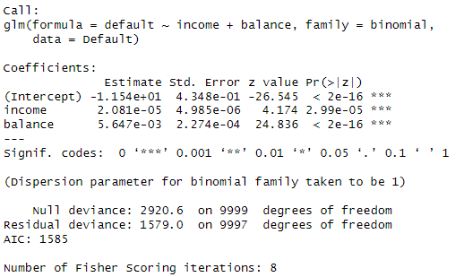
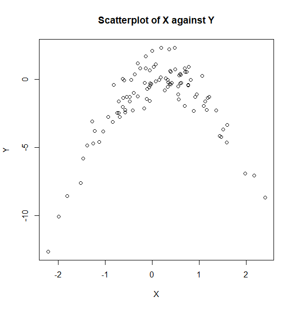

*해당 포스팅은 'an introduction to statistical learning' 책의 연습문제를 R로 해석하며 공부한 것을 정리해두었습니다*


<br>

# Linear_5.4 Exercises

<br>

## 5번

<br>

5. In Chapter 4, we used logistic regression to predict the probability of default using income and balance on the Default data set. We will now estimate the test error of this logistic regression model using the validation set approach. Do not forget to set a random seed before beginning your analysis.

<br>

### a
`Question`
(a) Fit a logistic regression model that uses income and balance to
predict default
<br>


`Answer`

로지스틱 회귀분석을 활용하여 Default 데이터셋에서 기본값(default)의 확률을 예측해야한다. 일단 glm()함수를 써서 로지스틱 회귀 모델을 fit한다. fit한다는 것은 단지 데이터에 통계모델을 적용하는 것이라고 생각하면 된다.


```r
library(ISLR)
set.seed(123)

model <- glm(default ~ income + balance, data=Default, family=binomial)
summary(model)
```
set.seed()는 R의 난수 생성기 초기 상태를 설정한다. 




일단 도출된 값을 보면 p-value값이 매우 작아 유의하다고 판단된다.


```
데이터를 무작위로 분할할 때 set.seed(123)을 사용하면, 코드를 다시 실행하더라도 항상 같은 데이터 분할 결과를 얻을 수 있음.
```

### b
`Question`

(b) Using the validation set approach, estimate the test error of this
model. In order to do this, you must perform the following steps:


i. Split the sample set into a training set and a validation set.

`Answer`

일단, 데이터 셋을 훈련 세트와 검증 세트로 나눈다

```r
sample_size <- dim(Default)[1]
train_index <- sample(1:sample_size, sample_size*0.7)
train_set <- Default[train_index, ]
validation_set <- Default[-train_index, ]
```

Default 데이터 프레임의 행의 개수를 sample_size에 저장하고,
1부터 sample_size까지의 숫자 중에서 무작위로 70%에 해당하는 훈련 데이터의 인덱스를 무작위로 추출한당.

그리고, 선택한 인덱스에 해당하는 행을 train_set으로,
-train_index인 나머지 행을 validation_set으로 지정했다.


`Question`
ii. Fit a multiple logistic regression model using only the training observations. 


`Answer`

훈련 세트만 사용하여 로지스틱 회귀 모델을 다시 적합
```r
model_train <- glm(default ~ income + balance, data=train_set, family=binomial)
```


`Question`
iii. Obtain a prediction of default status for each individual in
the validation set by computing the posterior probability of
default for that individual, and classifying the individual to
the default category if the posterior probability is greater
than 0.5.


`Answer`

검증 세트에서의 기본값(default) 예측

```r
probs <- predict(model_train, validation_set, type="response")
predictions <- ifelse(probs > 0.5, "Yes", "No")
```


로지스틱에서는 입력변수 기반으로 반응변수의 **확률**을 예측하는 것이다.


검증 데이터셋의 반응 변수(default) 값을 예측하고, type="response"를 써서 예측된 확률 값을 반환한다. 


그래서, 반환된 값이 0.5보다 크면 yes로, 작으면 no로 분류하기로 해보았다.


`Question`
iv. Compute the validation set error, which is the fraction of
the observations in the validation set that are misclassifed.


`Answer`
검증 세트에서의 set error 계산

```r
misclass_rate <- mean(predictions != validation_set$default)
misclass_rate
```

예측값과 검증 데이터의 실제값이 얼마나 다른지 평균을 계산해본다.


결과: [1] 0.02633333

100개중 약 2~3개 정도 잘못 분류된 것으로 확인되었다.


<br>


### c


`Question`

(c) Repeat the process in (b) three times, using three diferent splits
of the observations into a training set and a validation set. Comment on the results obtained.

<br>

`Answer`

- 1번째 결과: [1] 0.02633333

- 2번째 결과: [1] 0.026

- 3번째 결과: [1] 0.02733333


얻은 오차가 유사하다. 0.26~0.28 사이에 위치하며, 변동성이 낮기 때문에 안정적인 성능을 보인다고 할 수 있다.


<br>

### d

`Question`
(d) Now consider a logistic regression model that predicts the probability of default using income, balance, and a dummy variable
for student. Estimate the test error for this model using the validation set approach. Comment on whether or not including a
dummy variable for student leads to a reduction in the test error
rate


`Answer`
학생 dummy variable, income, balance를 사용한 기본값의 확률 예측하는 회귀를 그려야한다.

validation set approach를 사용해서 오류 측정하고, 다음으로 dummy 변수를 포함하는 것이 test error rate를 줄이는지 확인해보아야 한다...


일단 다시 fit 해주고,

```r
model_student <- glm(default ~ income + balance + student, data=train_set, family=binomial)
```


검증 세트에서의 기본값(default) 예측

```r
probs_student <- predict(model_student, validation_set, type="response")
predictions_student <- ifelse(probs_student > 0.5, "Yes", "No")
```


검증 세트에서의 error rate 계산

```r
misclass_rate_student <- mean(predictions_student != validation_set$default)
misclass_rate_student
```


결과: [1] 0.02733333


(b)와 (c)의 결과와 비슷하다. 즉, student 변수를 추가해도 test error를 not reduce. 


<br>

## 8번

<br> 
`Question`

We will now perform cross-validation on a simulated data set.


이번에는 교차검증 관련 문제다.


### a

(a) Generate a simulated data set as follows:

```
> set.seed(1)
> x <- rnorm(100)
> y <- x - 2 * x^2 + rnorm(100)
```

In this data set, what is n and what is p? Write out the model
used to generate the data in equation form.


`Answer`

- n: 데이터의 관측치 개수

 -> x 와 y의 길이: 100입니다.

- p: 사용된 예측 변수의 개수

 -> x와 x^2: 2


- equation form: \( Y = X - 2X^2 + \epsilon \)


```
rnorm(100)으로 생성된 랜덤한 값이기 때문에, 측정 오차가 있을 수 있기 때문에 오차 항목 ϵ가 있음
```


### b

`Question`
(b) Create a scatterplot of X against Y . Comment on what you fnd.


`Answer`

```r
plot(x, y, main="Scatterplot of X against Y", xlab="X", ylab="Y")
```





linear하지 않고, 2차 방정식의 형태를 잘 띄고 있고, 변동성도 크지 않은 것 같다.


<br>


### c


`Question`
(c) Set a random seed, and then compute the LOOCV errors that
result from ftting the following four models using least squares:


1. $Y = \beta_0 + \beta_1X + \epsilon$
2. $Y = \beta_0 + \beta_1X + \beta_2X^2 + \epsilon$
3. $Y = \beta_0 + \beta_1X + \beta_2X^2 + \beta_3X^3 + \epsilon$
4. $Y = \beta_0 + \beta_1X + \beta_2X^2 + \beta_3X^3 + \beta_4X^4 + \epsilon$


Note you may fnd it helpful to use the data.frame() function
to create a single data set containing both X and Y .


`Answer`

위 네 모델을 fit하고, LOOCV오류 계산해야한다.
boot패키지의 cv.glm()함수를 써서 계산해보겠다.

```r
library(boot)

data <- data.frame(x=x, y=y)

glm1 <- glm(y ~ x, data=data)
cv1 <- cv.glm(data, glm1)

glm2 <- glm(y ~ x + I(x^2), data=data)
cv2 <- cv.glm(data, glm2)

glm3 <- glm(y ~ x + I(x^2) + I(x^3), data=data)
cv3 <- cv.glm(data, glm3)

glm4 <- glm(y ~ x + I(x^2) + I(x^3) + I(x^4), data=data)
cv4 <- cv.glm(data, glm4)

cv1$delta[1], cv2$delta[1], cv3$delta[1], cv4$delta[1]
```


>결과

- cv1$delta[1]

[1] 7.288162

- cv2$delta[1]

[1] 0.9374236

- cv3$delta[1]

[1] 0.9566218

- cv4$delta[1]

[1] 0.9539049
 

모델1번이 가장 높은 CV 오차를 가진다. 위에서 보았듯 데이터는 2차 함수의 형태를 가지기 때문에 1차 함수인 linear는 잘 설명을 못하는 것임.

3차와 4차는 같은 곡선이기 때문에 큰 성능 차이를 가져오진 않는 것 같음.


```
cv.glm() 함수의 결과 객체인 cv에서 delta는 교차 검증 오차 추정치를 포함하는 벡터임. 


- delta[1]: 원래 샘플 데이터에서 적합된 모델에 대한 예측 오차. 단순한 K-겹 교차 검증 오차나 LOOCV 오차를 나타낼 때 사용됨.

- delta[2]: 교정된 예측 오차를 나타냄. 모델의 유연성을 고려하여 교정된 것으로, 일반적으로 더 복잡한 모델에서 사용됨
```


<br>


### d

`Question`
(d) Repeat (c) using another random seed, and report your results.
Are your results the same as what you got in (c)? Why?


`Answer`

다른 seed를 써서 반복해 보았다, 결과는 다음과 같다.

- cv1$delta[1]

[1] 9.858301

- cv2$delta[1]

[1] 1.00441

- cv3$delta[1]

[1] 1.01803

- cv4$delta[1]

[1] 1.035601


c와 유사하기 1번 함수가 오차가 제일 크다. 데이터 모델이 2차로 되어 있기 때문에, 시드가 바뀌어도 같은 결과가 나오는 것 같다.


<br>

### e

`Question`
(e) Which of the models in (c) had the smallest LOOCV error? Is
this what you expected? Explain your answer


`Answer`

실제 데이터 모델과 데이터 구조가 가장 일치하기 때문에 2번 모델이 가장 낮은 LOOCV 오차를 나타낼 수 밖에 없는 것 같다. 


<br><br><br>
끝🙂
<br><br><br>