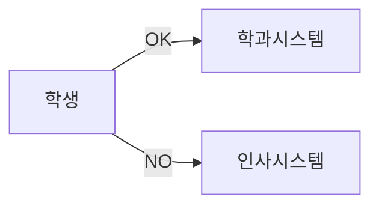

# 1. 엔터티의 이해
## 1.1 엔터티의 정의
### 1.1.1 엔터티란?

> 사람이 생각하는 개념이나 정보 단위와 같은 현실 세계의 대상체, 실세계에 존재하는 유형 혹은 무형 정보의 대상이며 서로 구별이 되는 하나하나의 대상을 의미한다.
> 
> 
> 개체는 하나 이상의 속성(정보)으로 구성된다. 예로 텔레비전, 공책, 책, 연필, 지우개, 컴퓨터 등등, 이런 것들이 다 개체라고 할 수 있다.   
> [위키백과]

즉 업무에 필요하며 유용한 정보를 저장할 수 있는 집합체라고 할 수 있습니다. 또는 집합체 간에 동질성을 지닌 인스턴스 또는 인스턴스의 행위에 대한 집합이라고 정의할 수 있습니다.

### 1.1.2 권위자의 정의

- 변별할 수 있는 **사물** - Peter Chen

- 데이터베이스 내에서 **변별 가능**한 객체 - C.J Date

- **정보를 저장**할 수 있는 어떤 것 - James Martin

- 정보가 저장될 수 있는 **사람, 장소, 물건, 사건, 개념 등** - Thomas Bruce

### 1.1.3 엔터티의 구성

**속성(Attribute):** 집합체에 속한 개체(인스턴스)들의 특성을 설명할 수 있는 요소입니다. (공통 속성/개별 속성)

# 2. 엔터티 및 인스턴스 내용과 표기법

엔터티를 표기하는 방법은 각각의 표기법에 따라 차이가 있으나, 대부분 사각형으로 표현합니다. 다만 속성을 표기하는데 약간의 차이가 있습니다.

# 3. 엔터티의 특징
## 3.1 업무 필요 정보

엔터티는 시스템 구축 대상의 업무에서 필요로 하고 관리해야 하는 정보이어야 합니다.

## 3.2 식별 가능

엔터티를 구성하는 인스턴스는 유일한 식별자(Unique Identifier)에 의해 식별이 가능합니다. 임의의 일련번호 또는 업무적으로 의미를 갖는 식별자를 부여하여 하나의 식별자에 하나의 인스턴스가 존재해야 합니다.

## 3.3 인스턴스의 집합

- **영속성(지속성)**

> [컴퓨터 공학](https://ko.m.wikipedia.org/wiki/%EC%BB%B4%ED%93%A8%ED%84%B0_%EA%B3%B5%ED%95%99)에서 **지속성**(Persistence)은 [프로세스](https://ko.m.wikipedia.org/wiki/%ED%94%84%EB%A1%9C%EC%84%B8%EC%8A%A4)가 생성했지만 별개로 유지되는 [상태](https://en.wikipedia.org/wiki/State_(computer_science))의 특징 중 한 가지이며, 별도의 [기억 장치](https://ko.m.wikipedia.org/wiki/%EA%B8%B0%EC%96%B5_%EC%9E%A5%EC%B9%98)에 데이터를 보존하는 것을 목적으로 한다. 이 특징으로 인해 프로그래머는 저장 장치로부터 데이터를 전송하는 작업 및 [자료 구조](https://ko.m.wikipedia.org/wiki/%EC%9E%90%EB%A3%8C_%EA%B5%AC%EC%A1%B0) 등을 이용해 데이터를 보존하는 것이 가능하다.
> 
> 
> 
> 이 특징 없이는 상태는 오직 [RAM](https://ko.m.wikipedia.org/wiki/RAM)에만 존재할 수 있고, 컴퓨터가 종료되어 RAM이 전력을 잃어버린다면 상태도 같이 사라져 버리게 된다. [위키백과]
> 

- **영속적으로 존재하는 인스턴스의 집합**   
하나의 엔터티는 여러 개의 인스턴스를 포함합니다. 엔터티의 특징 중에서 두 개 이상의 집합이라는 개념은 매우 중요합니다. 엔터티뿐만 아니라 엔터티 간의 관계, 프로세스와의 관계 등 업무를 분석/설계하는 설계자는 모든 업무에 해당 개념을 대입하고 검증해야 합니다.

## 3.4 업무 프로세스에 이용

엔터티는 업무 프로세스에 반드시 이용되어야 합니다. 해당 특징을 충족하지 못하는 엔터티가 존재하는 경우, 업무 분석 및 업무 프로세스 분석을 제대로 수행하지 못했음을 의미합니다. 프로세스 모델링 단계에서 데이터 모델과 함께 검증하거나, 상관 모델링 단계에서 단위 프로세스를 교차 검증하여 문제점을 발견할 수 있습니다.

## 3.5 속성(Attributes)

엔터티는 반드시 속성을 포함합니다. 주식별자만 존재하고 일반속성이 없는 경우 적절한 엔터티라고 할 수 없지만, 관계 엔터티(Associative Entity)는 주식별자 속성만 갖고 있어도 엔터티로 인정합니다.

## 3.6 관계(Relationship)

엔터티는 다른 엔터디와 하나 이상의 관계(Relationship)를 가집니다. 엔터티가 도출되었다는 것은 해당 업무 내에서 업무적인 연관성을 가지고 있다는 의미입니다.
단 통계성, 코드성, 시스템 처리 목적 엔터티의 경우 관계가 생략될 수 있습니다.

- **통계성 엔터티:** 업무 엔터티로부터 통계 업무(Read Only)만을 위해 정의하므로 생략 가능합니다.

- **코드성 엔터티:** 너무 많은 관계가 존재하여 관계 설정으로 인해 데이터 모델 읽기 효율성에 저하가 발생할 수 있습니다. 시스템을 구현할 때에도 성능 저하를 막고자 참조 무결성을 체크하지 않습니다.

- **시스템 처리 목적 엔터티:** 시스템 내부적인 목적으로 생성된 엔터티로 관계를 생략합니다.

# 4. 엔터티의 분류

## 4.1 유무형에 따른 분류

- **유형 엔터티** <i>e.g. 제품, 사원</i>

    - 물리적 형태 존재

    - 안정적

    - 지속적으로 활용

    - 업무로부터 엔터티 구분이 용이

- **개념 엔터티** <i>e.g. 부서, 실적</i>

    - 관리해야 할 개념적 정보로 구분

- **사건 엔터티** <i>e.g. 주문</i>

    - 업무를 수행함에 따라 발생

    - 발생량이 많음

    - 각종 통계 자료에 이용 가능

## 4.2 발생시점에 따른 분류

- **기본 엔터티** <i>e.g. 상품</i>

    - 관계에 의해 생성되지 않고 독립적으로 생성

    - 자식 엔터티를 가질 수 있음

    - 고유한 주식별자를 가짐

- **중심 엔터티** <i>e.g. 주문</i>

    - 기본 엔터티에서 파생되어 생성

    - 업무에서 중심적인 역할

    - 데이터의 양이 많음

    - 다른 엔터티와 관계를 맺으며 행위 엔터티를 생성

- **행위 엔터티** <i>e.g. 주문이력</i>

    - 두 개 이상의 부모 엔터티로부터 생성

    - 내용 변경이 잦고 데이터 양이 증가함

    - 분석 초기 단계보다 상세 설계 단계 또는 상관모델링에서 도출

# 5. 엔터티의 명명

1. 현업 업무에서 사용하는 용어를 사용합니다.
2. 약어 사용을 제한하고 대문자로 표기합니다.
3. 단수 명사를 사용하고 띄어쓰기는 사용하지 않습니다.
4. 모든 엔터티의 이름은 유일해야 하며, 다른 엔터티와 의미상의 중복도 피합니다.
5. 엔터티 이름을 통해서 해당 엔터티가 갖고 있는 데이터가 무엇인지 알 수 있도록 표현합니다, <i>i.g., 고객이 제품을 주문하였을 때 행위 엔터티에 대해 주문목록 또는 고객제품이라 명명할 수 있으나 후자의 경우 애매모호함이 있다</i>.

 
 
References   
SQL 전문가 가이드(2020 개정판)   
[https://dataonair.or.kr](https://dataonair.or.kr/)   
[https://www.wikipedia.org](https://www.wikipedia.org/)