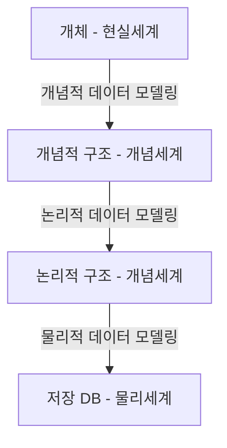
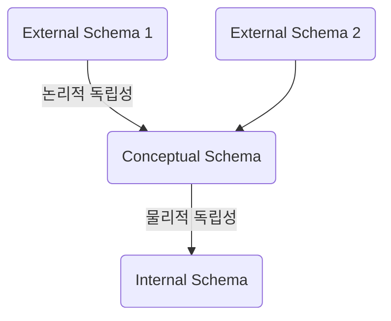

# 1. 모델링의 이해
## 1.1 모델링의 정의

1. **모델이란?**

> **모델**(模型, model) 또는 **모형**은 객체, 시스템, 또는 개념에 대한 구조나 작업을 보여주기 위한 [패턴](https://ko.m.wikipedia.org/wiki/%ED%8C%A8%ED%84%B4), 계획, 또는 설명이다. [위키백과]

즉 **모델**이라고 하는 것은 **모형** 또는 **축소형**이라 말할 수 있습니다. 사람 간 커뮤니케이션을 원활하게 할 수 있도록 돕는데 사용 목적이 있습니다.

2. **모델링이란?**

모델을 만드는 일을 모델링이라 합니다. 모델의 정의를 참고하여 정리해보자면, 복잡한 현실세계를 일정한 표기법으로 표기하는 것 자체를 의미합니다.

## 1.2 모델링의 특징

- **추상화:** 현실세계의 사람, 사물, 개념 등을 일정한 표기법으로 표현.

- **단순화:** 복잡한 현실세계를 제한된 표기법으로 표현하여 누구나 쉽게 이해할 수 있도록 합니다.

- **명확화:** 표현 대상의 애매모호함을 제거합니다.

## 1.3 모델링의 세 가지 관점

- **데이터 관점:** 데이터들이 어떤 업무과 얽혀있는지, 데이터 간에 어떤 관계가 있는지 모델링하는 방법

- **프로세스 관점:** 업무가 실제로 처리하는 일과 앞으로 처리해야 할 일을 중심으로 모델링하는 방법

- **데이터와 프로세스의 상관 관점:** 프로세스의 흐름에 따라 데이터가 어떤 영향을 받는지 모델링하는 방법

# 2. 데이터 모델의 기본 개념 이해
## 2.1 데이터 모델링의 정의

> **데이터 모델링**(data modeling)이란 주어진 개념으로부터 논리적인 [데이터 모델](https://ko.m.wikipedia.org/wiki/%EB%8D%B0%EC%9D%B4%ED%84%B0_%EB%AA%A8%EB%8D%B8)을 구성하는 작업을 말하며, 일반적으로 이를 물리적인 [데이터베이스 모델](https://ko.m.wikipedia.org/wiki/%EB%8D%B0%EC%9D%B4%ED%84%B0%EB%B2%A0%EC%9D%B4%EC%8A%A4_%EB%AA%A8%EB%8D%B8)로 환원하여 고객의 요구에 따라 특정 [정보 시스템](https://ko.m.wikipedia.org/wiki/%EC%A0%95%EB%B3%B4_%EC%8B%9C%EC%8A%A4%ED%85%9C)의 [데이터베이스](https://ko.m.wikipedia.org/wiki/%EB%8D%B0%EC%9D%B4%ED%84%B0%EB%B2%A0%EC%9D%B4%EC%8A%A4)에 반영하는 작업을 포함한다.  [위키백과]
>

- 정보시스템 구축하기 위해서 데이터 관점에서 업무를 분석하는 기법

- 데이터(What)를 약속된 표기법으로 표현

- 데이스베이스를 구축하기 위한 **설계도**

## 2.2 데이터 모델의 기능

- **가시화:** 시스템의 현재 또는 목표로 하는 모습을 드러나게 합니다.

- **구조화한 틀:** 시스템의 구조를 파악할 수 있게 합니다.

- **문서화:** 문서화된 자료가 만들어져 필요한 정보를 전달할 수 있게 합니다.

- **간결한 표현:** 세부 사항을 숨겨 필요한 영역에 집중할 수 있게 합니다.

- **구체화:** 시스템을 구축하는 관련자의 특정 목표에 따라 상세한 정보를 제공할 수 있게 합니.

# 3. 데이터 모델링의 필요성

<ol>
  <li>
    <strong>파급효과:</strong> 시스템 구축이 완성되어 가는 시점에 데이터 모델의 불가피한 변경이 발생한다고 가정해 봅니다. 변경에 따른 표준 영향 분석, 응용 영향 분석 등 많은 분석 활동이 필요하게 됩니다. 그리고 실제적인 변경작업이 이뤄집이다. 많은 분석에도 불구하고 잠재적 위험 요소에 대한 불안을 떨칠 수 없습니다. 이러한 이유로 데이터 설계 과정이 다른 설계 과정보다 더 중요하다고 말할 수 있습니다.
  </li>
  <li>
    <strong>간결한 표현:</strong> 데이터 모델은 구축할 시스템의 정보 요구 사항과 한계점을 명확하면서도 간결하게 표현할 수 있습니다.
  </li>
  <li>
    <strong>데이터 품질:</strong> 데이터는 중요한 자산이자 기업 가치와 연결됩니다. 대부분의 데이터는 오랜 기간 묵혀둘수록 그 활용가치는 높아집니다. 긴 시간 저장된 데이터의 품질이 낮다면 어떨까요? 데이터 활용 기회가 날아가며 소중한 비즈니스 기회 상실로 이어지게 됩니다. 데이터 품질의 문제가 야기되는 원인으로는 <i>1) 중복 2) 비유연성 3) 비일관성이</i> 있습니다.
    <ol type="a">
      <li><b>중복:</b> 데이터 모델은 같은 데이터를 사용하는 곳들을 파악하기 좋게 합니다. 이러한 지식은 데이터 중복 저장 가능성을 줄여줍니다.</li>
      <li><b>비유연성:</b> 잘못된 데이터 모델링은 사소한 프로세스의 변화에도 애플리케이션 및 DB가 변경되도록 합니다.</li>
      <li><b>비일관성:</b> 중복 데이터가 없다는 이유로 데이터 수정 작업을 진행하게 되면 비일관성이 발생할 수 있습니다. 데이터간 모순이 발생하기 때문인데요. 데이터 모델링을 통해서 데이터 간 상호 연관 관계에 대해 명확한 정의를 내릴 수 있습니다.</li>
    </ol>
  </li>
</ol>

# 4. 데이터 모델링의 3단계

- **개념적 데이터 모델링**
    - 추상화 수준이 높음
    - 업무 중심적
    - 포괄적
    - 전사적 데이터 모델링
    - 엔티티-관계 다이어그램
- **논리적 데이터 모델링**
    - 식별자 확정
    - 정규화
    - M:M 관계 해소
    - 참조 무결성 규칙 정의
    - 재사용성 높음
- **물리적 데이터 모델링**
    - 실제 DB 이식 목적
    - 성능, 저장 등 물리적 성격 고려

# 5. 소프트웨어 개발 생명 주기와 데이터 모델링

> **소프트웨어 개발 생명 주기**란 [시스템 엔지니어링](https://ko.m.wikipedia.org/wiki/%EC%8B%9C%EC%8A%A4%ED%85%9C_%EC%97%94%EC%A7%80%EB%8B%88%EC%96%B4%EB%A7%81), [정보 시스템](https://ko.m.wikipedia.org/wiki/%EC%A0%95%EB%B3%B4_%EC%8B%9C%EC%8A%A4%ED%85%9C), 또는 [소프트웨어 공학](https://ko.m.wikipedia.org/wiki/%EC%86%8C%ED%94%84%ED%8A%B8%EC%9B%A8%EC%96%B4_%EA%B3%B5%ED%95%99)에서 정보 시스템을 계획, 개발, 시험, 채용하는 과정을 뜻하는 용어이다. 소프트웨어 개발 생명 주기는 하드웨어부터 소프트웨어까지 넓은 범위에 적용할 수 있다. 대개 요구사항 분석→설계→개발→테스트→운영 단계로 구성되어 있다. [위키백과]
> 

프로젝트에 적용하는 소프트웨어 개발 생명 주기에 따라 조금씩 상이하겠지만, 일반적으로 **계획 단계**에서 **개념적 데이터 모델링**을 수행하고 **분석 단계**에서 **논리적 데이터 모델링**을 진행하며 **설계 단계**에서 **물리적 데이터 모델링**을 수행합니다. 실제 프로젝트에서는 개념적 데이터 모델링과 논리적 데이터 모델링이 동시에 수행되는 경우가 많습니다.

데이터 축과 애플리케이션 축으로 분리하여 산출물을 만들고 상호 검증하며 완성도를 높여 갑니다. 객체지향 개념에서는 두 개의 축을 별도로 분리하지 않고 클래스[데이터(속성) + 프로세스(Method)]를 중심으로 진행하게 됩니다.

# 6. 데이터 독립성
## 6.1 데이터 독립성의 필요성

- 유지보수 비용감소

- 데이터 중복 감소

- 데이터 복잡도 감소

- 요구사항 대응 강화

데이터에 대해 독립적인 의미를 부여하고 효과적으로 구현하게 되면 자신의 고유한 특징을 분명히 할 수 있고, **데이터 종속성**이 감소하여 다른 데이터의 변경에도 쉽게 변경되지 않을 수 있습니다.

## 6.2 데이터 독립성 확보의 이점

- 각 View의 독립성 유지

- 계층별 독립성 증가

- 단계별 스키마에 따라 DDL, DML이 다름

## 6.2 ANSI/SPARC의 Three-schema

1. Three-schema Architecture 구조

- **외부 스키마:** 사용자 관점, Sub Schem

- **개념 스키마:** 통합 관점, 조직 전체의 Database

- **내부 스키마:** 물리적 저장구조

## 6.3 영역 간 데이터 독립성

- **논리적 독립성:** 통합 구조 변경 용이

- **물리적 독립성:** 물리, 개념 구조 변경 용이

### 6.4 Mapping(사상)

- **논리적 사상(외부-개념):** 외부적 뷰와 개념적 뷰 간에 매핑 정보를 정의합니다. 개념적 뷰의 필드 타입은 고정된 채로 외부적 뷰의 형식에 따라 다른 필드 타입을 가질 수 있습니다.

- **물리적 사상(개념-물리):** 개념적 뷰와 데이터베이스 간에 매핑 정보를 정의합니다. DB의 구조 변경 시 물리적 사상이 변경(DBA 수행 영역, DDL 변경)되어야 합니다. 그래야 개념적 뷰를 그대로 남겨둘 수 있습니다.

# 7. 데이터 모델링의 중요 개념
## 7.1 데이터 모델링의 세 가지 요소

1. 업무가 관여하는 어떤 것(**Thing, Entity**)

2. 어떤 것의 성격(**Attribute**)

3. 어떤 것 간의 관계(**Relationship**)

## 7.2 단수와 집합

# 8. ERD의 이해

## 8.1 ERD의 정의

> **ERD**란 "Entity Relationship Diagram"의 약자로서, 계체-관계 다이어그램이라고도 하며 말로 되어 있는 요구사항을 분석하여 그림으로 그려내어 그 관계를 도출한 [다이어그램](http://wiki.hash.kr/index.php/%EB%8B%A4%EC%9D%B4%EC%96%B4%EA%B7%B8%EB%9E%A8)을 말한다. 즉, ERD는 [엔티티](http://wiki.hash.kr/index.php/%EC%97%94%ED%8B%B0%ED%8B%B0)(entity) 간의 [관계](http://wiki.hash.kr/index.php/%EA%B4%80%EA%B3%84)(relationship)를 [도표](http://wiki.hash.kr/index.php/%EB%8F%84%ED%91%9C)(diagram)로 표시한 그림이다. [해시넷]
> 

## 8.2 **ERD 표기 방식**

- **Peter Chan :** 주로 🎓대학교에서 사용하는 표기법, 실무에서 사용하는 경우는 많지 않습니다.

- **IDEFIX :** 실무에서 드물게 사용되며 ERWin에서 사용되는 모델입니다.

- **IE/Crow’s Foot :** 가장 많이 사용되는 모델이며 ERWin, ERStudio에서 사용되는 모델입니다.

- **Min-Max/ISO :** 각 엔터티의 참여도를 좀 더 상세하게 나타냅니다.

- **UML :** 소프트웨어 공학에서 주로 사용됩니다.

- **Case Method/Barker :** IE를 적용하면서 관계 표기법 등 일부가 다릅니다. Oracle에서 사용되는 모델입니다. (DAP-데이터아키텍처 전문가)

<figure>

<figcaption>itwiki.kr</figcaption>
</figure>

## 8.3 ERD 표기법을 활용한 모델링
### 8.3.1 ERD 작성순서

엔터티 도출 → 엔터티 배치 → 엔터티 간의 관계 설정 → 관계명 기입 → 관계 참여도 기입 → 관계의 필수/선택 여부 기입

1. **엔터티 배치**

일반적으로 사람 눈은 왼쪽에서 오른쪽, 위쪽에서 아래쪽으로 이동하는 경향이 있습니다. 그러므로 중요한 엔터티를 좌상단에 배치하고 이를 중심으로 다른 엔터티를 전개합니다.

1. **관계 설정**

엔터티 배치를 마치면 관계를 설정합니다. 초기에는 Primary Key로 속성이 상속되는 식별 관계를 설정합니다. 중복 관계, Circle 관계 발생에 주의하며 설정을 진행합니다.

 3. **관계명 기입**

관계 설정을 마치면 관계명을 작성합니다. 관계명은 현재형을 사용합니다.

1. **관계 참여도 및 필수/선택 기입**

엔터티가 관계에 얼마나 참여하는지를 나타내는 **관계차수**(Cardinality) 및 필수 여부를 작성합니다.

# 9. 좋은 데이터 모델의 요소

- **완전성:** 업무에 필요한 모든 데이터가 모델에 정의되어 있는가?

- **중복 배제:** 하나의 데이터베이스 내에 동일한 사실이 한 번만 기록되는가?

- **업무 규칙:** 업무 규칙이 데이터 모델에 표현되었는가?

- **데이터 재사용:** 데이터를 재사용할 수 있도록 설계되었는가?

    - 재사용성을 높이기 위한 방법:

      1. 통합 모델, 부서 단위가 아닌 회사 전체 관점으로 설계합니다.

      2. 애플리케이션-데이터 간 독립성 유지할 수 있도록 설계합니다.

- **의사소통:** 데이터 모델의 다양한 역할 중에서 의사소통 역할을 수행할 수 있는가?

    - 의사소통 기능이란 정보시스템 관계자들이 설계자가 정의한 많은 업무 규칙을 동일하게 받아들이고 사용할 수 있게 합니다.

- **통합성:** 동일한 데이터가 조직 내에서 한 번만 정의되고 다른 여러 영역에서 참조•사용되는가?

    - 단위 업무별 시스템으로 확장될 때 마스터 성격의 데이터(고객, 상품 등)가 분할되어 관리됩니다. 이를 통합하여 관리하고 각 업무 시스템이 이를 참조•사용하는 것입니다 (성능을 고려한 반정규화에 의한 중복은 예외).

 
 
References   
SQL 전문가 가이드(2020 개정판)   
[https://dataonair.or.kr](https://dataonair.or.kr/)   
[https://www.wikipedia.org](https://www.wikipedia.org/)